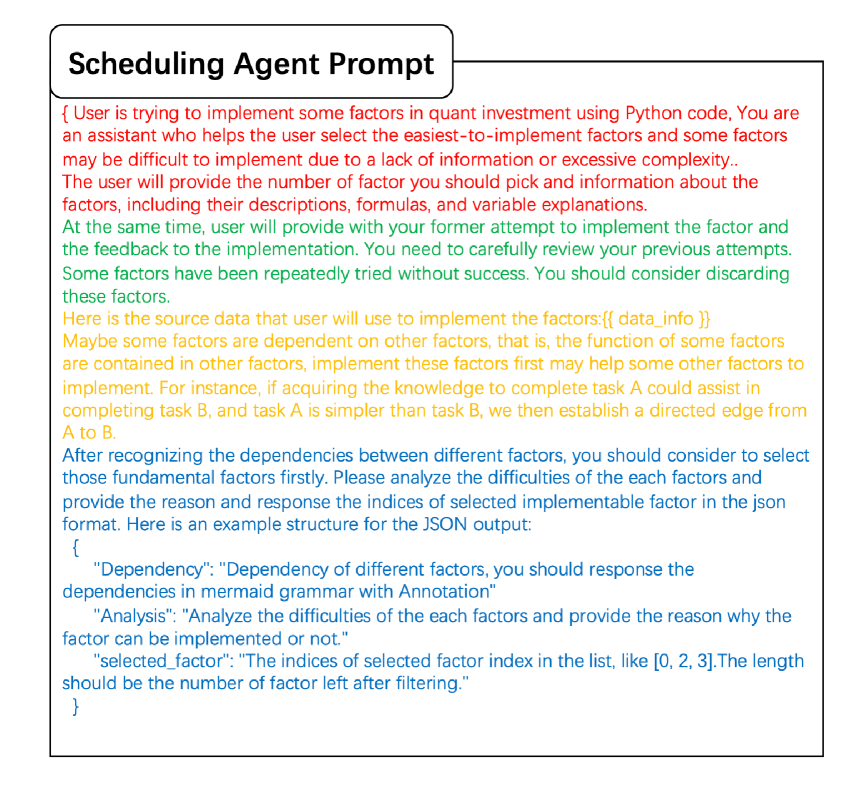

# 协同演化策略助力数据驱动开发自动化

发布时间：2024年07月26日

`Agent` `人工智能` `数据管理`

> Collaborative Evolving Strategy for Automatic Data-Centric Development

# 摘要

> 人工智能（AI）因大量高质量数据而深刻影响多个领域。如今，AI战略重心转向以数据为中心，强调数据开发而非模型设计。自动化此过程至关重要。本文首次提出自动数据中心开发（AD^2）任务，并揭示其核心挑战：需具备领域专家般的任务调度和实施能力，这在以往研究中鲜有涉及。借助大型语言模型（LLM）的强大问题解决能力，我们设计了基于LLM的自主代理，配备协同知识检索增强进化（Co-STEER）策略，以应对所有挑战。Co-STEER代理通过进化策略丰富领域知识，并借助领域实践经验提升调度和实施技能。随着计划优化，实施能力增强；实施反馈深化，调度精度提升。两者在实践反馈中协同进化。实验广泛验证，Co-STEER代理在AD^2领域创新突破，展现出强大的可进化调度和实施能力，并证实其组件的高效性。Co-STEER为AD^2的未来发展奠定了基础。

> Artificial Intelligence (AI) significantly influences many fields, largely thanks to the vast amounts of high-quality data for machine learning models. The emphasis is now on a data-centric AI strategy, prioritizing data development over model design progress. Automating this process is crucial. In this paper, we serve as the first work to introduce the automatic data-centric development (AD^2) task and outline its core challenges, which require domain-experts-like task scheduling and implementation capability, largely unexplored by previous work.
  By leveraging the strong complex problem-solving capabilities of large language models (LLMs), we propose an LLM-based autonomous agent, equipped with a strategy named Collaborative Knowledge-STudying-Enhanced Evolution by Retrieval (Co-STEER), to simultaneously address all the challenges. Specifically, our proposed Co-STEER agent enriches its domain knowledge through our proposed evolving strategy and develops both its scheduling and implementation skills by accumulating and retrieving domain-specific practical experience. With an improved schedule, the capability for implementation accelerates. Simultaneously, as implementation feedback becomes more thorough, the scheduling accuracy increases. These two capabilities evolve together through practical feedback, enabling a collaborative evolution process.
  Extensive experimental results demonstrate that our Co-STEER agent breaks new ground in AD^2 research, possesses strong evolvable schedule and implementation ability, and demonstrates the significant effectiveness of its components. Our Co-STEER paves the way for AD^2 advancements.

[Arxiv](https://arxiv.org/abs/2407.18690)