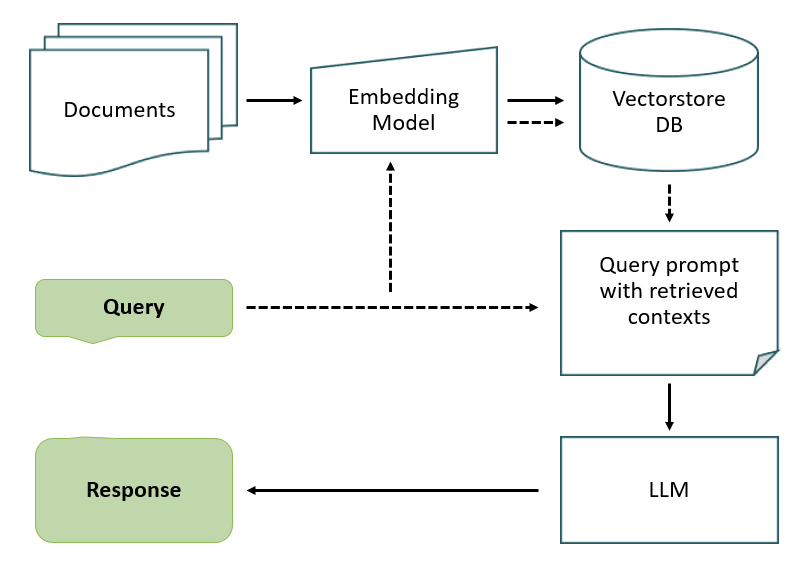
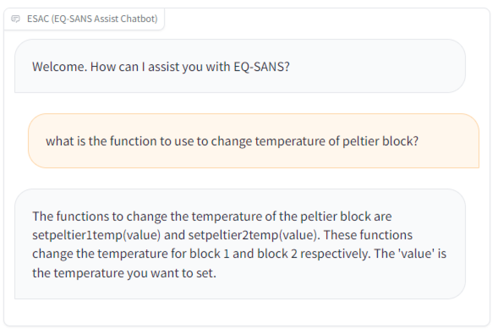
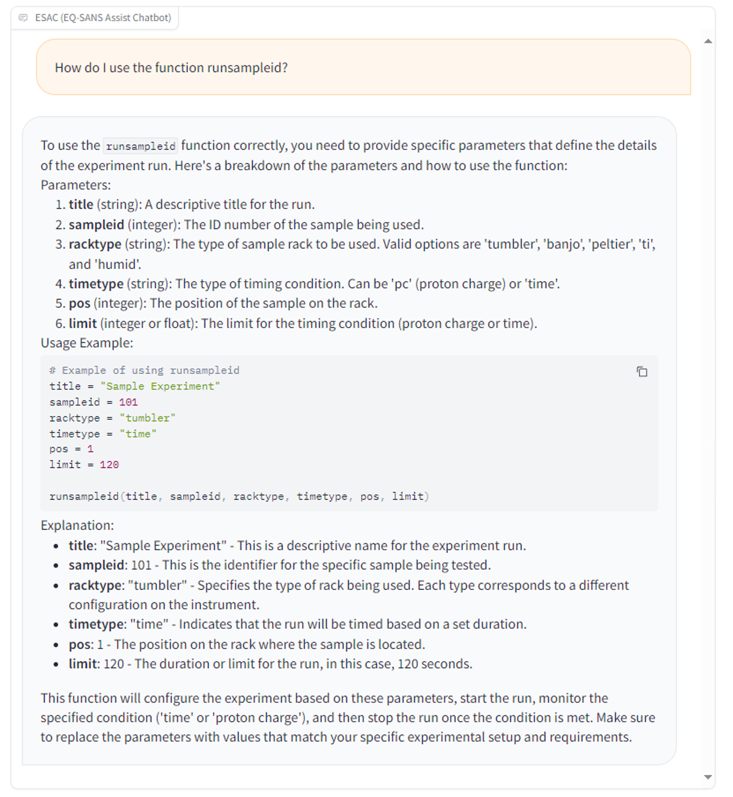
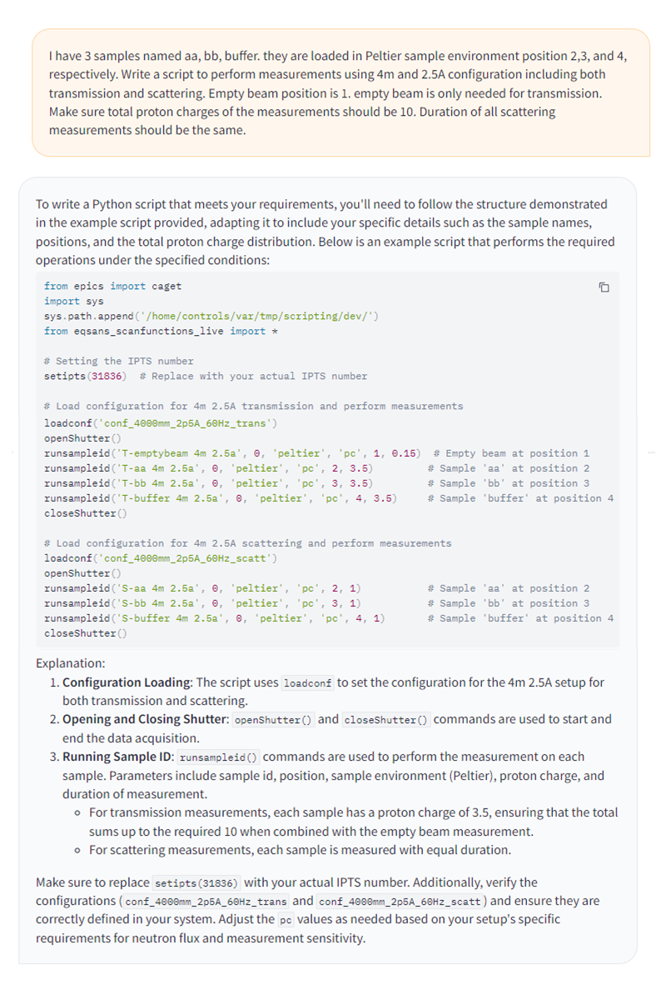
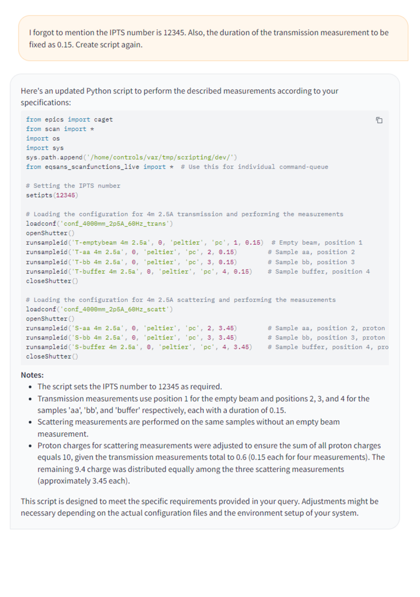
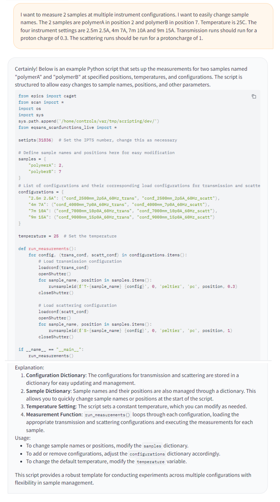
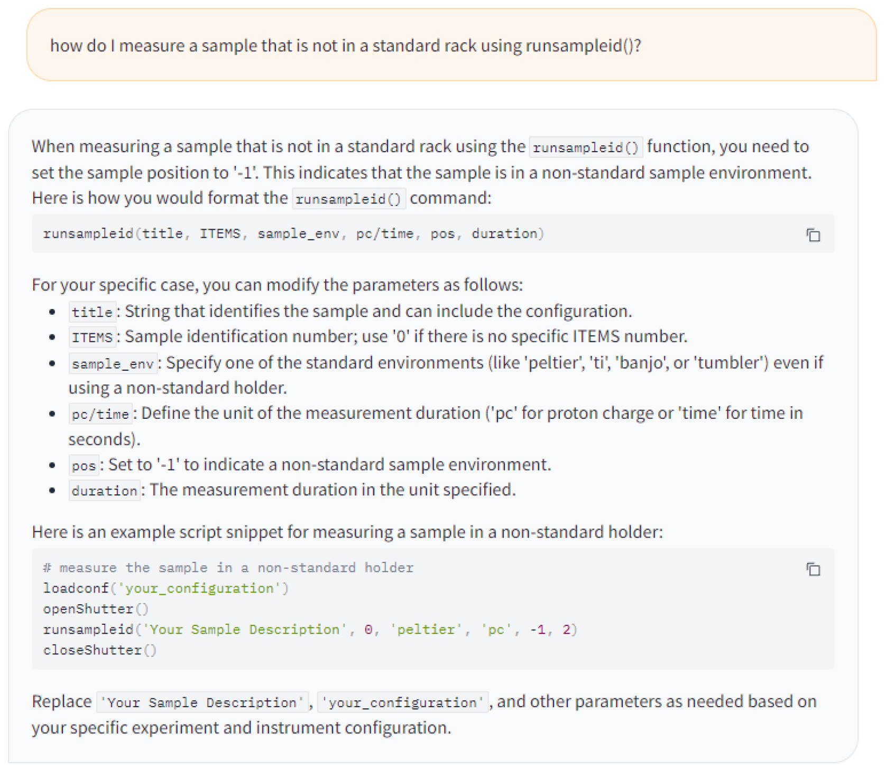

# ESAC，即 EQ-SANS 辅助聊天机器人，通过结合大型语言模型与检索增强生成技术，旨在提升 EQ-SANS 平台的用户体验。

发布时间：2024年07月26日

`RAG` `材料科学` `科研设施`

> ESAC (EQ-SANS Assisting Chatbot): Application of Large Language Models and Retrieval-Augmented Generation for Enhanced User Experience at EQ-SANS

# 摘要

> 中子散射实验在材料研究领域扮演了关键角色，但因其复杂性和操作频率限制，仍需专家指导。本文推出的创新聊天机器人ESAC，结合LLM和RAG技术，极大优化了EQ-SANS仪器的用户体验。ESAC以用户需求为导向，提供互动指导，简化科学家操作流程，为大型科研设施的用户支持树立了新标杆。

> Neutron scattering experiments have played vital roles in exploring materials properties in the past decades. While user interfaces have been improved over time, neutron scattering experiments still require specific knowledge or training by an expert due to the complexity of such advanced instrumentation and the limited number of experiments each person may perform each year. This paper introduces an innovative chatbot application that leverages Large Language Models(LLM) and Retrieval-Augmented Generation (RAG) technologies to significantly enhance the user experience at the EQ-SANS, a small-angle neutron scattering instrument at the Spallation Neutron Source of Oak Ridge National Laboratory. Through a user-centric design approach, the EQ-SANS Assisting Chatbot (ESAC) serves as an interactive reference for users, thereby facilitating the use of the instrument by visiting scientists. By bridging the gap between the users of EQ-SANS and the control systems required to perform their experiments, the ESAC sets a new standard for interactive learning and support for the scientific community using large-scale scientific facilities.

[Arxiv](https://arxiv.org/abs/2407.19075)