# 每一细节皆关键：运用多模态大型语言模型确保科学图表的完整性

发布时间：2024年07月26日

`LLM应用` `科学研究` `数据分析`

> Every Part Matters: Integrity Verification of Scientific Figures Based on Multimodal Large Language Models

# 摘要

> 本文深入探讨了科学图表中文字与图像的精细对齐问题，超越了以往仅关注简单图表（如条形图和饼图）的研究。我们提出了“图表完整性验证”这一新任务，旨在精确评估技术在科学图表中整合文本与视觉元素的能力。为此，我们创建了专用的半自动数据集Figure-seg，并引入了创新框架EPM，该框架利用多模态大型语言模型，不仅逐步提升文本与图表的对齐精度，还通过类比推理增强整体完整性。实验结果显示，这些创新大幅提升了现有方法的性能，使得对复杂科学图表的分析更为精准和深入。这一进展不仅深化了我们对多模态技术的理解，也为需要精确解读复杂视觉数据的领域带来了新的研究方向和应用前景。

> This paper tackles a key issue in the interpretation of scientific figures: the fine-grained alignment of text and figures. It advances beyond prior research that primarily dealt with straightforward, data-driven visualizations such as bar and pie charts and only offered a basic understanding of diagrams through captioning and classification. We introduce a novel task, Figure Integrity Verification, designed to evaluate the precision of technologies in aligning textual knowledge with visual elements in scientific figures. To support this, we develop a semi-automated method for constructing a large-scale dataset, Figure-seg, specifically designed for this task. Additionally, we propose an innovative framework, Every Part Matters (EPM), which leverages Multimodal Large Language Models (MLLMs) to not only incrementally improve the alignment and verification of text-figure integrity but also enhance integrity through analogical reasoning. Our comprehensive experiments show that these innovations substantially improve upon existing methods, allowing for more precise and thorough analysis of complex scientific figures. This progress not only enhances our understanding of multimodal technologies but also stimulates further research and practical applications across fields requiring the accurate interpretation of complex visual data.

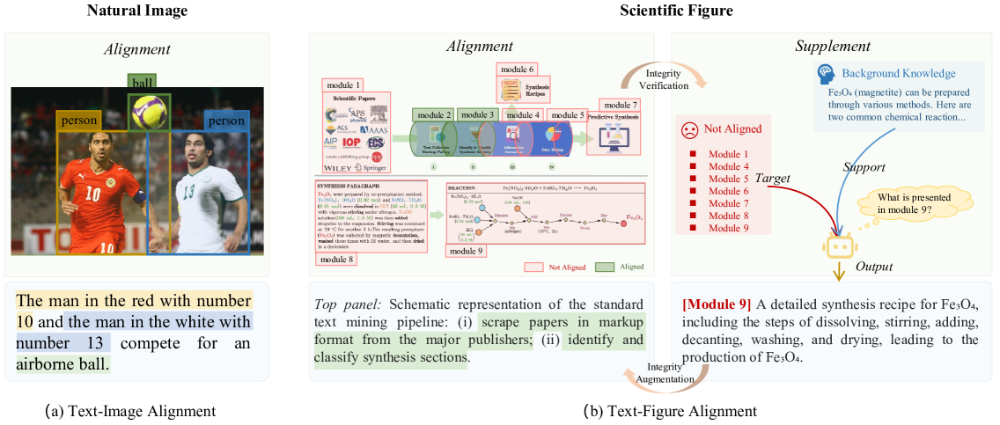

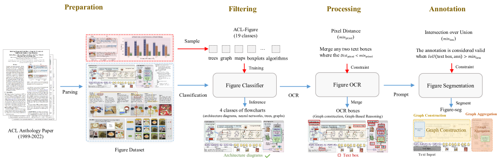

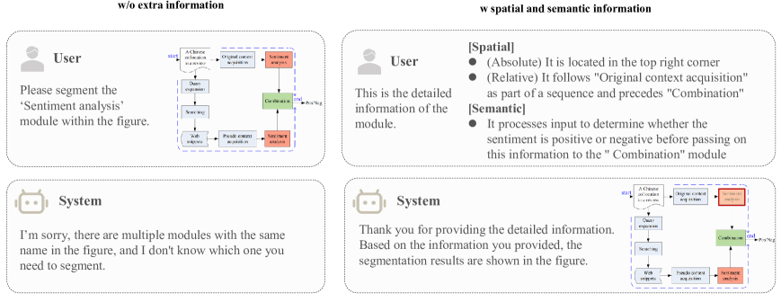

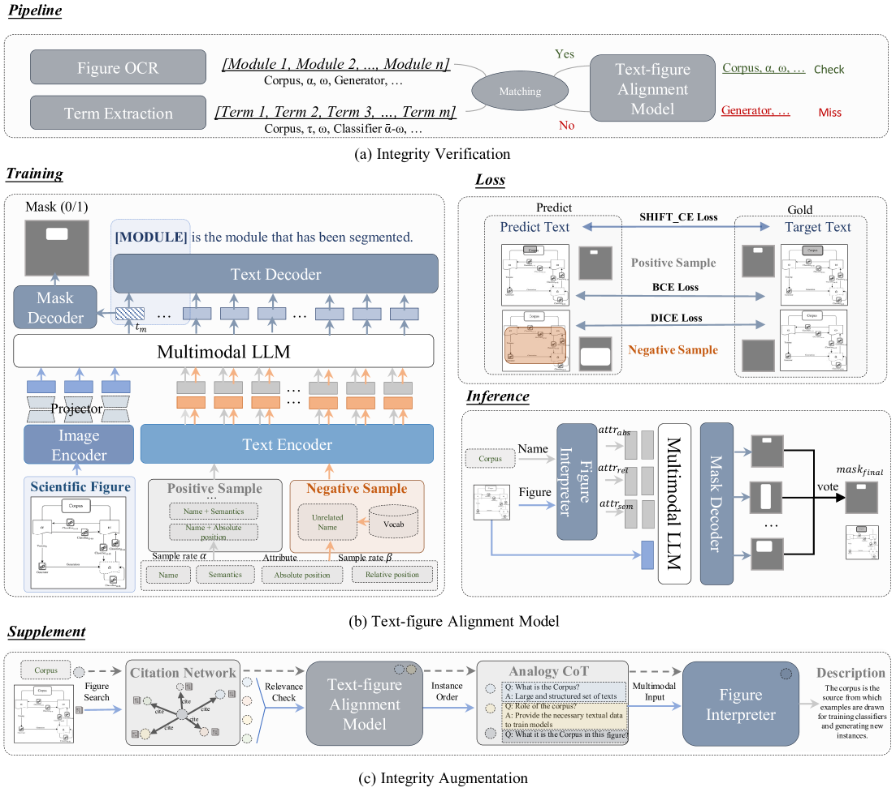

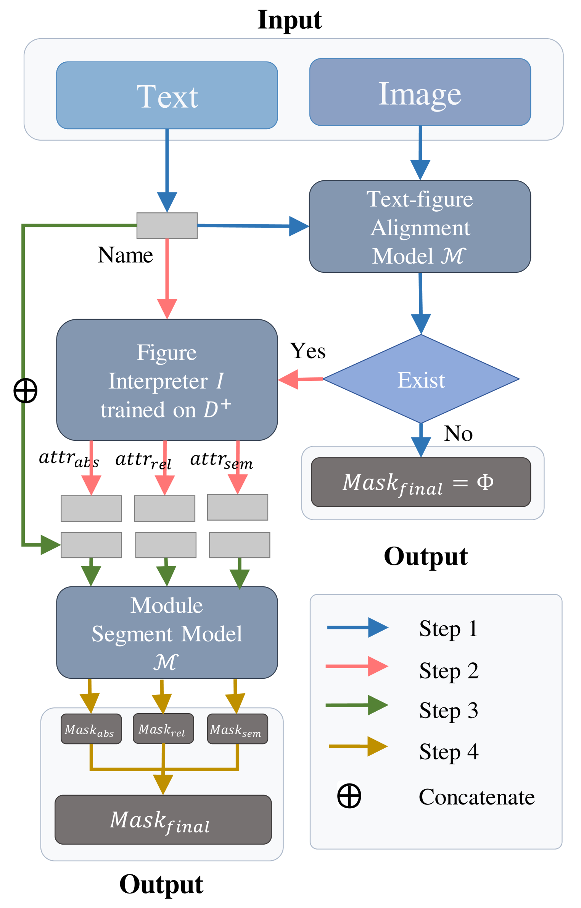

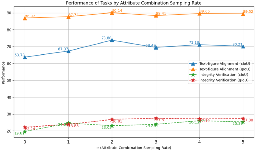

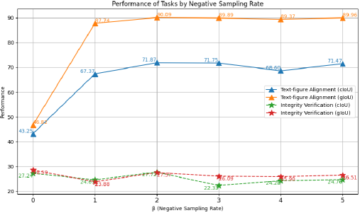

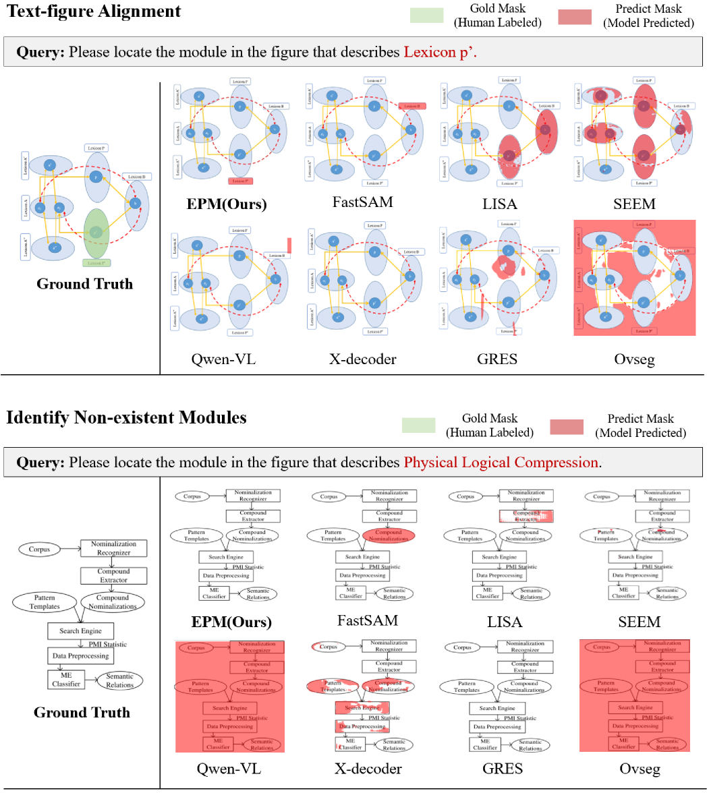

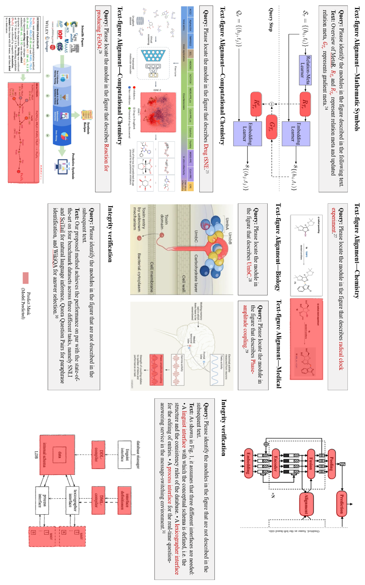

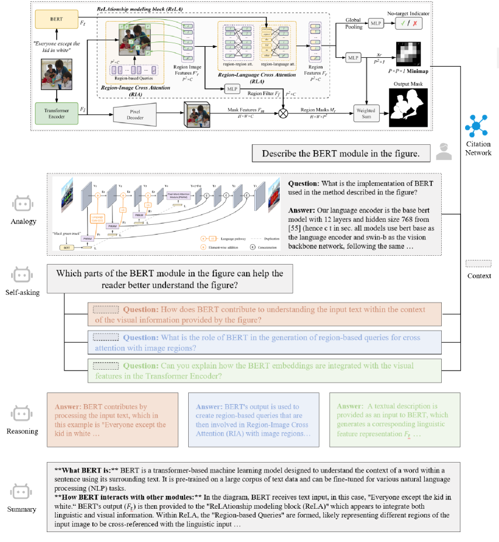

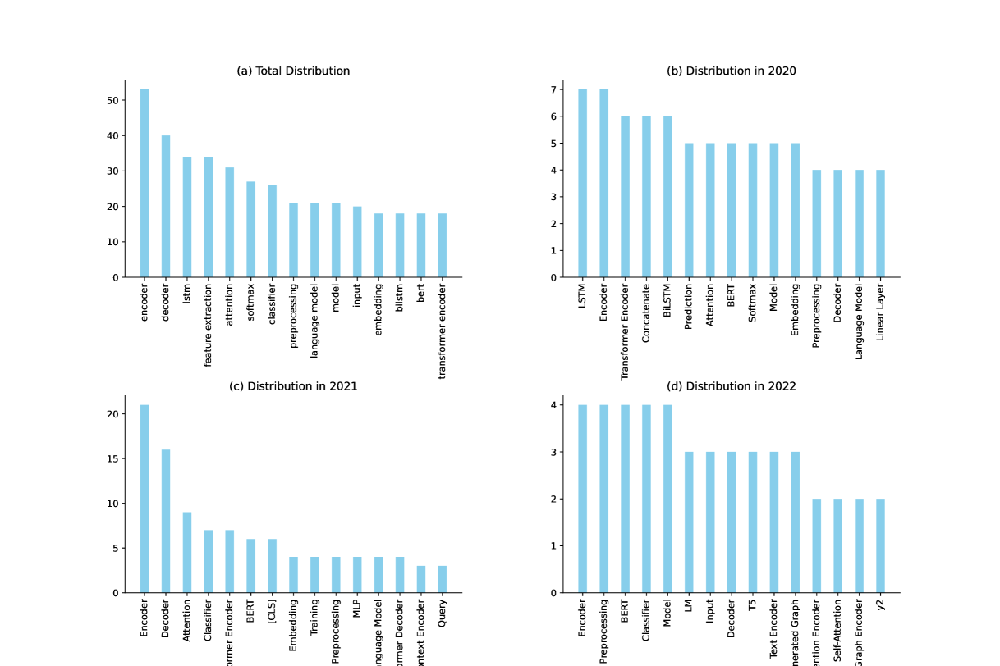

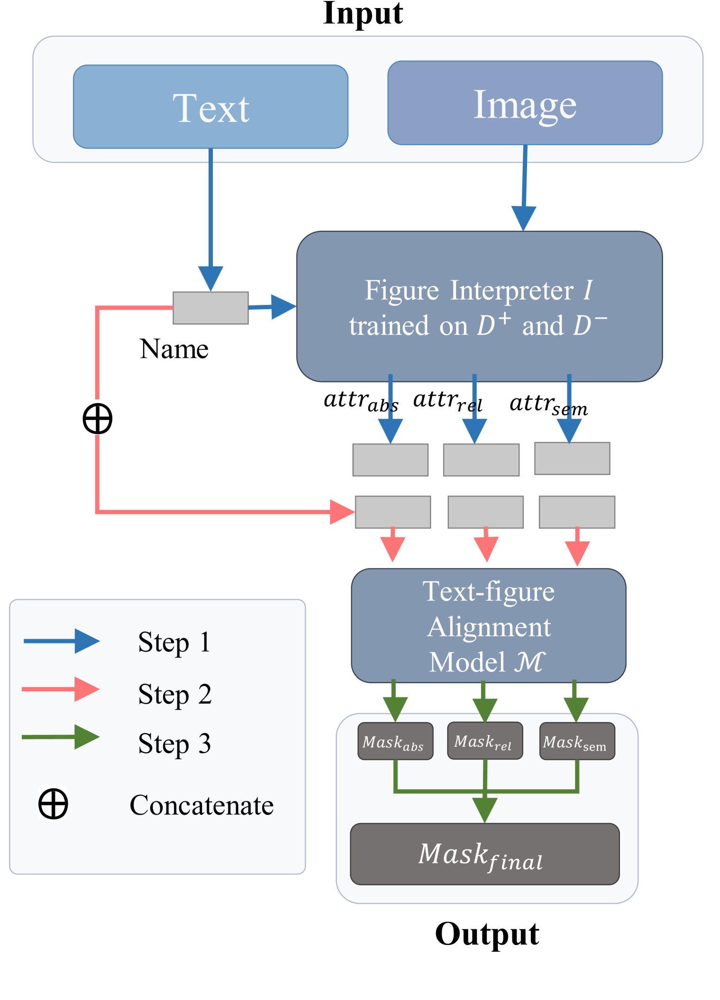

[Arxiv](https://arxiv.org/abs/2407.18626)