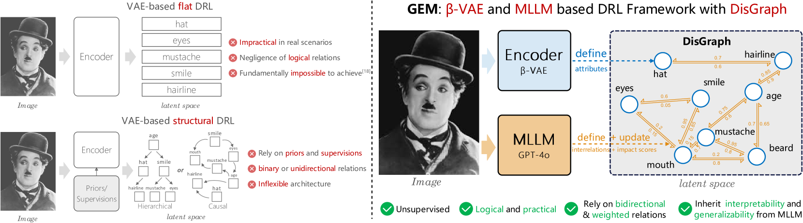
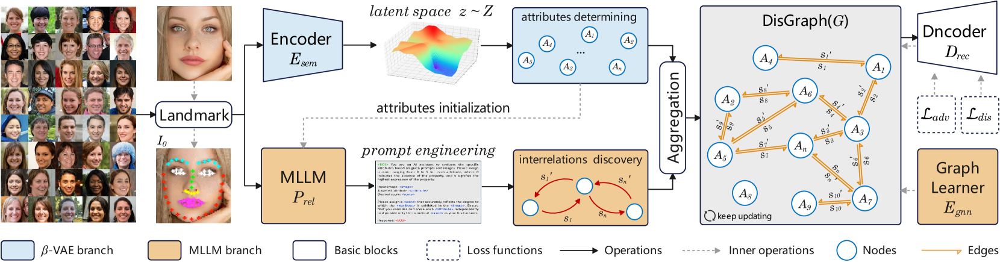
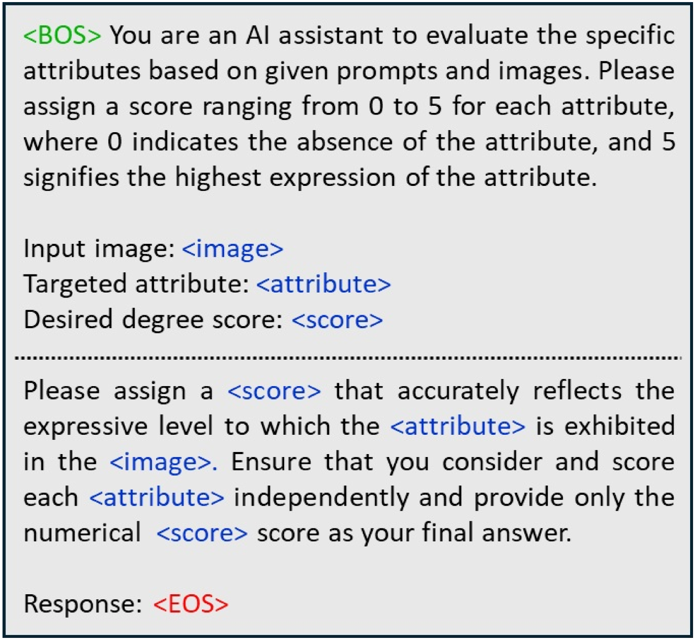
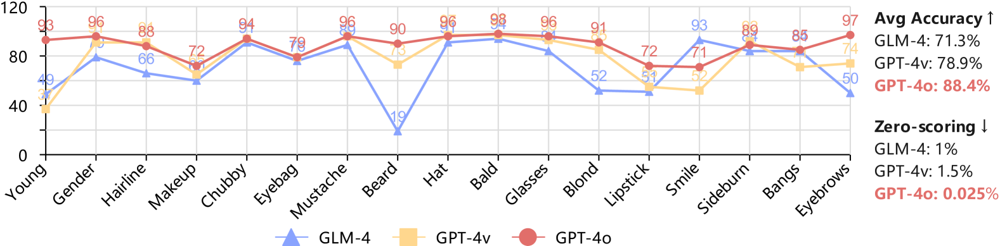
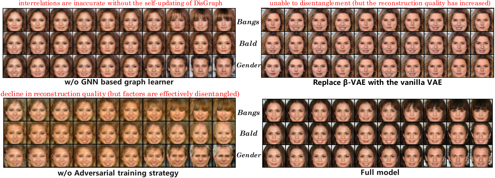

# 通过多模态大型语言模型实现基于图的无监督解耦表示学习

发布时间：2024年07月26日

`LLM理论` `人工智能` `数据分析`

> Graph-based Unsupervised Disentangled Representation Learning via Multimodal Large Language Models

# 摘要

> 解耦表示学习 (DRL) 旨在揭示并分解观察背后的潜在因素，助力数据感知与生成。然而，现有 DRL 方法常基于语义因素统计独立的假设，这在现实中往往不成立。为解决这一难题，我们提出了一种基于双向加权图的框架，以学习复杂数据中属性的分解及其相互关系。具体而言，我们采用 $β$-VAE 模块提取因素作为图的初始节点，并借助多模态大型语言模型 (MLLM) 发现并排序潜在相关性，进而更新加权边。通过融合这些模块，我们的模型实现了细粒度、实用且无监督的解耦。实验显示，该方法在解耦与重建方面表现卓越，并从 MLLMs 中继承了增强的可解释性与泛化能力。

> Disentangled representation learning (DRL) aims to identify and decompose underlying factors behind observations, thus facilitating data perception and generation. However, current DRL approaches often rely on the unrealistic assumption that semantic factors are statistically independent. In reality, these factors may exhibit correlations, which off-the-shelf solutions have yet to properly address. To tackle this challenge, we introduce a bidirectional weighted graph-based framework, to learn factorized attributes and their interrelations within complex data. Specifically, we propose a $β$-VAE based module to extract factors as the initial nodes of the graph, and leverage the multimodal large language model (MLLM) to discover and rank latent correlations, thereby updating the weighted edges. By integrating these complementary modules, our model successfully achieves fine-grained, practical and unsupervised disentanglement. Experiments demonstrate our method's superior performance in disentanglement and reconstruction. Furthermore, the model inherits enhanced interpretability and generalizability from MLLMs.

[Arxiv](https://arxiv.org/abs/2407.18999)