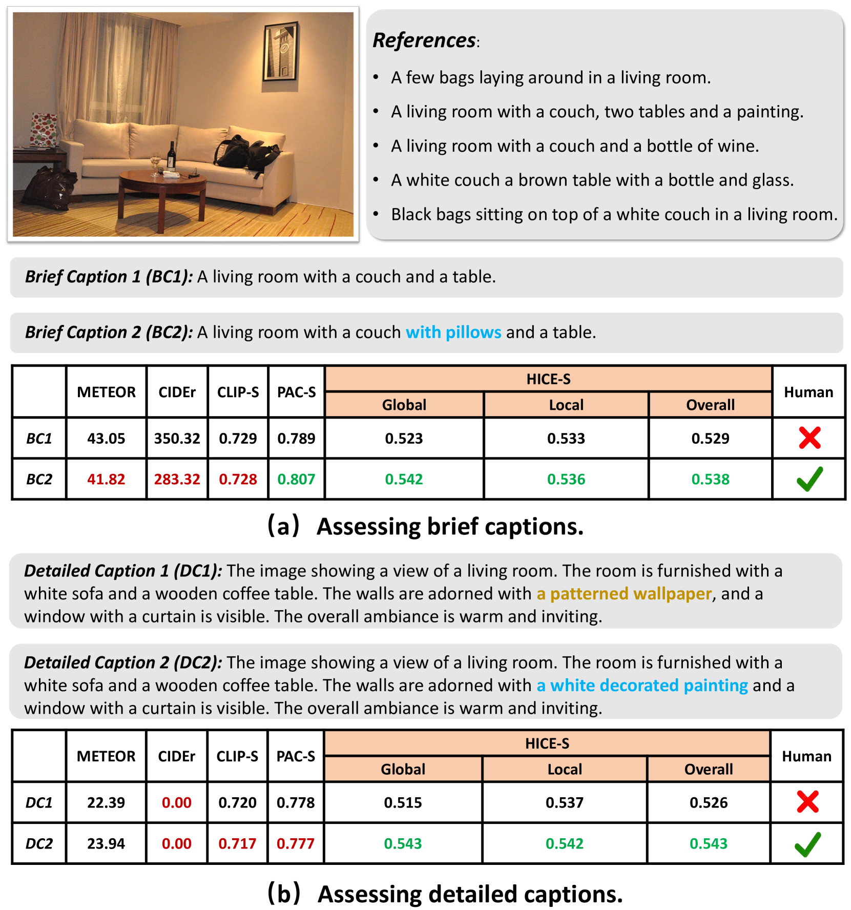
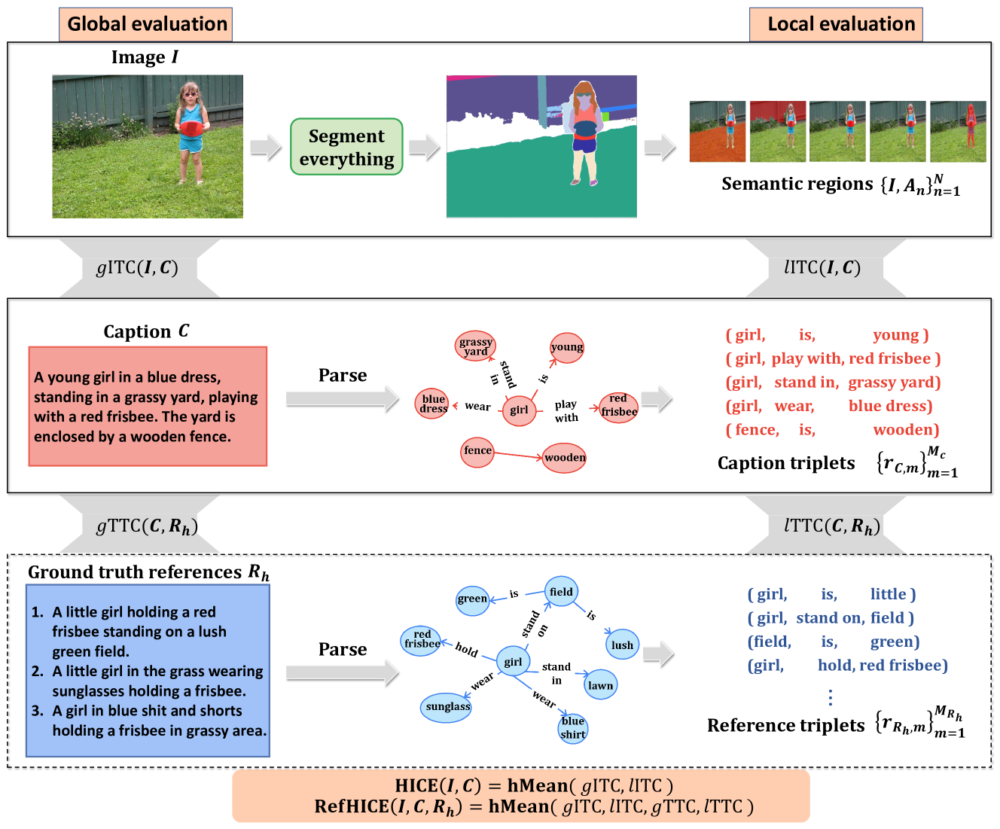
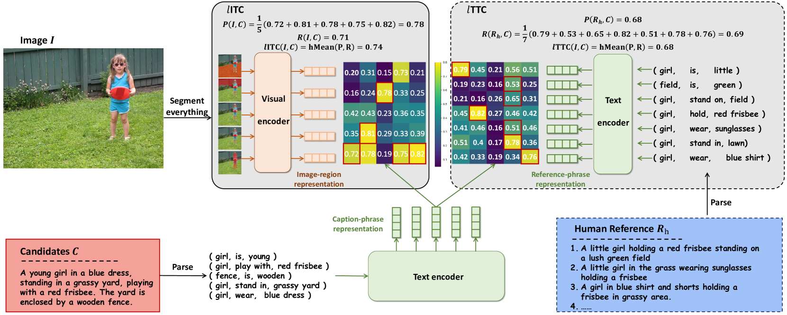
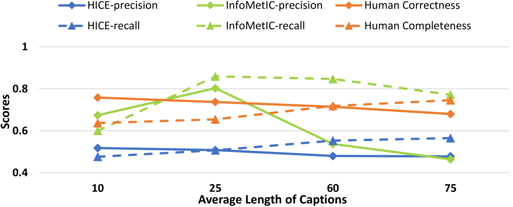
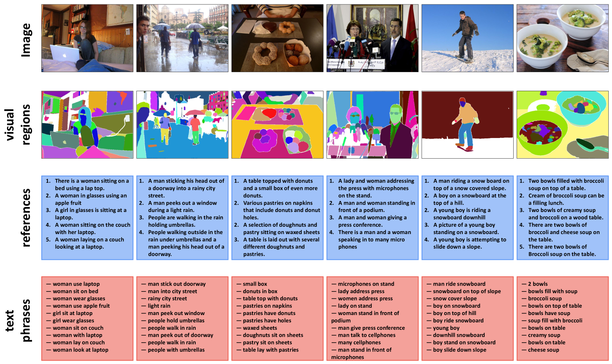

# HICEScore：一种专为图像描述评估设计的层次化评价指标

发布时间：2024年07月26日

`LLM应用` `计算机视觉` `图像处理`

> HICEScore: A Hierarchical Metric for Image Captioning Evaluation

# 摘要

> 图像描述评估指标分为基于参考和无参考两类。基于参考的方法因过度依赖有限的人工标注而难以评估富含视觉细节的描述性字幕。相反，无参考指标如CLIP通过跨模态相似性虽有效，但受限于全局兼容性，难以捕捉局部细节和小对象。为此，我们创新提出分层图像描述评估分数（HICE-S），通过识别局部视觉和文本元素，构建可解释的分层评分体系，超越了传统单尺度设计的局限。实验证明，HICE-S在多个基准测试中领先，不仅优于无参考指标CLIP-S和PAC-S，也超越了基于参考的METEOR和CIDEr。案例研究显示，HICE-S的评估过程与人类直观判断高度一致。代码已公开于https://github.com/joeyz0z/HICE。

> Image captioning evaluation metrics can be divided into two categories, reference-based metrics and reference-free metrics. However, reference-based approaches may struggle to evaluate descriptive captions with abundant visual details produced by advanced multimodal large language models, due to their heavy reliance on limited human-annotated references. In contrast, previous reference-free metrics have been proven effective via CLIP cross-modality similarity. Nonetheless, CLIP-based metrics, constrained by their solution of global image-text compatibility, often have a deficiency in detecting local textual hallucinations and are insensitive to small visual objects. Besides, their single-scale designs are unable to provide an interpretable evaluation process such as pinpointing the position of caption mistakes and identifying visual regions that have not been described. To move forward, we propose a novel reference-free metric for image captioning evaluation, dubbed Hierarchical Image Captioning Evaluation Score (HICE-S). By detecting local visual regions and textual phrases, HICE-S builds an interpretable hierarchical scoring mechanism, breaking through the barriers of the single-scale structure of existing reference-free metrics. Comprehensive experiments indicate that our proposed metric achieves the SOTA performance on several benchmarks, outperforming existing reference-free metrics like CLIP-S and PAC-S, and reference-based metrics like METEOR and CIDEr. Moreover, several case studies reveal that the assessment process of HICE-S on detailed captions closely resembles interpretable human judgments.Our code is available at https://github.com/joeyz0z/HICE.

[Arxiv](https://arxiv.org/abs/2407.18589)