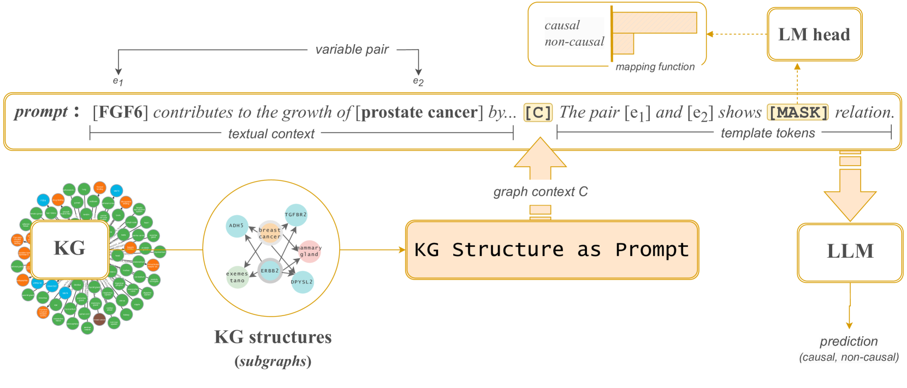
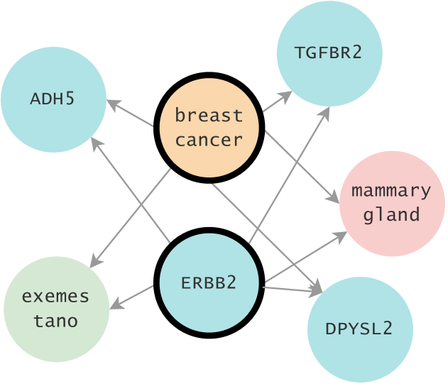
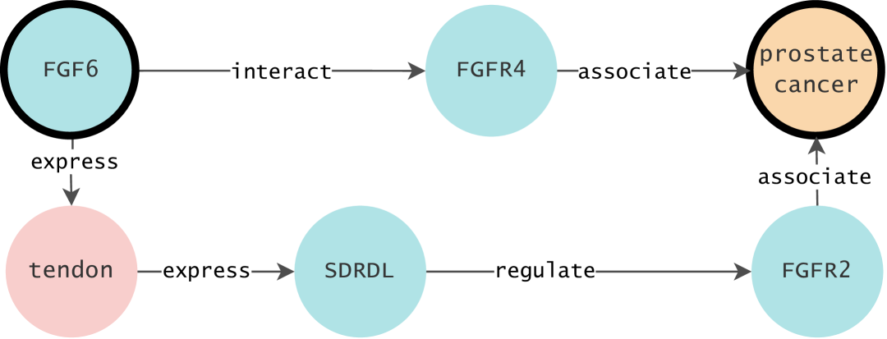

# 以知识图谱结构为提示，旨在提升小型语言模型在基于知识的因果发现任务中的表现。

发布时间：2024年07月26日

`LLM理论` `生物医学` `知识图谱`

> Knowledge Graph Structure as Prompt: Improving Small Language Models Capabilities for Knowledge-based Causal Discovery

# 摘要

> 因果发现的目标是根据观测数据推断变量间的因果关系。大型语言模型（LLM）通过分析变量的元数据而非数据本身，为解决这一问题提供了新视角，即基于知识的因果发现。本文探讨了小型语言模型（SLM，参数少于10亿）利用提示学习进行基于知识的因果发现的能力。我们创新性地提出将知识图谱的结构信息（如共同邻居和元路径）融入提示学习，以提升SLM的性能。实验证明，在少数样本条件下，我们的方法在生物医学和开放领域数据集上表现优异，超越了传统微调和多数基线方法。这表明，结合知识图谱和提示学习，SLM有望超越参数更多的LLM。相关代码和数据集已公开在GitHub上。

> Causal discovery aims to estimate causal structures among variables based on observational data. Large Language Models (LLMs) offer a fresh perspective to tackle the causal discovery problem by reasoning on the metadata associated with variables rather than their actual data values, an approach referred to as knowledge-based causal discovery. In this paper, we investigate the capabilities of Small Language Models (SLMs, defined as LLMs with fewer than 1 billion parameters) with prompt-based learning for knowledge-based causal discovery. Specifically, we present KG Structure as Prompt, a novel approach for integrating structural information from a knowledge graph, such as common neighbor nodes and metapaths, into prompt-based learning to enhance the capabilities of SLMs. Experimental results on three types of biomedical and open-domain datasets under few-shot settings demonstrate the effectiveness of our approach, surpassing most baselines and even conventional fine-tuning approaches trained on full datasets. Our findings further highlight the strong capabilities of SLMs: in combination with knowledge graphs and prompt-based learning, SLMs demonstrate the potential to surpass LLMs with larger number of parameters. Our code and datasets are available on GitHub.

[Arxiv](https://arxiv.org/abs/2407.18752)