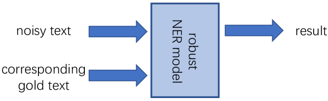
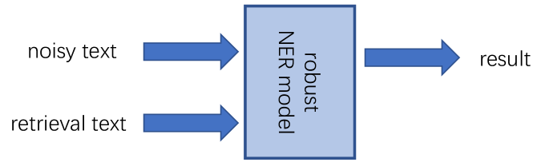
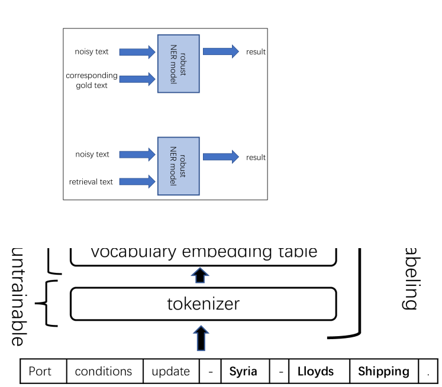
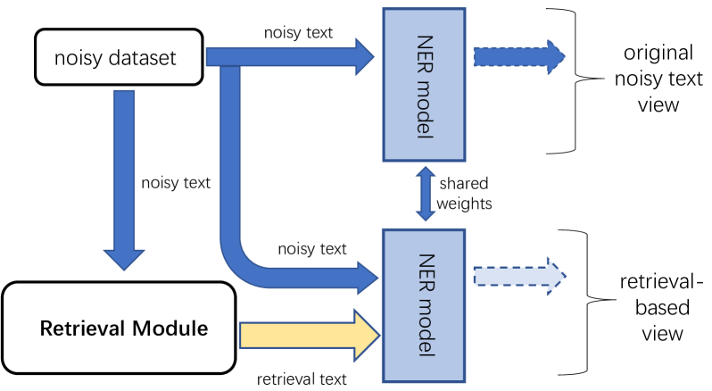

# 通过检索增强技术，从噪声数据中培养出鲁棒的命名实体识别器。

发布时间：2024年07月26日

`LLM应用` `知识库`

> Learning Robust Named Entity Recognizers From Noisy Data With Retrieval Augmentation

# 摘要

> 命名实体识别（NER）模型在处理含噪声的输入时常常表现不佳，如拼写错误或光学字符识别错误。学习一个鲁棒的NER模型颇具挑战。现有模型依赖于噪声文本及其“黄金”标准文本进行训练，这在实际应用中往往不可行。本文探讨了一种更现实的场景：仅利用噪声文本及其NER标签。我们提出从知识库中检索相关文本，以增强噪声输入的表示。设计了三种检索策略：基于词汇的稀疏检索、基于语义的密集检索和任务特定的自检索。检索后，通过连接并编码原始与检索文本，利用transformer网络的自注意力机制，提升噪声文本的上下文表示。此外，引入多视角训练框架，在推理时不依赖检索，进一步提升鲁棒性。实验结果显示，我们的检索增强模型在多种噪声环境下均取得了显著的性能提升。

> Named entity recognition (NER) models often struggle with noisy inputs, such as those with spelling mistakes or errors generated by Optical Character Recognition processes, and learning a robust NER model is challenging. Existing robust NER models utilize both noisy text and its corresponding gold text for training, which is infeasible in many real-world applications in which gold text is not available. In this paper, we consider a more realistic setting in which only noisy text and its NER labels are available. We propose to retrieve relevant text of the noisy text from a knowledge corpus and use it to enhance the representation of the original noisy input. We design three retrieval methods: sparse retrieval based on lexicon similarity, dense retrieval based on semantic similarity, and self-retrieval based on task-specific text. After retrieving relevant text, we concatenate the retrieved text with the original noisy text and encode them with a transformer network, utilizing self-attention to enhance the contextual token representations of the noisy text using the retrieved text. We further employ a multi-view training framework that improves robust NER without retrieving text during inference. Experiments show that our retrieval-augmented model achieves significant improvements in various noisy NER settings.

[Arxiv](https://arxiv.org/abs/2407.18562)