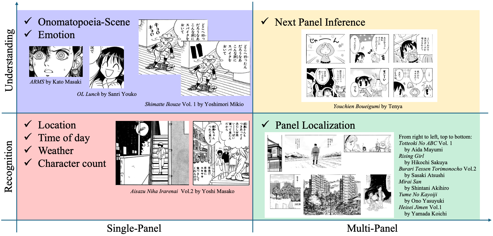
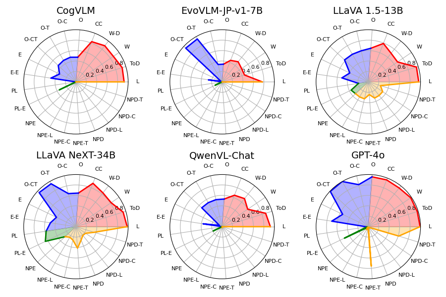

# MangaUB：专为大型多模态模型设计的漫画理解评测基准

发布时间：2024年07月26日

`LLM应用` `人工智能`

> MangaUB: A Manga Understanding Benchmark for Large Multimodal Models

# 摘要

> 漫画作为一种结合风格化绘画与文字的流行媒介，其独特性要求传统计算系统进行专门设计。然而，现代大型多模态模型（LMMs）的自适应性为更通用的解决方案带来了希望。为了深入分析LMMs在漫画理解任务中的表现并探索改进空间，我们推出了MangaUB这一创新基准。MangaUB不仅评估模型对单幅漫画内容的识别能力，还考察其对跨画面故事线的理解，从而细致剖析模型在漫画理解方面的多维能力。研究结果表明，模型在图像内容识别上表现出色，但在捕捉跨画面情感与信息流方面仍面临挑战，这为未来LMMs在漫画理解领域的研究指明了方向。

> Manga is a popular medium that combines stylized drawings and text to convey stories. As manga panels differ from natural images, computational systems traditionally had to be designed specifically for manga. Recently, the adaptive nature of modern large multimodal models (LMMs) shows possibilities for more general approaches. To provide an analysis of the current capability of LMMs for manga understanding tasks and identifying areas for their improvement, we design and evaluate MangaUB, a novel manga understanding benchmark for LMMs. MangaUB is designed to assess the recognition and understanding of content shown in a single panel as well as conveyed across multiple panels, allowing for a fine-grained analysis of a model's various capabilities required for manga understanding. Our results show strong performance on the recognition of image content, while understanding the emotion and information conveyed across multiple panels is still challenging, highlighting future work towards LMMs for manga understanding.

[Arxiv](https://arxiv.org/abs/2407.19034)