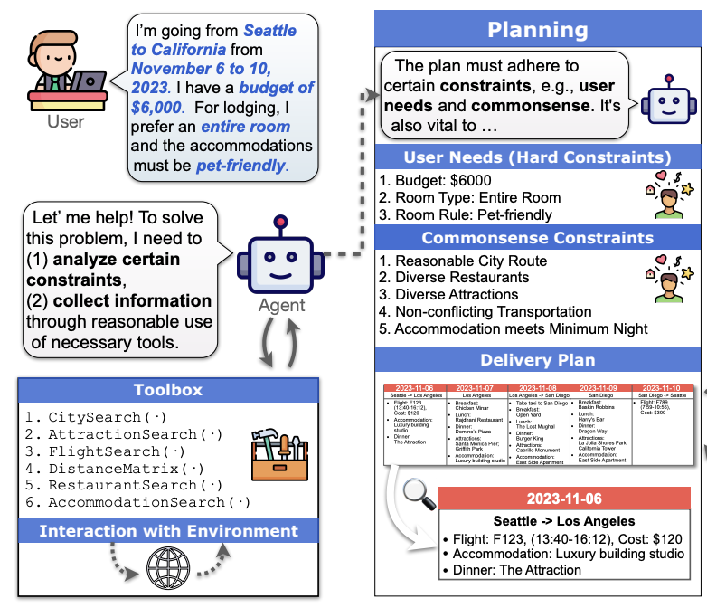
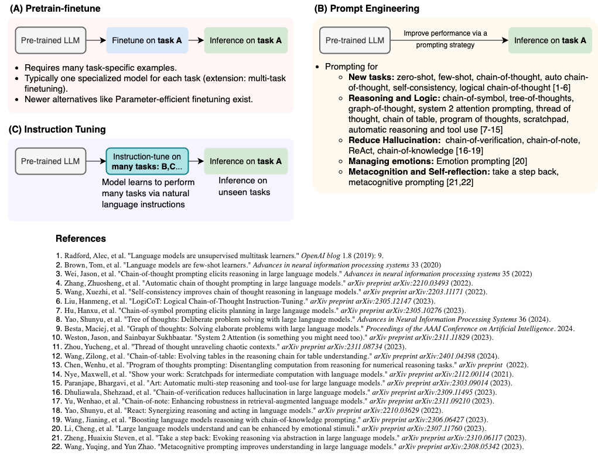
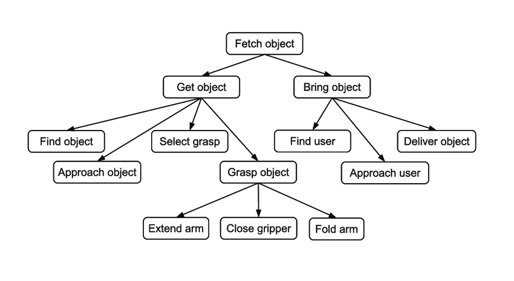
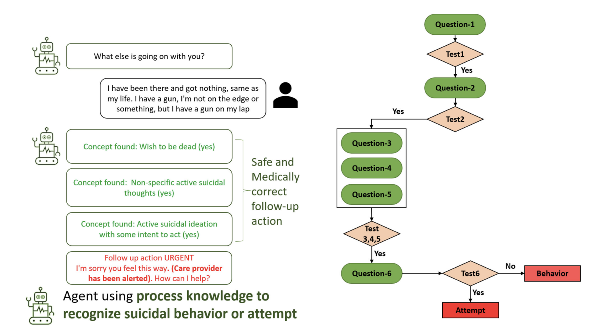
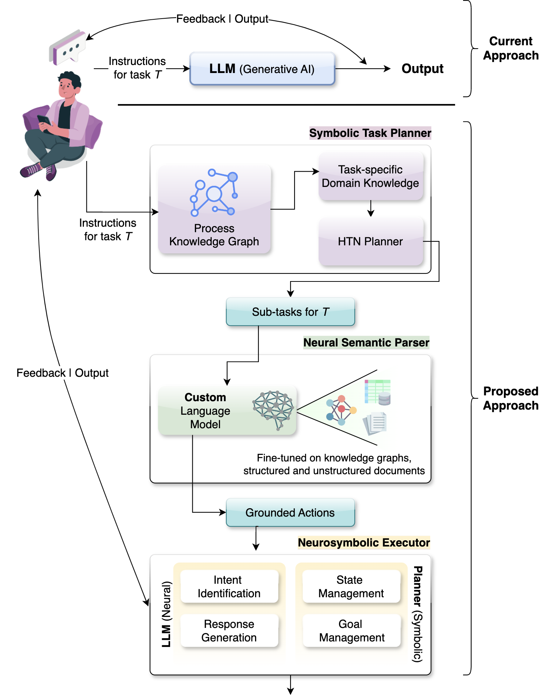

# 神经符号 AI：提升生成 AI 的可指导性

发布时间：2024年07月26日

`LLM理论` `人工智能` `创意产业`

> Neurosymbolic AI for Enhancing Instructability in Generative AI

# 摘要

> 生成式AI通过LLMs在文本、图像和音乐创作中展现了强大的指令遵循能力，这得益于指令调优技术。尽管LLMs在理解和执行指令方面取得了显著进步，但在处理复杂多步骤指令和泛化到新任务方面仍有挑战。本文探讨了神经符号AI如何为提升LLMs的可指令性提供更优路径，通过符号任务规划、神经语义解析和神经符号执行，增强任务执行的可靠性和上下文感知能力，使LLMs能更精确灵活地响应各种指令。

> Generative AI, especially via Large Language Models (LLMs), has transformed content creation across text, images, and music, showcasing capabilities in following instructions through prompting, largely facilitated by instruction tuning. Instruction tuning is a supervised fine-tuning method where LLMs are trained on datasets formatted with specific tasks and corresponding instructions. This method systematically enhances the model's ability to comprehend and execute the provided directives. Despite these advancements, LLMs still face challenges in consistently interpreting complex, multi-step instructions and generalizing them to novel tasks, which are essential for broader applicability in real-world scenarios. This article explores why neurosymbolic AI offers a better path to enhance the instructability of LLMs. We explore the use a symbolic task planner to decompose high-level instructions into structured tasks, a neural semantic parser to ground these tasks into executable actions, and a neuro-symbolic executor to implement these actions while dynamically maintaining an explicit representation of state. We also seek to show that neurosymbolic approach enhances the reliability and context-awareness of task execution, enabling LLMs to dynamically interpret and respond to a wider range of instructional contexts with greater precision and flexibility.

[Arxiv](https://arxiv.org/abs/2407.18722)