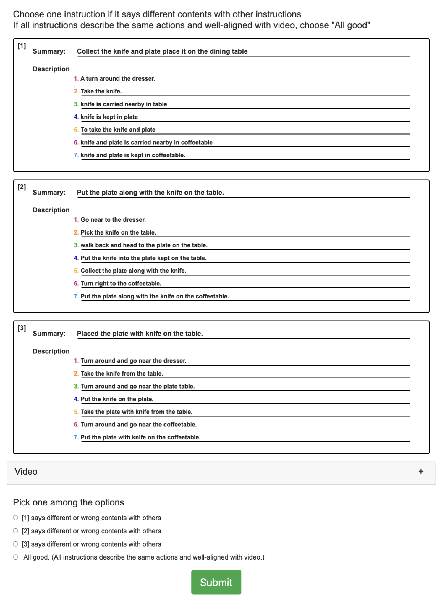
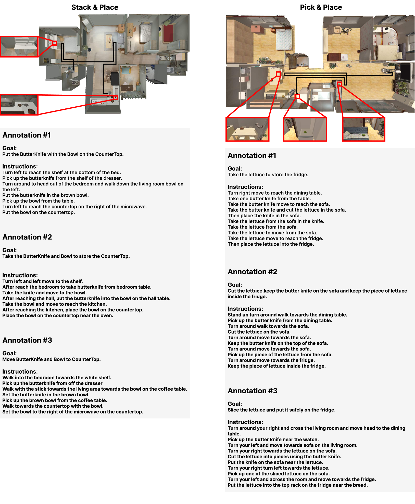

# ReALFRED：照片级真实环境中的具身指令跟随基准

发布时间：2024年07月26日

`Agent` `机器人` `智能家居`

> ReALFRED: An Embodied Instruction Following Benchmark in Photo-Realistic Environments

# 摘要

> 模拟虚拟环境虽已广泛用于训练家务机器人，但常因对象交互性有限、视觉差异大或环境尺寸小而难以直接部署。为此，我们推出ReALFRED基准，结合真实场景、对象与布局，训练机器人通过自由语言指令在大规模多房间3D场景中执行任务。我们扩展了ALFRED基准，缩小视觉差距，增大环境空间。分析显示，现有方法在ReALFRED上表现欠佳，激励社区在更真实环境中创新。代码与数据已公开。

> Simulated virtual environments have been widely used to learn robotic agents that perform daily household tasks. These environments encourage research progress by far, but often provide limited object interactability, visual appearance different from real-world environments, or relatively smaller environment sizes. This prevents the learned models in the virtual scenes from being readily deployable. To bridge the gap between these learning environments and deploying (i.e., real) environments, we propose the ReALFRED benchmark that employs real-world scenes, objects, and room layouts to learn agents to complete household tasks by understanding free-form language instructions and interacting with objects in large, multi-room and 3D-captured scenes. Specifically, we extend the ALFRED benchmark with updates for larger environmental spaces with smaller visual domain gaps. With ReALFRED, we analyze previously crafted methods for the ALFRED benchmark and observe that they consistently yield lower performance in all metrics, encouraging the community to develop methods in more realistic environments. Our code and data are publicly available.

[Arxiv](https://arxiv.org/abs/2407.18550)