# 当前正确，随后错误：探讨偏好变化中的非平稳直接偏好优化

发布时间：2024年07月26日

`LLM理论` `人工智能` `机器学习`

> Right Now, Wrong Then: Non-Stationary Direct Preference Optimization under Preference Drift

# 摘要

> 强化学习从人类反馈（RLHF）确保大型语言模型（LLM）与人类偏好一致，但这些偏好常因外部因素而变化。当前算法未考虑时间偏好变化，可能导致模型错位。为此，我们提出非平稳直接偏好优化（NS-DPO），通过动态模型和指数加权，更关注近期数据，确保模型适应偏好变化。理论分析和实验证明，NS-DPO在偏好变化场景中表现出色，既保持稳健性，又不牺牲平稳情况下的性能。

> Reinforcement learning from human feedback (RLHF) aligns Large Language Models (LLMs) with human preferences. However, these preferences can often change over time due to external factors (e.g. environment change and societal influence). Consequently, what was wrong then might be right now. Current preference optimization algorithms do not account for temporal preference drift in their modeling, which can lead to severe misalignment. To address this limitation, we use a Dynamic Bradley-Terry model that models preferences via time-dependent reward functions, and propose Non-Stationary Direct Preference Optimisation (NS-DPO). By introducing a discount parameter in the loss function, NS-DPO applies exponential weighting, which proportionally focuses learning on more time-relevant datapoints. We theoretically analyse the convergence of NS-DPO in the offline setting, providing upper bounds on the estimation error caused by non-stationary preferences. Finally, we demonstrate the effectiveness of NS-DPO1 for fine-tuning LLMs in scenarios with drifting preferences. By simulating preference drift using renowned reward models and modifying popular LLM datasets accordingly, we show that NS-DPO fine-tuned LLMs remain robust under non-stationarity, significantly outperforming baseline algorithms that ignore temporal preference changes, without sacrificing performance in stationary cases.

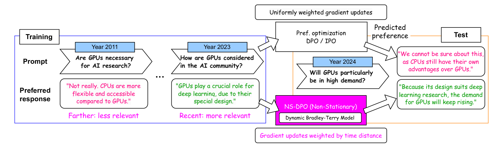

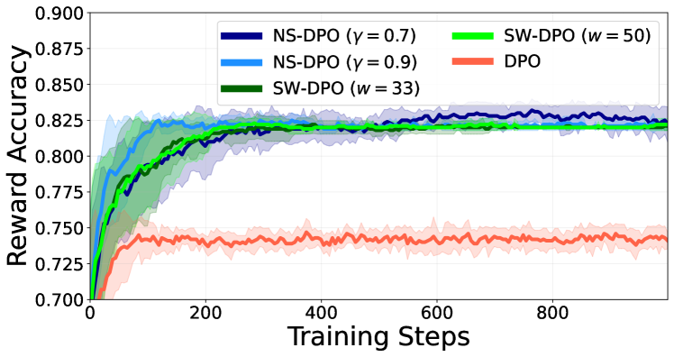

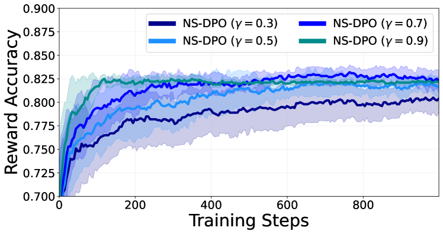

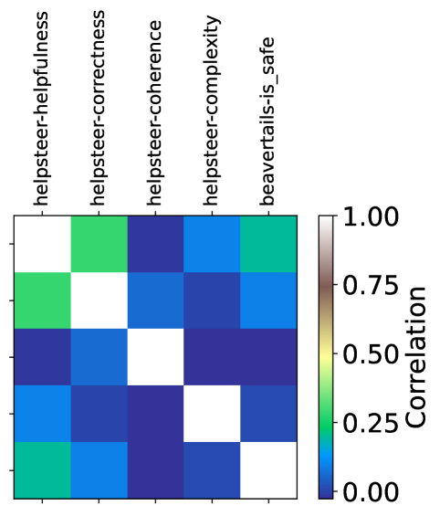

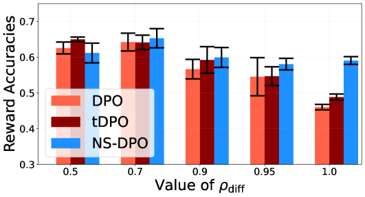

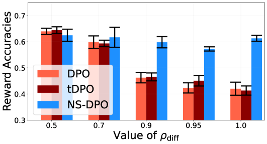

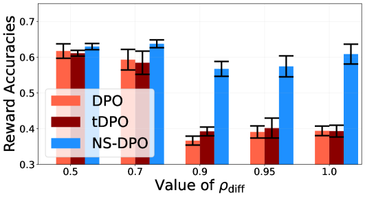

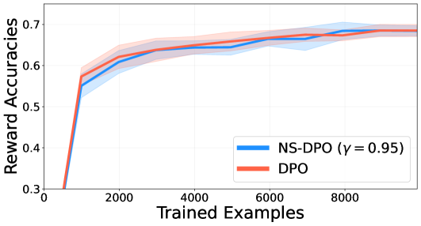

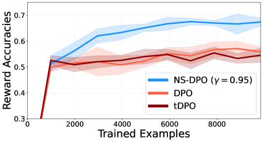

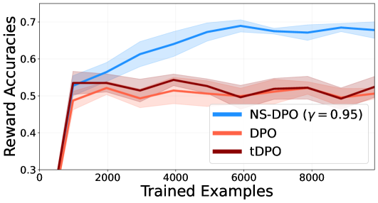

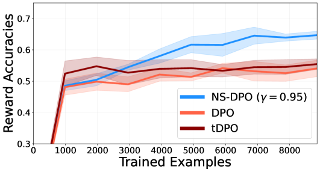

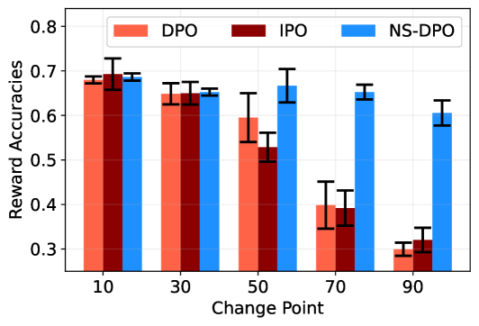

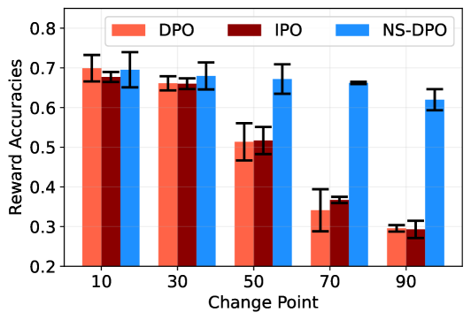

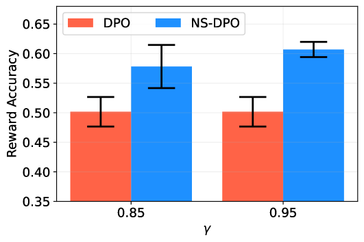

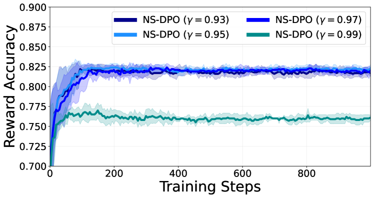

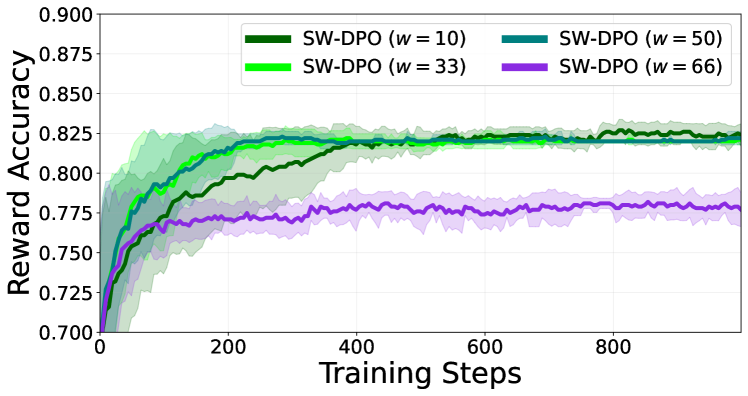

[Arxiv](https://arxiv.org/abs/2407.18676)