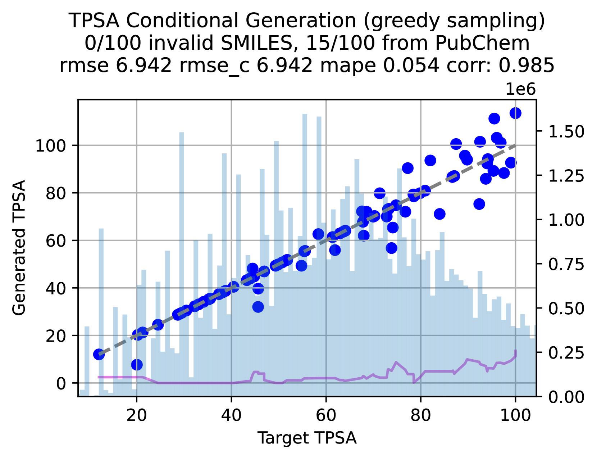

# 利用大型语言模型进行小分子优化

发布时间：2024年07月26日

`LLM应用`

> Small Molecule Optimization with Large Language Models

# 摘要

> 大型语言模型的最新进展为分子药物设计带来了创新。我们推出了Chemlactica和Chemma，这两款模型在包含110M分子及其计算属性的40B令牌语料库上进行了微调，展现出在生成特定属性分子和预测新分子特性方面的强大能力。我们还开发了一种新型优化算法，该算法结合遗传算法、拒绝采样和提示优化，能够在有限访问预言机的情况下优化分子属性。该算法在多个分子优化基准测试中表现卓越，尤其在实用分子优化上比以往方法提升了8%。我们已公开发布相关训练语料库、语言模型及优化算法。

> Recent advancements in large language models have opened new possibilities for generative molecular drug design. We present Chemlactica and Chemma, two language models fine-tuned on a novel corpus of 110M molecules with computed properties, totaling 40B tokens. These models demonstrate strong performance in generating molecules with specified properties and predicting new molecular characteristics from limited samples. We introduce a novel optimization algorithm that leverages our language models to optimize molecules for arbitrary properties given limited access to a black box oracle. Our approach combines ideas from genetic algorithms, rejection sampling, and prompt optimization. It achieves state-of-the-art performance on multiple molecular optimization benchmarks, including an 8% improvement on Practical Molecular Optimization compared to previous methods. We publicly release the training corpus, the language models and the optimization algorithm.

[Arxiv](https://arxiv.org/abs/2407.18897)