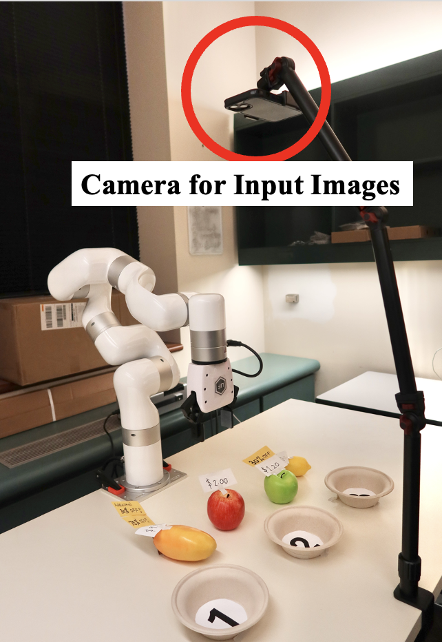
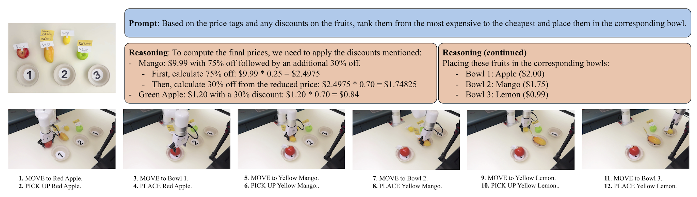
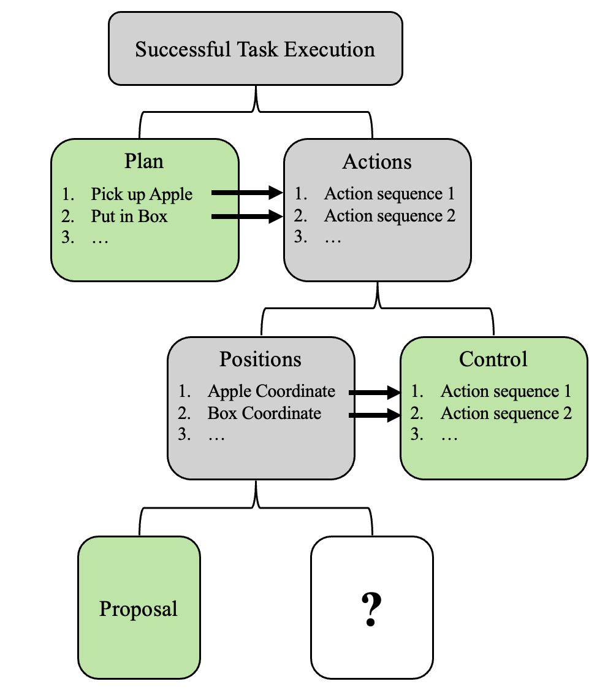

# 借助视觉-语言模型，我们能在零-shot 场景下解决机器人难题。

发布时间：2024年07月26日

`Agent` `机器人` `人工智能`

> Solving Robotics Problems in Zero-Shot with Vision-Language Models

# 摘要

> 我们推出了Wonderful Team，这是一个多智能体视觉LLM框架，专为零-shot环境下的机器人问题解决而设计。在这个框架中，我们向VLLM提供新环境的图像和任务描述，让它输出完成任务所需的动作序列。尽管先前的研究多集中在对某些环节进行微调，但得益于VLLM能力的最新进展，许多任务可能不再需要这种微调。我们的研究表明，通过精心设计，一个现成的VLLM能够全面处理机器人任务，从高级规划到低级执行。Wonderful Team利用多智能体LLM的最新技术，通过智能体层次结构分配任务，实现自我纠正，并有效解决长期任务。在VIMABench和真实环境中的广泛实验证明，该系统能以零-shot方式应对多种机器人任务，包括操作、视觉目标达成和视觉推理。这些成果突显了一个重要观点：视觉-语言模型的发展迅猛，应成为未来机器人问题解决方案的核心。

> We introduce Wonderful Team, a multi-agent visual LLM (VLLM) framework for solving robotics problems in the zero-shot regime. By zero-shot we mean that, for a novel environment, we feed a VLLM an image of the robot's environment and a description of the task, and have the VLLM output the sequence of actions necessary for the robot to complete the task. Prior work on VLLMs in robotics has largely focused on settings where some part of the pipeline is fine-tuned, such as tuning an LLM on robot data or training a separate vision encoder for perception and action generation. Surprisingly, due to recent advances in the capabilities of VLLMs, this type of fine-tuning may no longer be necessary for many tasks. In this work, we show that with careful engineering, we can prompt a single off-the-shelf VLLM to handle all aspects of a robotics task, from high-level planning to low-level location-extraction and action-execution. Wonderful Team builds on recent advances in multi-agent LLMs to partition tasks across an agent hierarchy, making it self-corrective and able to effectively partition and solve even long-horizon tasks. Extensive experiments on VIMABench and real-world robotic environments demonstrate the system's capability to handle a variety of robotic tasks, including manipulation, visual goal-reaching, and visual reasoning, all in a zero-shot manner. These results underscore a key point: vision-language models have progressed rapidly in the past year, and should strongly be considered as a backbone for robotics problems going forward.

[Arxiv](https://arxiv.org/abs/2407.19094)