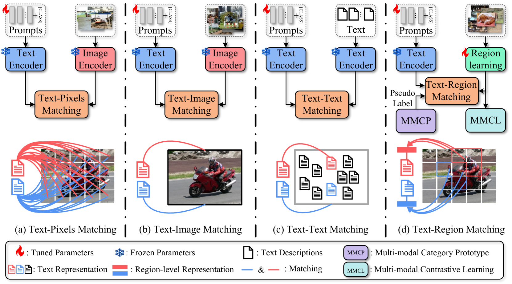
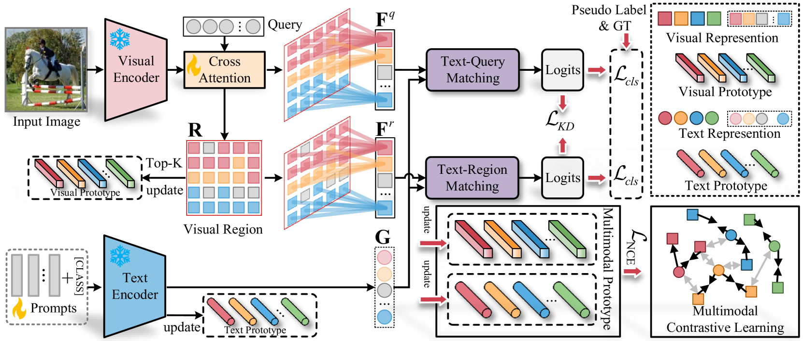
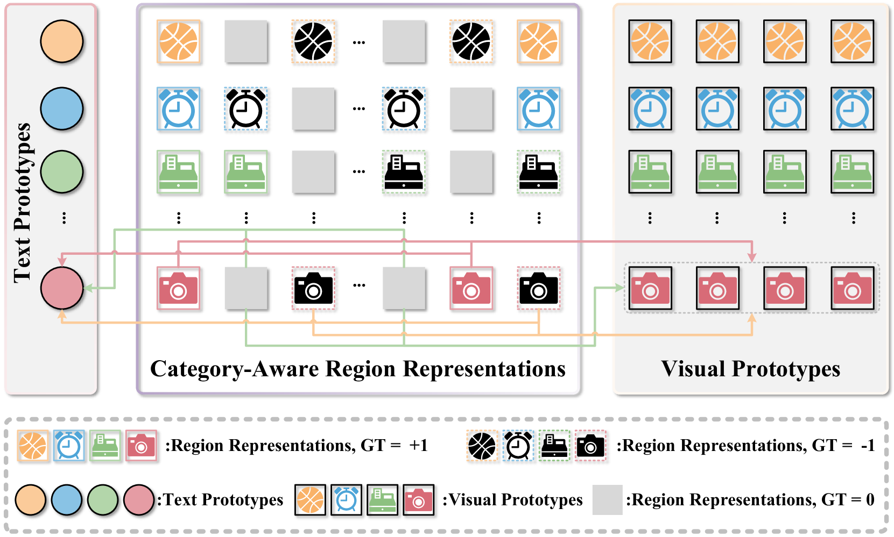
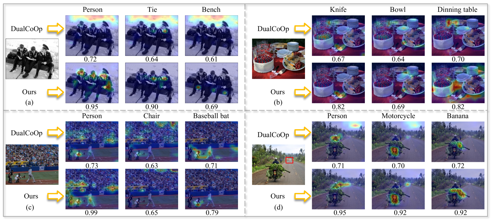

# 针对多标签图像识别中的标签缺失问题，文本-区域匹配技术提供了一种解决方案。

发布时间：2024年07月26日

`LLM应用` `计算机视觉` `机器学习`

> Text-Region Matching for Multi-Label Image Recognition with Missing Labels

# 摘要

> 近期，大规模视觉语言预训练模型在多项下游任务中表现卓越。受此启发，针对多标签图像识别中标签缺失问题，我们利用VLP提示调优技术进行了前沿探索。然而，由于多标签图像中存在复杂的语义差异和标签缺失，现有方法往往难以有效匹配文本与视觉特征。为此，我们提出TRM-ML方法，通过优化多标签提示调优，实现更精准的跨模态匹配。与传统方法不同，我们聚焦于类别感知区域信息，而非全局图像或像素，从而在一对一匹配中缩小语义鸿沟。同时，我们引入多模态对比学习，进一步缩小模态间语义差异，并构建类内与类间关系。针对标签缺失问题，我们设计了多模态类别原型，利用类内与类间语义关系推断未知标签，辅助生成伪标签。实验结果显示，我们的框架在多个基准数据集上均显著超越现有技术。相关代码已公开发布。

> Recently, large-scale visual language pre-trained (VLP) models have demonstrated impressive performance across various downstream tasks. Motivated by these advancements, pioneering efforts have emerged in multi-label image recognition with missing labels, leveraging VLP prompt-tuning technology. However, they usually cannot match text and vision features well, due to complicated semantics gaps and missing labels in a multi-label image. To tackle this challenge, we propose \textbf{T}ext-\textbf{R}egion \textbf{M}atching for optimizing \textbf{M}ulti-\textbf{L}abel prompt tuning, namely TRM-ML, a novel method for enhancing meaningful cross-modal matching. Compared to existing methods, we advocate exploring the information of category-aware regions rather than the entire image or pixels, which contributes to bridging the semantic gap between textual and visual representations in a one-to-one matching manner. Concurrently, we further introduce multimodal contrastive learning to narrow the semantic gap between textual and visual modalities and establish intra-class and inter-class relationships. Additionally, to deal with missing labels, we propose a multimodal category prototype that leverages intra- and inter-category semantic relationships to estimate unknown labels, facilitating pseudo-label generation. Extensive experiments on the MS-COCO, PASCAL VOC, Visual Genome, NUS-WIDE, and CUB-200-211 benchmark datasets demonstrate that our proposed framework outperforms the state-of-the-art methods by a significant margin. Our code is available here\href{https://github.com/yu-gi-oh-leilei/TRM-ML}{\raisebox{-1pt}{\faGithub}}.

[Arxiv](https://arxiv.org/abs/2407.18520)