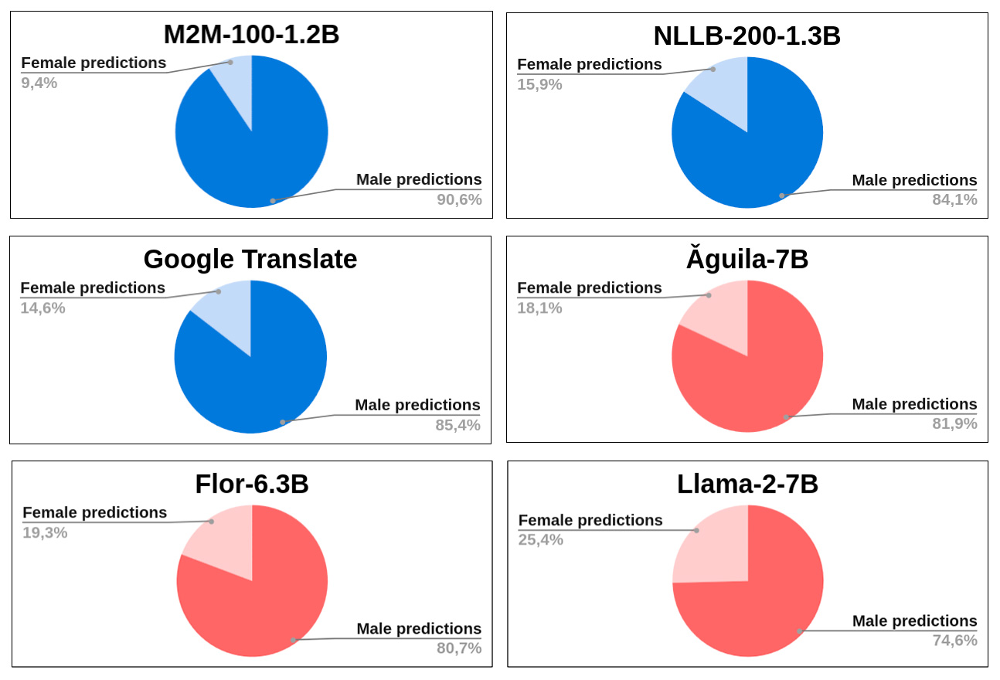

# 提示的力量：利用大型语言模型，我们致力于评估并缓解机器翻译中的性别偏见。

发布时间：2024年07月26日

`LLM应用` `机器翻译` `性别研究`

> The power of Prompts: Evaluating and Mitigating Gender Bias in MT with LLMs

# 摘要

> 本文通过 LLM 视角探讨机器翻译中的性别偏见，利用四个常用测试集评估了多种基础 LLM 在英译加泰罗尼亚语和西班牙语时的翻译质量和性别偏见。研究发现，所有模型均存在性别偏见，且基础 LLM 偏见程度高于 NMT 模型。为减少偏见，我们探索了指令调整 LLM 的提示工程技术，发现特定提示结构在 WinoMT 数据集上能减少高达 12% 的性别偏见，显著缩小了 LLM 与 NMT 系统间的性别偏见差距。

> This paper studies gender bias in machine translation through the lens of Large Language Models (LLMs). Four widely-used test sets are employed to benchmark various base LLMs, comparing their translation quality and gender bias against state-of-the-art Neural Machine Translation (NMT) models for English to Catalan (En $\rightarrow$ Ca) and English to Spanish (En $\rightarrow$ Es) translation directions. Our findings reveal pervasive gender bias across all models, with base LLMs exhibiting a higher degree of bias compared to NMT models. To combat this bias, we explore prompting engineering techniques applied to an instruction-tuned LLM. We identify a prompt structure that significantly reduces gender bias by up to 12% on the WinoMT evaluation dataset compared to more straightforward prompts. These results significantly reduce the gender bias accuracy gap between LLMs and traditional NMT systems.

[Arxiv](https://arxiv.org/abs/2407.18786)