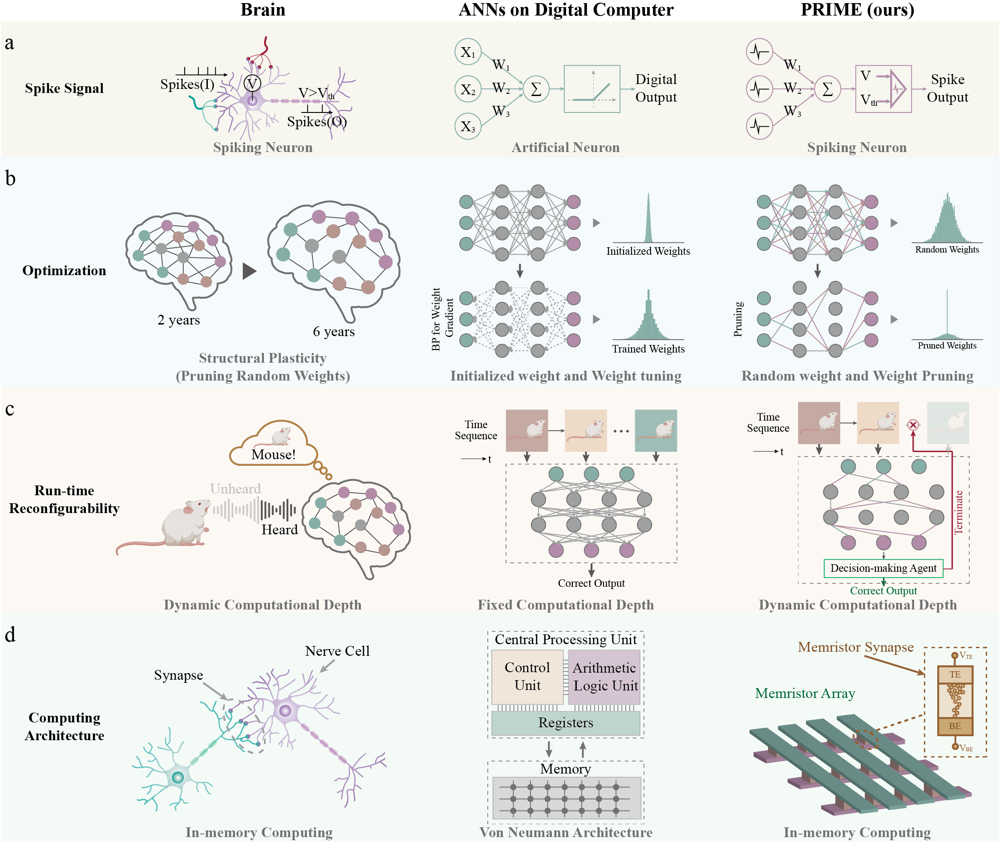
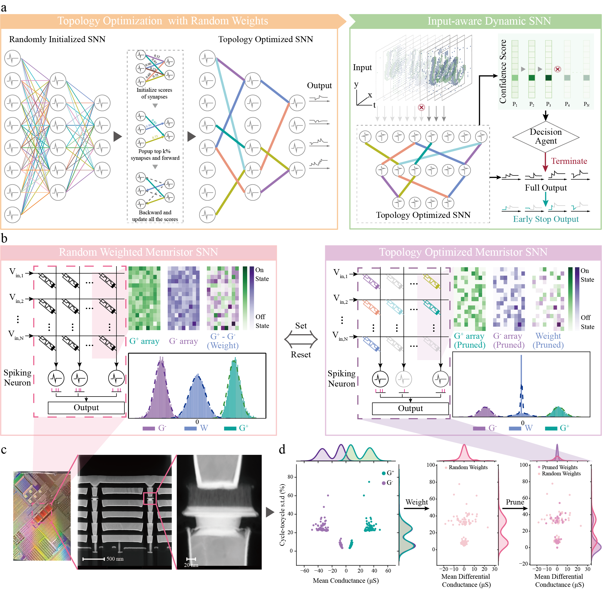
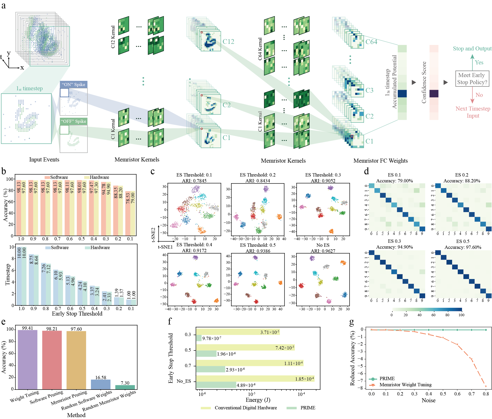
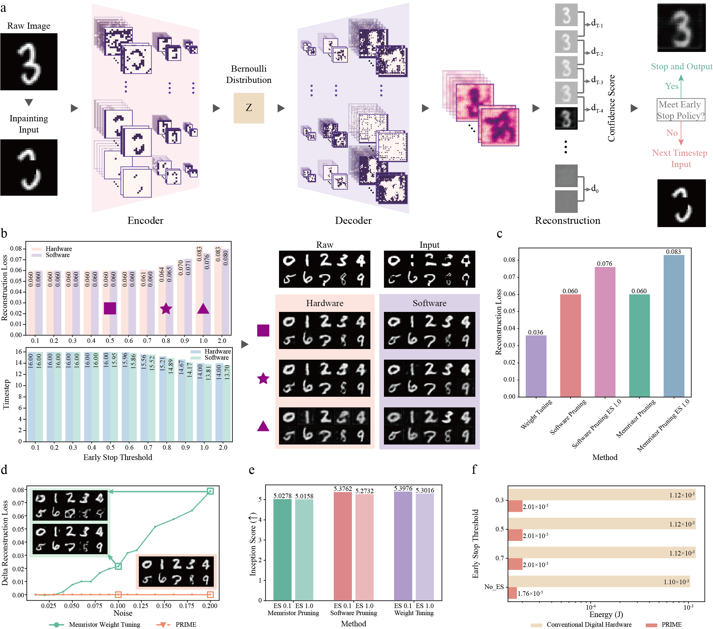
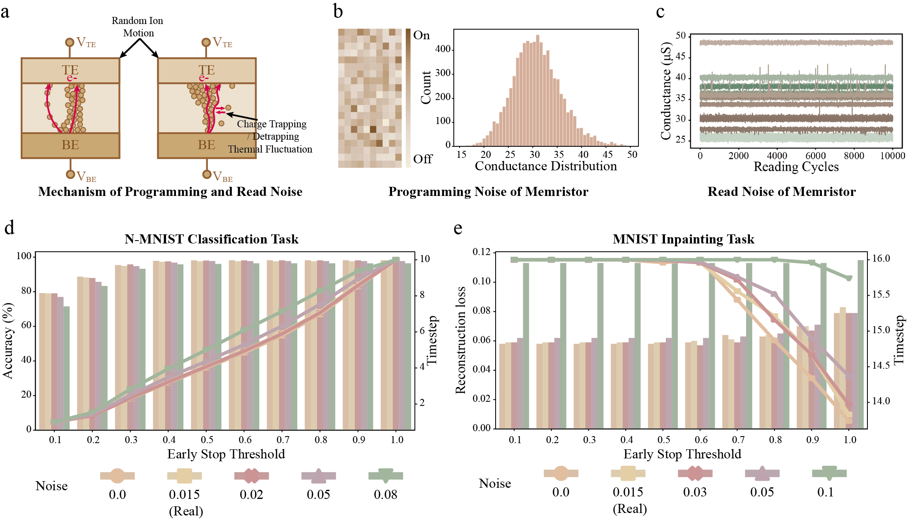

# 针对输入感知的动态脉冲神经网络，进行随机忆阻器的拓扑优化。

发布时间：2024年07月26日

`LLM理论` `能源效率` `神经形态计算`

> Topology Optimization of Random Memristors for Input-Aware Dynamic SNN

# 摘要

> 机器学习领域正迎来前所未有的发展，大型语言模型和世界模拟器等人工神经网络在数字计算机上的应用日益广泛。然而，这些系统在能源效率和对不同难度输入的适应性方面仍难以与人类大脑匹敌。为此，我们提出了PRIME优化方案，通过模拟大脑的脉冲机制和结构可塑性，优化神经网络的拓扑结构，实现运行时的动态调整，并利用忆阻器内存计算缓解架构瓶颈。实验结果表明，PRIME在保持性能的同时，大幅提升了能源效率，并显著减少了计算负载，展现出对随机噪声的鲁棒性。这一软硬件协同设计为未来类脑神经形态计算的发展奠定了基础。

> There is unprecedented development in machine learning, exemplified by recent large language models and world simulators, which are artificial neural networks running on digital computers. However, they still cannot parallel human brains in terms of energy efficiency and the streamlined adaptability to inputs of different difficulties, due to differences in signal representation, optimization, run-time reconfigurability, and hardware architecture. To address these fundamental challenges, we introduce pruning optimization for input-aware dynamic memristive spiking neural network (PRIME). Signal representation-wise, PRIME employs leaky integrate-and-fire neurons to emulate the brain's inherent spiking mechanism. Drawing inspiration from the brain's structural plasticity, PRIME optimizes the topology of a random memristive spiking neural network without expensive memristor conductance fine-tuning. For runtime reconfigurability, inspired by the brain's dynamic adjustment of computational depth, PRIME employs an input-aware dynamic early stop policy to minimize latency during inference, thereby boosting energy efficiency without compromising performance. Architecture-wise, PRIME leverages memristive in-memory computing, mirroring the brain and mitigating the von Neumann bottleneck. We validated our system using a 40 nm 256 Kb memristor-based in-memory computing macro on neuromorphic image classification and image inpainting. Our results demonstrate the classification accuracy and Inception Score are comparable to the software baseline, while achieving maximal 62.50-fold improvements in energy efficiency, and maximal 77.0% computational load savings. The system also exhibits robustness against stochastic synaptic noise of analogue memristors. Our software-hardware co-designed model paves the way to future brain-inspired neuromorphic computing with brain-like energy efficiency and adaptivity.

[Arxiv](https://arxiv.org/abs/2407.18625)