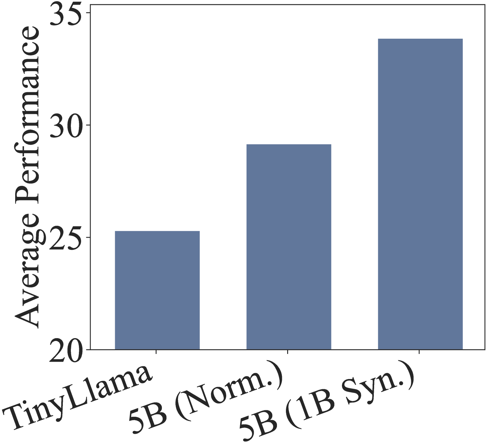
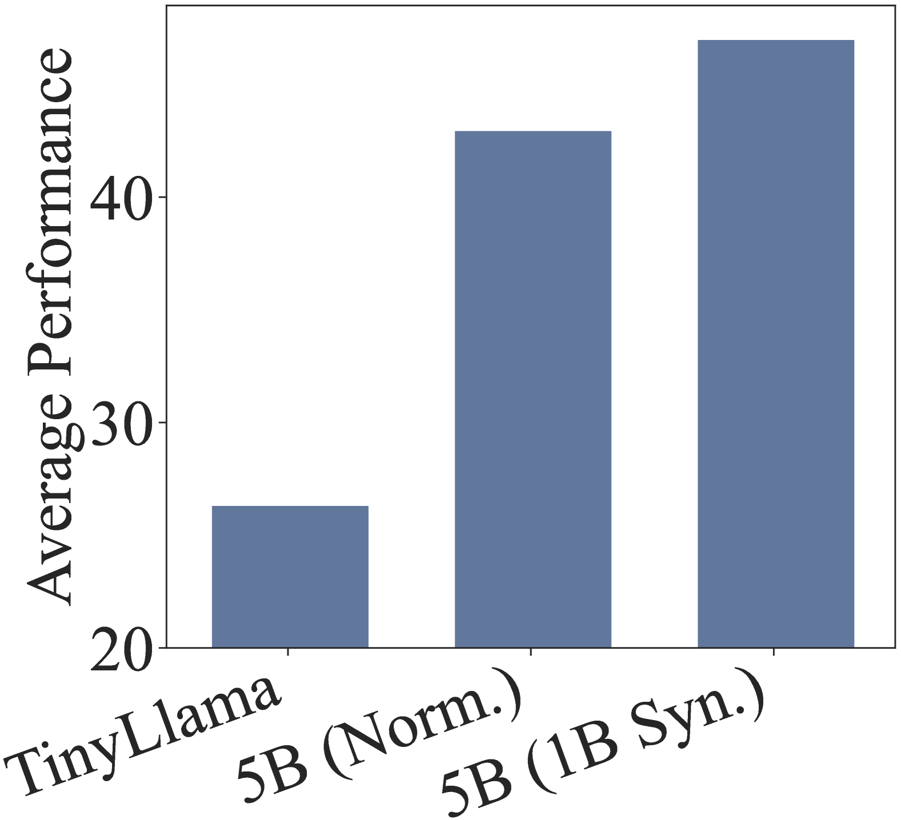
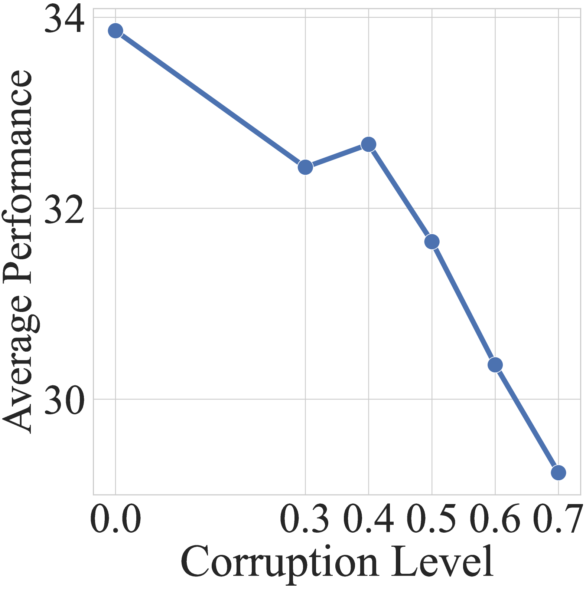
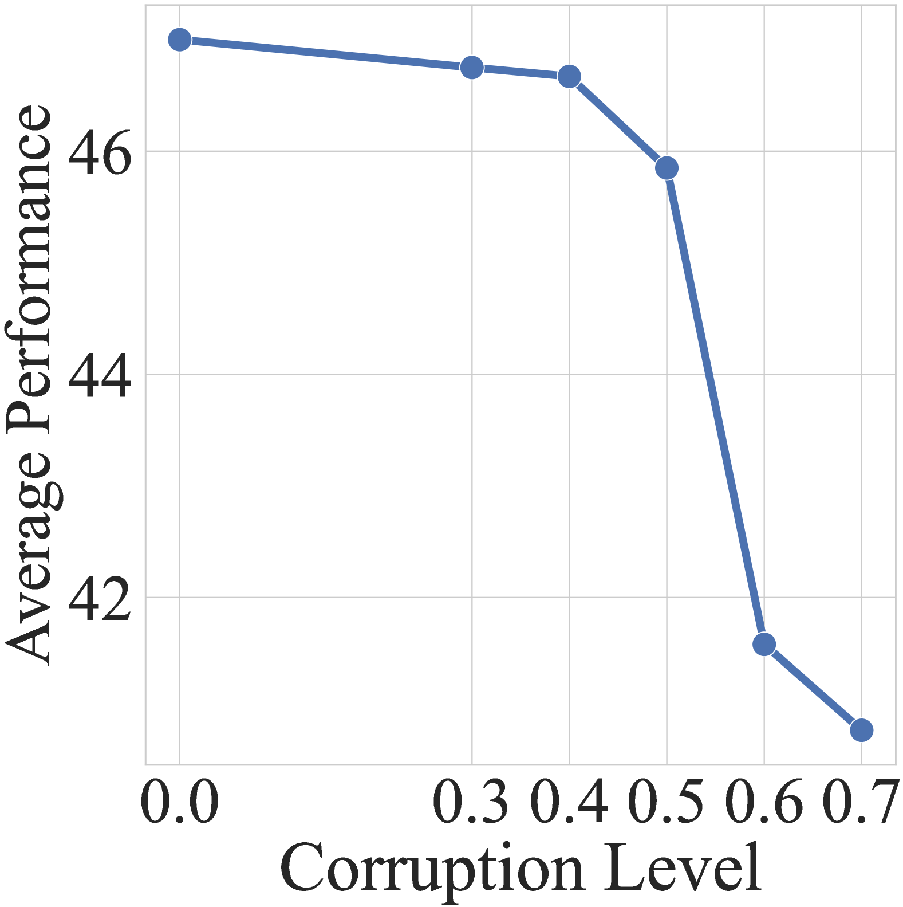
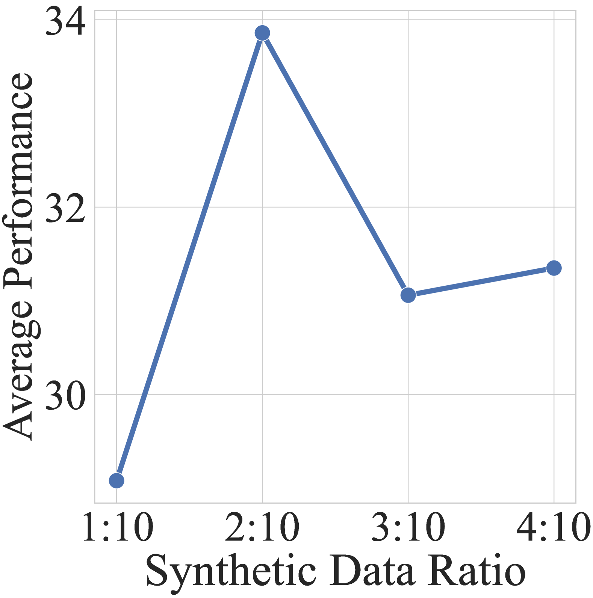
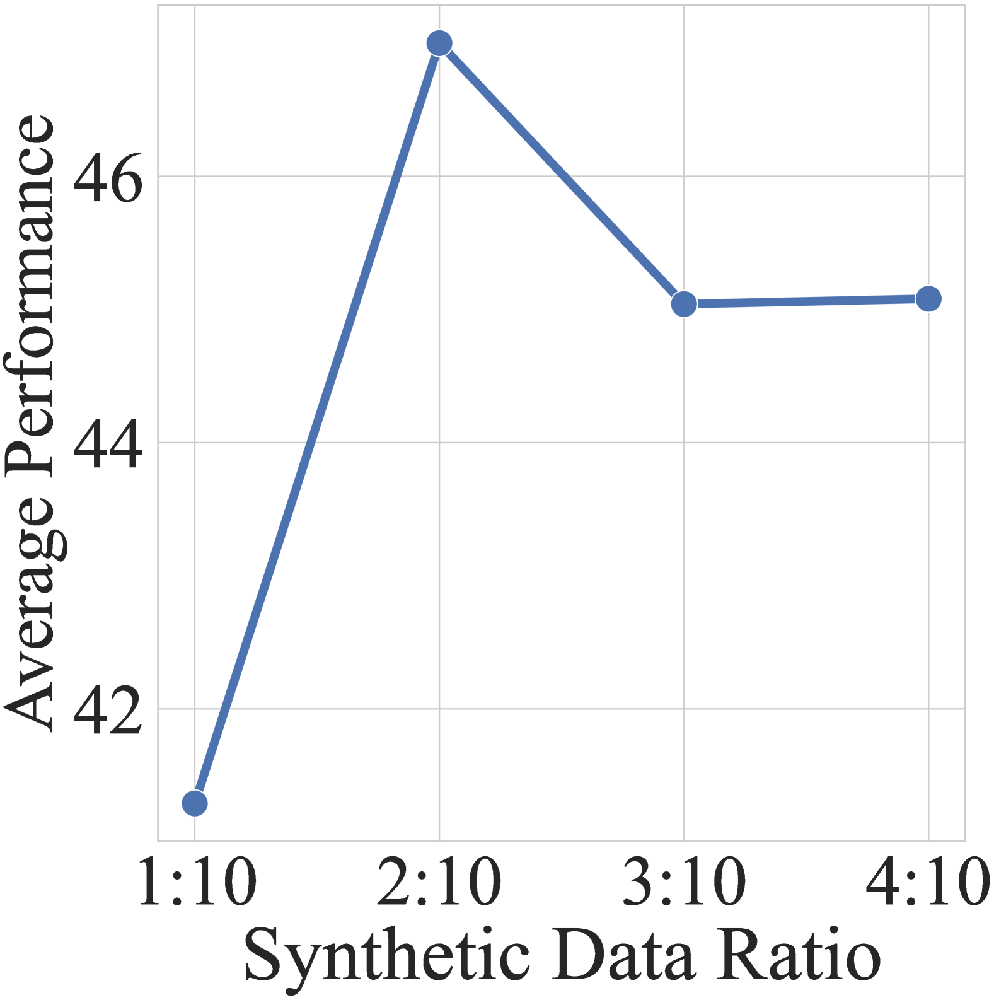
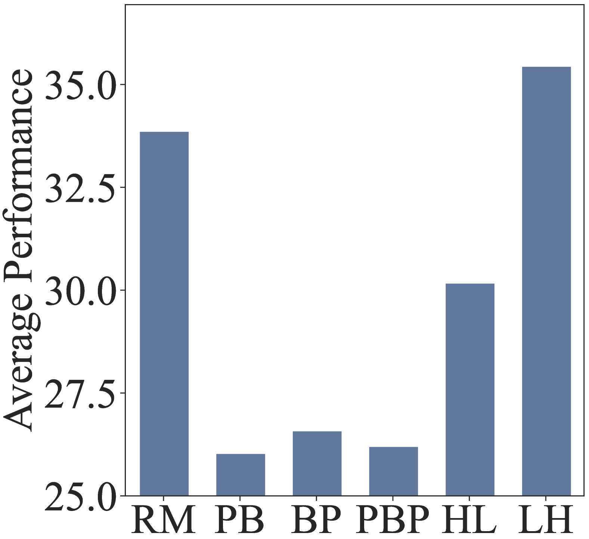
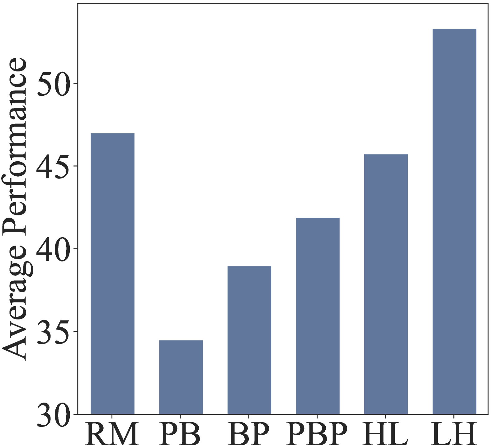
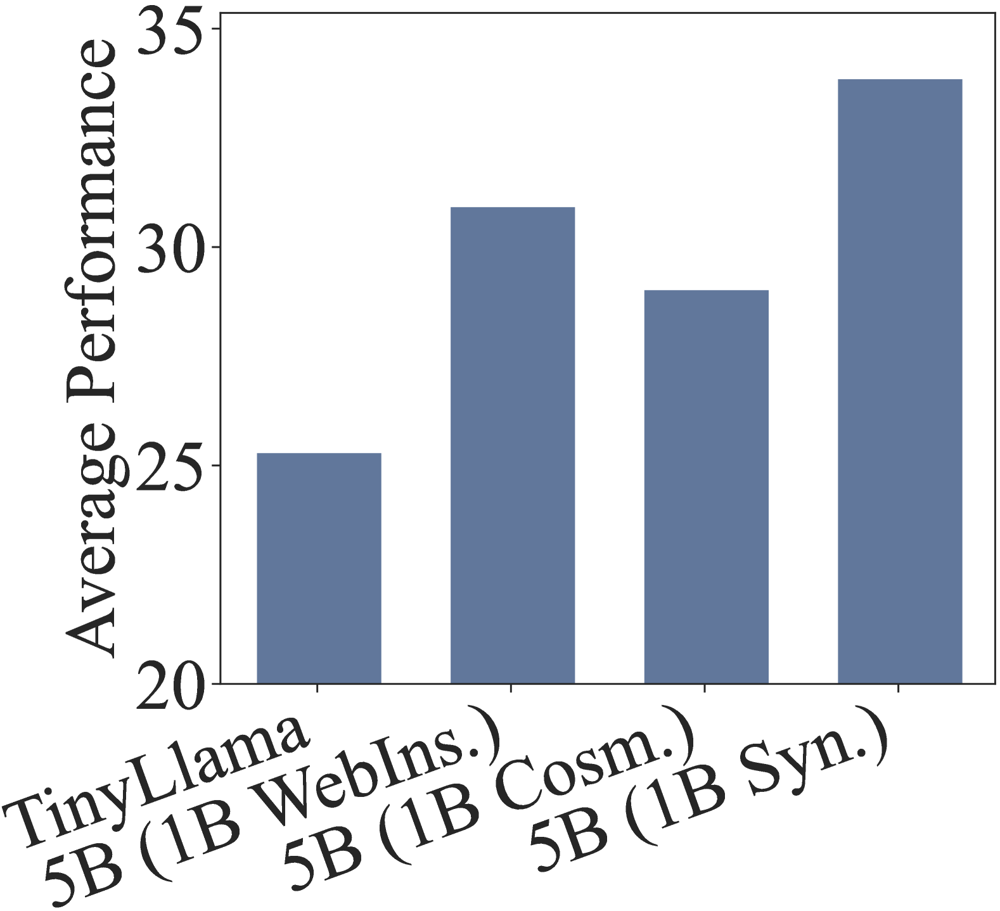
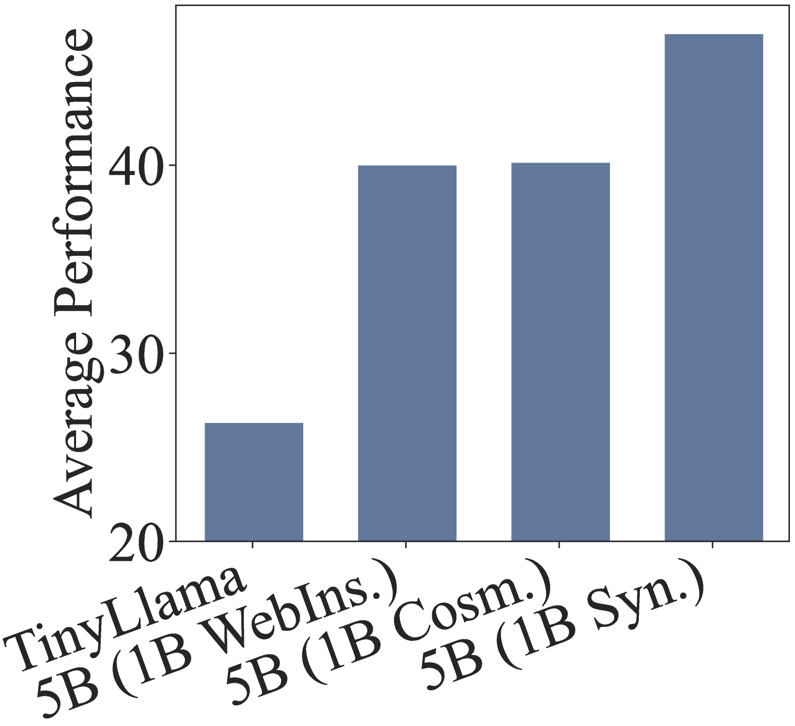

# 探索大型语言模型持续预训练的有效与高效之道

发布时间：2024年07月26日

`LLM应用` `科学研究` `人工智能`

> Towards Effective and Efficient Continual Pre-training of Large Language Models

# 摘要

> 持续预训练（CPT）是调整语言模型以适应特定领域或任务的关键策略。本文详细介绍了如何通过持续预训练Llama-3（8B）来显著提升其中文语言及科学推理能力。我们精心设计了数据混合与课程学习策略，既保留了模型的原始能力，又引入了新的技能。具体而言，我们通过合成多学科的科学问答对，有效强化了Llama-3的科学推理能力，并将其命名为Llama-3-SynE。此外，我们还通过TinyLlama模型进行了调优实验，并将成果应用于骨干模型的训练。实验结果显示，我们的方法在多个评估基准上显著提升了模型的性能，包括通用能力和科学推理能力，且未损害原有性能。相关模型、数据和代码已公开在https://github.com/RUC-GSAI/Llama-3-SynE。

> Continual pre-training (CPT) has been an important approach for adapting language models to specific domains or tasks. To make the CPT approach more traceable, this paper presents a technical report for continually pre-training Llama-3 (8B), which significantly enhances the Chinese language ability and scientific reasoning ability of the backbone model. To enhance the new abilities while retaining the original abilities, we design specific data mixture and curriculum strategies by utilizing existing datasets and synthesizing high-quality datasets. Specifically, we synthesize multidisciplinary scientific question and answer (QA) pairs based on related web pages, and subsequently incorporate these synthetic data to improve the scientific reasoning ability of Llama-3. We refer to the model after CPT as Llama-3-SynE (Synthetic data Enhanced Llama-3). We also present the tuning experiments with a relatively small model -- TinyLlama, and employ the derived findings to train the backbone model. Extensive experiments on a number of evaluation benchmarks show that our approach can largely improve the performance of the backbone models, including both the general abilities (+8.81 on C-Eval and +6.31 on CMMLU) and the scientific reasoning abilities (+12.00 on MATH and +4.13 on SciEval), without hurting the original capacities. Our model, data, and codes are available at https://github.com/RUC-GSAI/Llama-3-SynE.

[Arxiv](https://arxiv.org/abs/2407.18743)