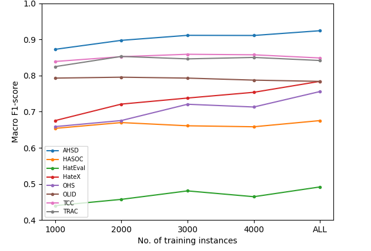

# 迈向通用攻击性语言识别

发布时间：2024年07月26日

`LLM应用` `网络安全` `社交媒体`

> Towards Generalized Offensive Language Identification

# 摘要

> 网络上的攻击性内容，如仇恨言论和网络欺凌，已成为全球性难题。这促使机器学习和自然语言处理领域投入大量精力，开发自动识别并减轻有害内容影响的系统。这些系统主要采用两种策略：一是利用公开模型和接口，包括大型语言模型的提示；二是通过标注数据集训练机器学习模型。然而，这两种方法的泛化能力尚未明确，且在实际应用中的有效性常受质疑。本文通过新基准测试，实证分析了攻击性语言检测模型和数据集的泛化能力，并解答了三个关键研究问题。这些发现对于构建强健的现实世界攻击性语言检测系统具有重要价值。

> The prevalence of offensive content on the internet, encompassing hate speech and cyberbullying, is a pervasive issue worldwide. Consequently, it has garnered significant attention from the machine learning (ML) and natural language processing (NLP) communities. As a result, numerous systems have been developed to automatically identify potentially harmful content and mitigate its impact. These systems can follow two approaches; (1) Use publicly available models and application endpoints, including prompting large language models (LLMs) (2) Annotate datasets and train ML models on them. However, both approaches lack an understanding of how generalizable they are. Furthermore, the applicability of these systems is often questioned in off-domain and practical environments. This paper empirically evaluates the generalizability of offensive language detection models and datasets across a novel generalized benchmark. We answer three research questions on generalizability. Our findings will be useful in creating robust real-world offensive language detection systems.

[Arxiv](https://arxiv.org/abs/2407.18738)