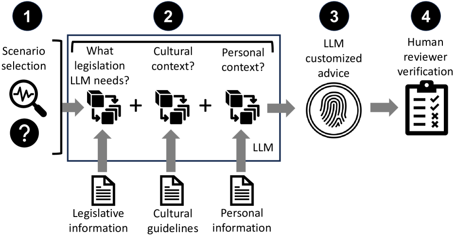

# AgentPeerTalk：借助AI智能辨别，助力学生在校园互动中识别欺凌与玩笑，从而增强自我保护能力。

发布时间：2024年07月27日

`Agent` `心理健康`

> AgentPeerTalk: Empowering Students through Agentic-AI-Driven Discernment of Bullying and Joking in Peer Interactions in Schools

# 摘要

> 解决学校欺凌问题，刻不容缓，关乎学生心理健康。本研究利用大型语言模型（LLM），如ChatGPT-4等，旨在区分校园互动中的欺凌与玩笑，赋予学生力量。通过人工评审，我们发现并非所有LLM都适合代理方法，而ChatGPT-4表现最为出色。LLM输出差异，或受政治过度修正、上下文限制及训练数据偏见影响。ChatGPT-4在代理方法下，上下文准确性卓越，能为脆弱学生提供实时支持。此研究凸显代理AI在教育领域的社会价值，为减轻欺凌负面影响、提升学生福祉开辟新径。

> Addressing school bullying effectively and promptly is crucial for the mental health of students. This study examined the potential of large language models (LLMs) to empower students by discerning between bullying and joking in school peer interactions. We employed ChatGPT-4, Gemini 1.5 Pro, and Claude 3 Opus, evaluating their effectiveness through human review. Our results revealed that not all LLMs were suitable for an agentic approach, with ChatGPT-4 showing the most promise. We observed variations in LLM outputs, possibly influenced by political overcorrectness, context window limitations, and pre-existing bias in their training data. ChatGPT-4 excelled in context-specific accuracy after implementing the agentic approach, highlighting its potential to provide continuous, real-time support to vulnerable students. This study underlines the significant social impact of using agentic AI in educational settings, offering a new avenue for reducing the negative consequences of bullying and enhancing student well-being.

[Arxiv](https://arxiv.org/abs/2408.01459)