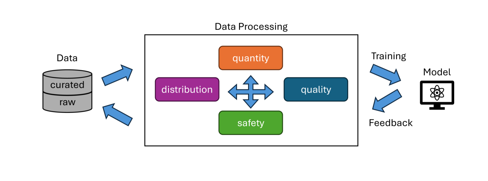

# 现代多模态模型中的数据处理技巧

发布时间：2024年07月27日

`LLM应用` `人工智能` `数据处理`

> Data Processing Techniques for Modern Multimodal Models

# 摘要

> 数据处理在多模态模型训练中至关重要。本文全面回顾了现代多模态模型训练中的数据处理技术，特别聚焦于扩散模型和MLLMs。我们将其归纳为数据质量、数量、分布和安全四大类，并探讨了不同模型中的数据处理方法选择。本研究旨在为多模态模型开发者提供实用的数据处理技术指南。

> Data processing plays an significant role in current multimodal model training. In this paper. we provide an comprehensive review of common data processing techniques used in modern multimodal model training with a focus on diffusion models and multimodal large language models (MLLMs). We summarized all techniques into four categories: data quality, data quantity, data distribution and data safety. We further present our findings in the choice of data process methods in different type of models. This study aims to provide guidance to multimodal models developers with effective data processing techniques.

[Arxiv](https://arxiv.org/abs/2407.19180)