# LLaVA-Read：提升多模态语言模型的阅读技能

发布时间：2024年07月27日

`LLM应用` `图像处理` `多模态系统`

> LLaVA-Read: Enhancing Reading Ability of Multimodal Language Models

# 摘要

> 大型多模态语言模型虽在图像处理上表现出色，但在解析图像内密集文本时却显力不从心，主要归咎于其有限的文本识别与布局理解能力。为此，我们深入分析了传统视觉编码器的不足，并推出了LLaVA-Read模型，该模型结合双视觉编码器与视觉文本编码器，显著提升了在富含文本图像任务中的表现。我们的研究强调，视觉文本理解仍是一大挑战，而高效的视觉文本编码器则是构建未来多模态系统的关键。

> Large multimodal language models have demonstrated impressive capabilities in understanding and manipulating images. However, many of these models struggle with comprehending intensive textual contents embedded within the images, primarily due to the limited text recognition and layout understanding ability. To understand the sources of these limitations, we perform an exploratory analysis showing the drawbacks of classical visual encoders on visual text understanding. Hence, we present LLaVA-Read, a multimodal large language model that utilizes dual visual encoders along with a visual text encoder. Our model surpasses existing state-of-the-art models in various text-rich image understanding tasks, showcasing enhanced comprehension of textual content within images. Together, our research suggests visual text understanding remains an open challenge and an efficient visual text encoder is crucial for future successful multimodal systems.

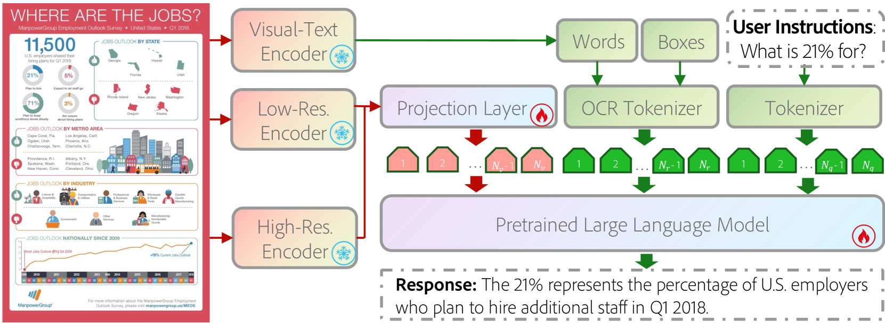

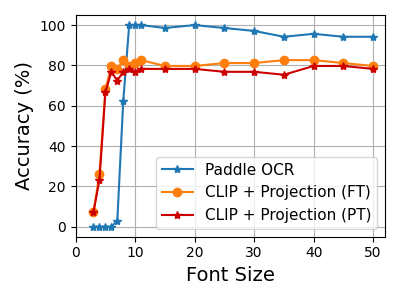

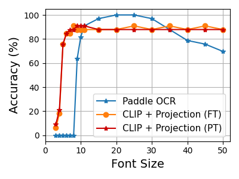

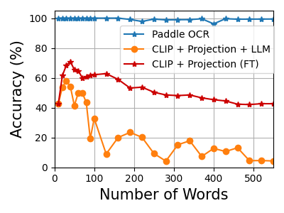

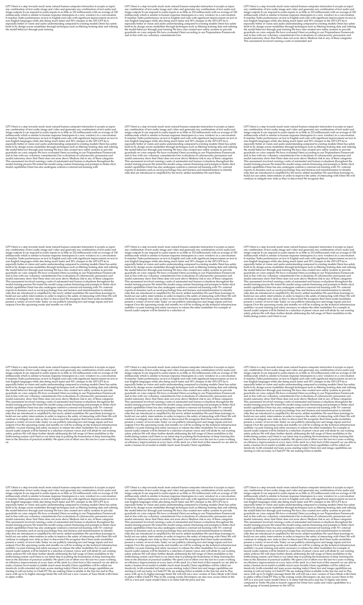

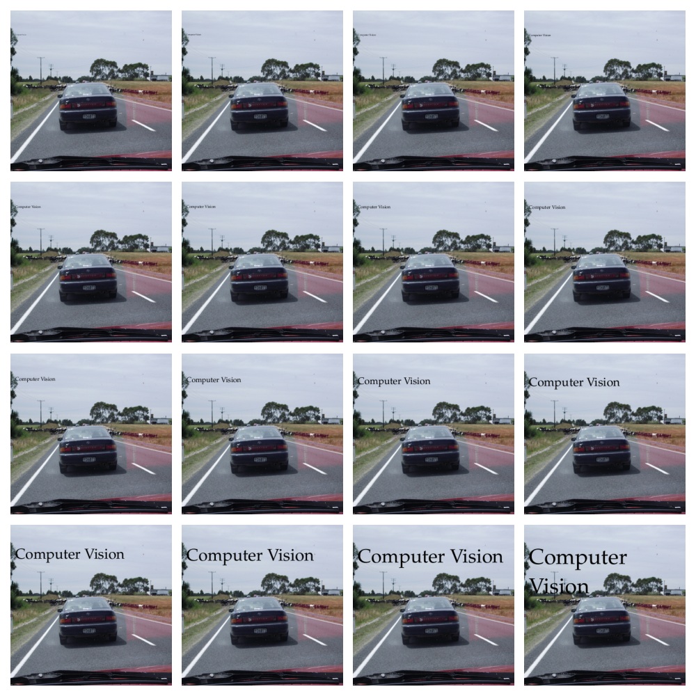

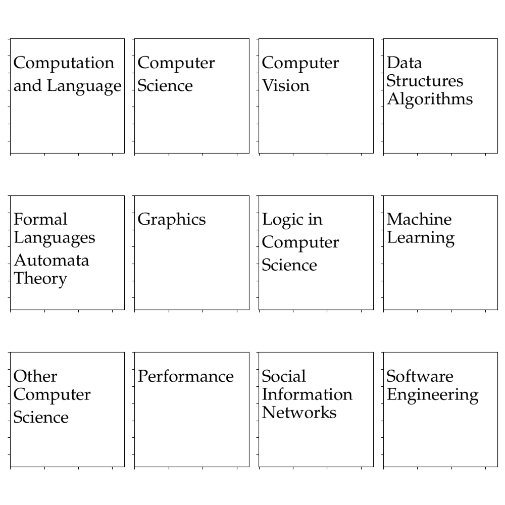

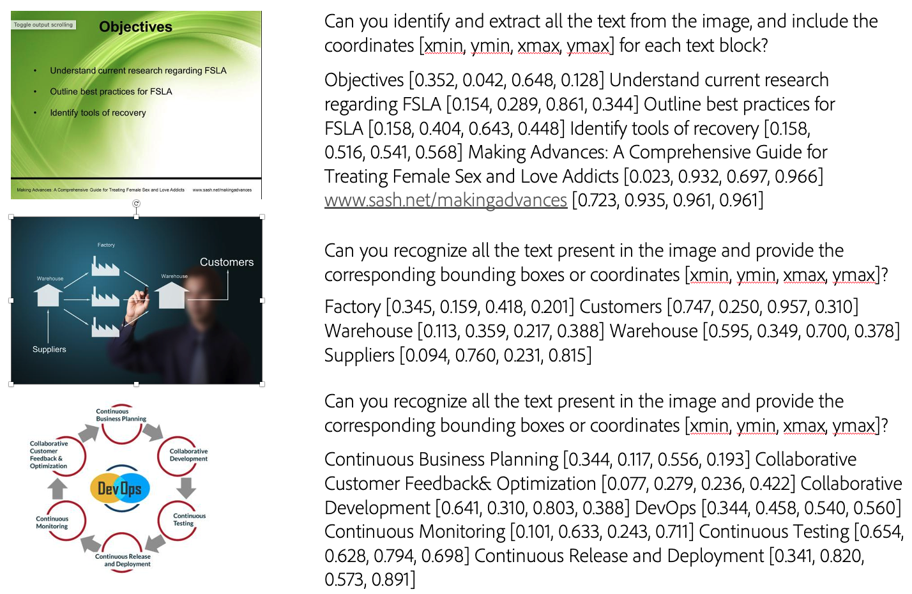

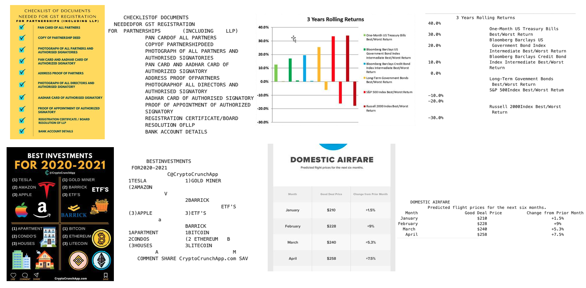

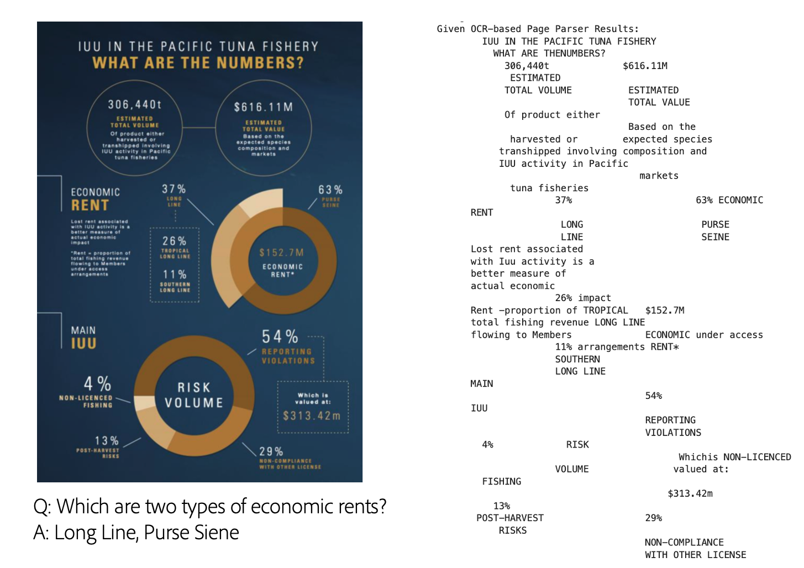

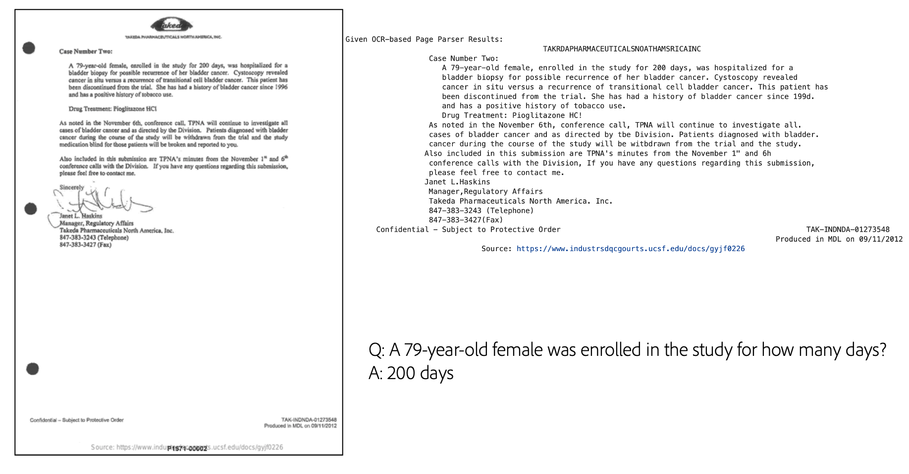

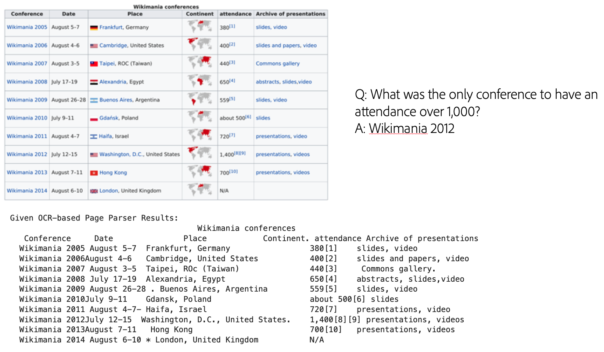

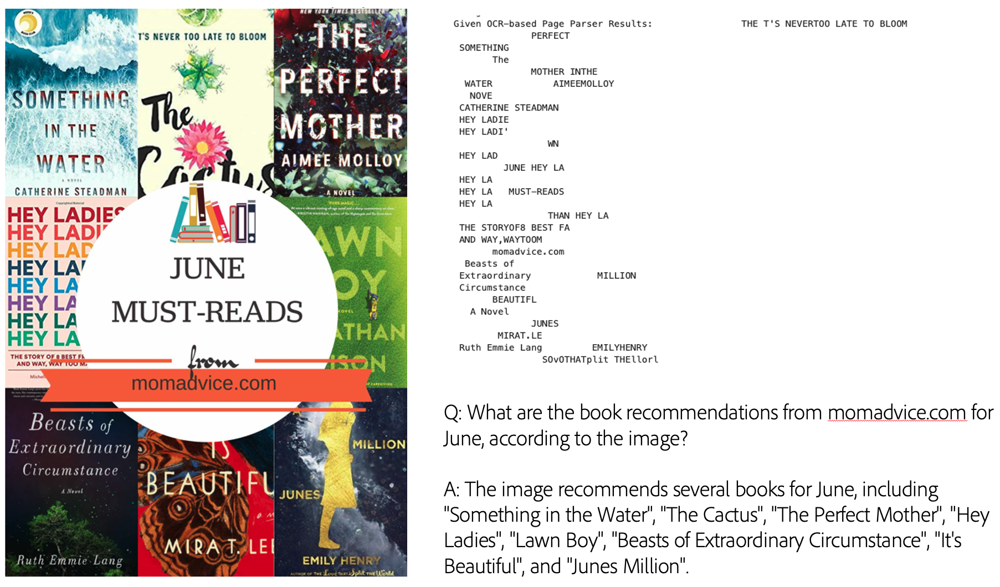

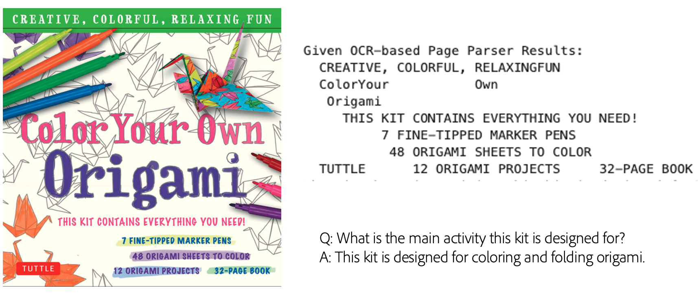

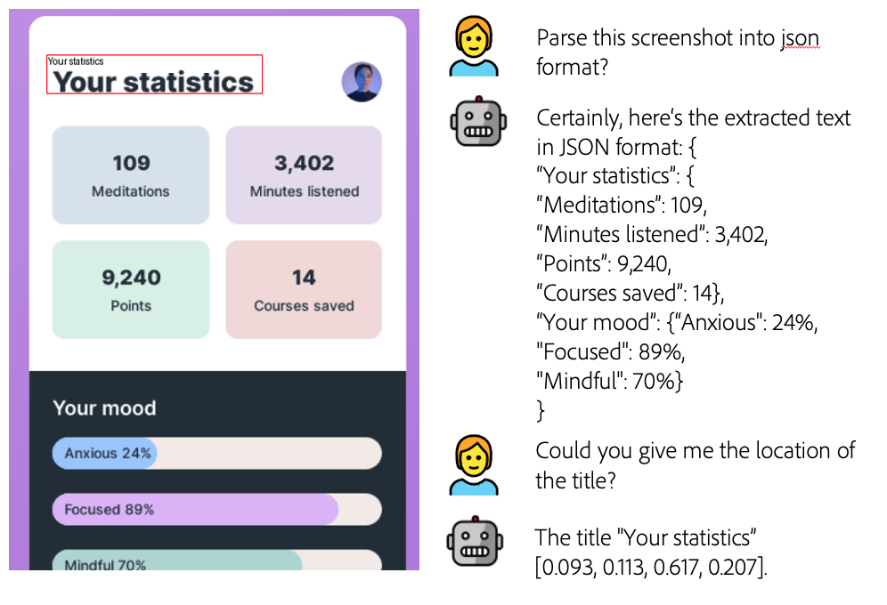

[Arxiv](https://arxiv.org/abs/2407.19185)