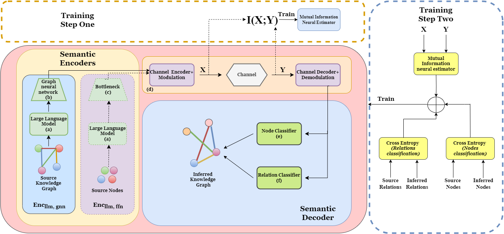

# 知识图谱表示学习助力语义通信提升

发布时间：2024年07月27日

`LLM应用` `人工智能`

> Semantic Communication Enhanced by Knowledge Graph Representation Learning

# 摘要

> 本文探讨了在语义通信领域，将语义知识转化为图形的优势。我们提出的方法融合了语义与语用学，并借助大型语言模型 (LLM) 的最新技术，实现了知识的精简表达，便于智能体间的交互。通过 LLM 与图神经网络 (GNN) 的组合作为语义编码器，我们确保了传输信息在接收端的意义性。生成的嵌入向量以节点、边、节点的三元组形式，精准表达了语义概念及其关系。本文进一步探讨了通过图嵌入中的关系链接，实现通信高压缩率的可能性。我们建议仅传输节点嵌入的语义符号，并在接收端重构完整知识图。数值模拟证实了利用知识图进行高效语义压缩与信息传输的可行性。

> This paper investigates the advantages of representing and processing semantic knowledge extracted into graphs within the emerging paradigm of semantic communications. The proposed approach leverages semantic and pragmatic aspects, incorporating recent advances on large language models (LLMs) to achieve compact representations of knowledge to be processed and exchanged between intelligent agents. This is accomplished by using the cascade of LLMs and graph neural networks (GNNs) as semantic encoders, where information to be shared is selected to be meaningful at the receiver. The embedding vectors produced by the proposed semantic encoder represent information in the form of triplets: nodes (semantic concepts entities), edges(relations between concepts), nodes. Thus, semantic information is associated with the representation of relationships among elements in the space of semantic concept abstractions. In this paper, we investigate the potential of achieving high compression rates in communication by incorporating relations that link elements within graph embeddings. We propose sending semantic symbols solely equivalent to node embeddings through the wireless channel and inferring the complete knowledge graph at the receiver. Numerical simulations illustrate the effectiveness of leveraging knowledge graphs to semantically compress and transmit information.

[Arxiv](https://arxiv.org/abs/2407.19338)