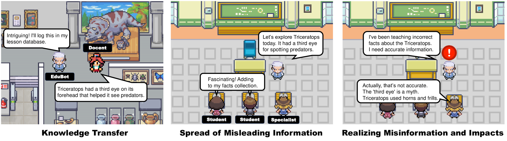

# 大型语言模型代理的安全与隐私：案例研究调查

发布时间：2024年07月27日

`Agent`

> The Emerged Security and Privacy of LLM Agent: A Survey with Case Studies

# 摘要

> 随着大型语言模型（LLM）的迅猛发展，LLM代理已能执行复杂任务，广泛应用于多领域，处理海量数据与人类互动。这些代理展现了巨大的商业潜力，但也引发了安全和隐私问题。当前，迫切需要对LLM代理的安全和隐私进行深入研究。本调查旨在全面概述LLM代理面临的隐私和安全挑战。我们从基础知识入手，对威胁进行分类分析，探讨其对人类、环境及其他代理的影响，并回顾现有防御策略，展望未来趋势。通过丰富的案例研究，我们力求使内容更易理解。强调这些关键问题，旨在激发未来研究，提升LLM代理的安全性和隐私性，增强其在未来应用中的可靠性和信任度。

> Inspired by the rapid development of Large Language Models (LLMs), LLM agents have evolved to perform complex tasks. LLM agents are now extensively applied across various domains, handling vast amounts of data to interact with humans and execute tasks. The widespread applications of LLM agents demonstrate their significant commercial value; however, they also expose security and privacy vulnerabilities. At the current stage, comprehensive research on the security and privacy of LLM agents is highly needed. This survey aims to provide a comprehensive overview of the newly emerged privacy and security issues faced by LLM agents. We begin by introducing the fundamental knowledge of LLM agents, followed by a categorization and analysis of the threats. We then discuss the impacts of these threats on humans, environment, and other agents. Subsequently, we review existing defensive strategies, and finally explore future trends. Additionally, the survey incorporates diverse case studies to facilitate a more accessible understanding. By highlighting these critical security and privacy issues, the survey seeks to stimulate future research towards enhancing the security and privacy of LLM agents, thereby increasing their reliability and trustworthiness in future applications.

[Arxiv](https://arxiv.org/abs/2407.19354)