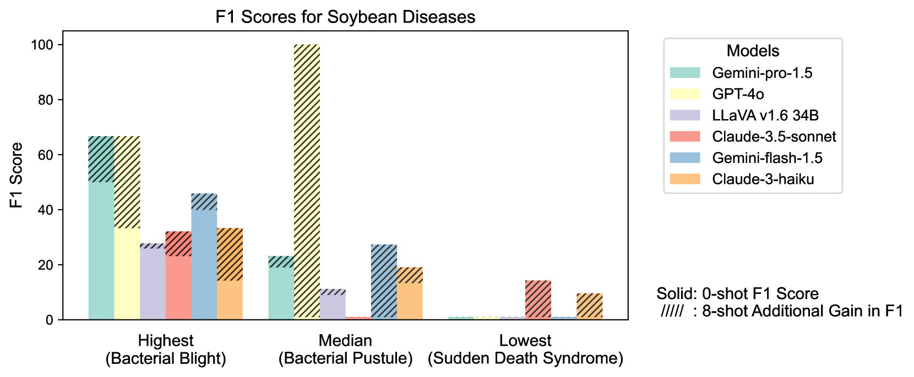
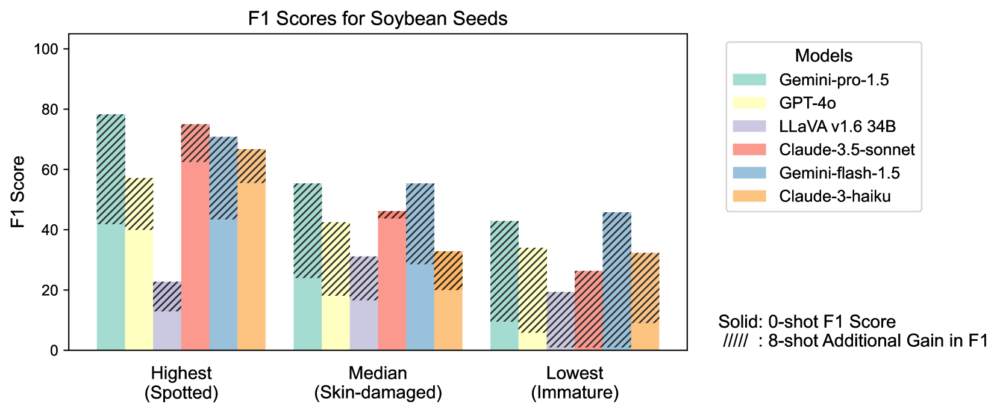

# AgEval：一个针对多模态 LLM 的零-shot 和少-shot 植物应激表型分析的基准测试

发布时间：2024年07月28日

`LLM应用` `人工智能`

> AgEval: A Benchmark for Zero-Shot and Few-Shot Plant Stress Phenotyping with Multimodal LLMs

# 摘要

> 传统上，植物应激表型的评估依赖于专家和专业模型，这在农业中限制了其可扩展性。随着多模态大型语言模型（LLMs）的最新进展，我们提出了AgEval基准，涵盖12项不同任务，旨在评估这些模型在植物应激表型方面的能力。研究显示，通过少-shot学习，模型性能显著提升，例如最佳模型在8-shot识别任务中F1分数从46.24%跃升至73.37%。尽管其他类别的示例对性能影响微乎其微或为负面，但确切类别的示例能提升性能达15.38%。此外，我们发现模型性能在不同类别间的一致性存在差异，变异系数（CV）介于26.02%至58.03%之间，强调了专业知识在提升性能可靠性中的重要性。AgEval不仅为农业应用中的多模态LLMs设定了基准，还揭示了其在规模化提升植物应激表型方面的潜力。基准和代码详情可访问：https://anonymous.4open.science/r/AgEval/

> Plant stress phenotyping traditionally relies on expert assessments and specialized models, limiting scalability in agriculture. Recent advances in multimodal large language models (LLMs) offer potential solutions to this challenge. We present AgEval, a benchmark comprising 12 diverse plant stress phenotyping tasks, to evaluate these models' capabilities. Our study assesses zero-shot and few-shot in-context learning performance of state-of-the-art models, including Claude, GPT, Gemini, and LLaVA. Results show significant performance improvements with few-shot learning, with F1 scores increasing from 46.24% to 73.37% in 8-shot identification for the best-performing model. Few-shot examples from other classes in the dataset have negligible or negative impacts, although having the exact category example helps to increase performance by 15.38%. We also quantify the consistency of model performance across different classes within each task, finding that the coefficient of variance (CV) ranges from 26.02% to 58.03% across models, implying that subject matter expertise is needed - of 'difficult' classes - to achieve reliability in performance. AgEval establishes baseline metrics for multimodal LLMs in agricultural applications, offering insights into their promise for enhancing plant stress phenotyping at scale. Benchmark and code can be accessed at: https://anonymous.4open.science/r/AgEval/

[Arxiv](https://arxiv.org/abs/2407.19617)