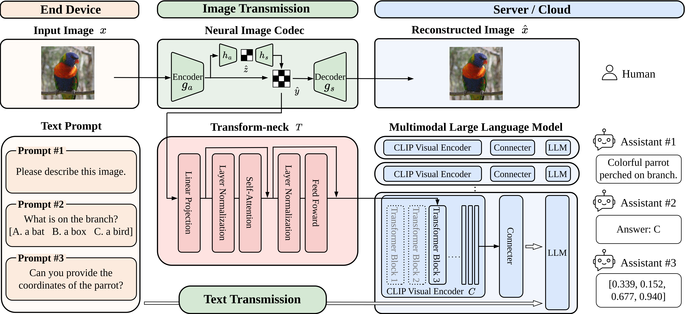
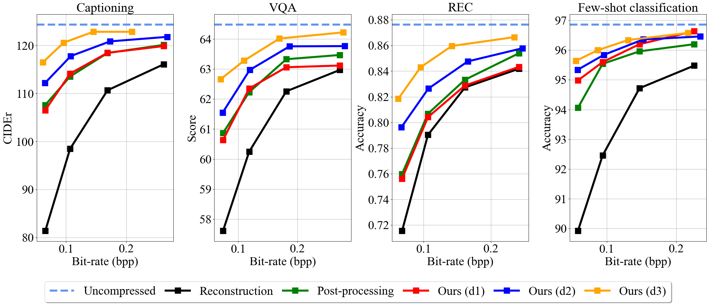
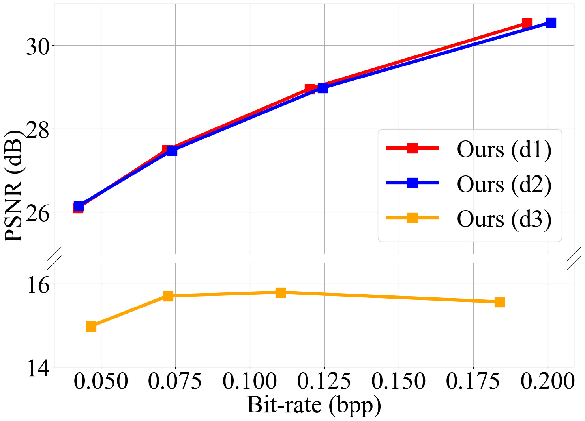
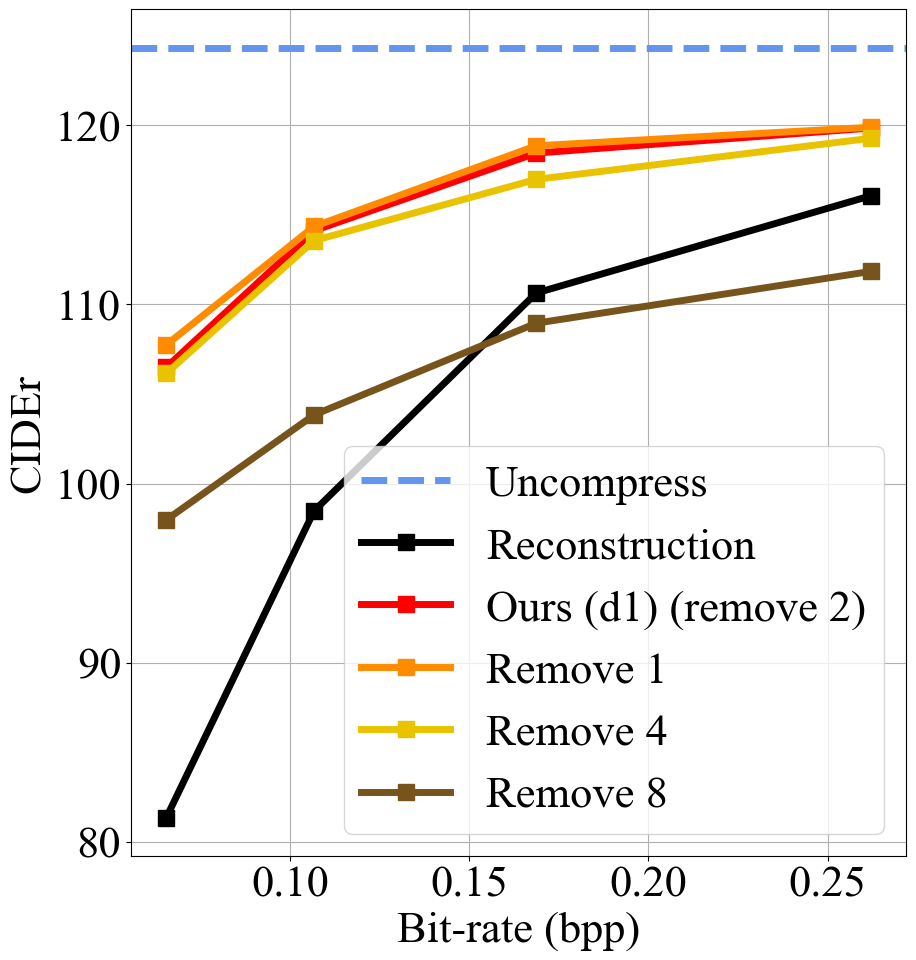
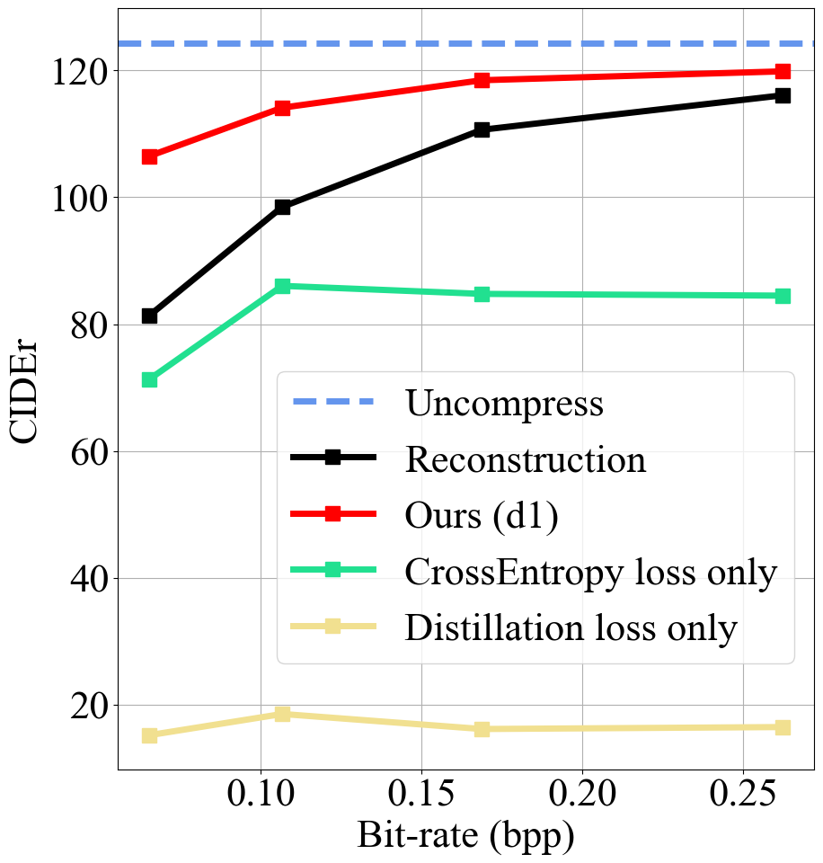
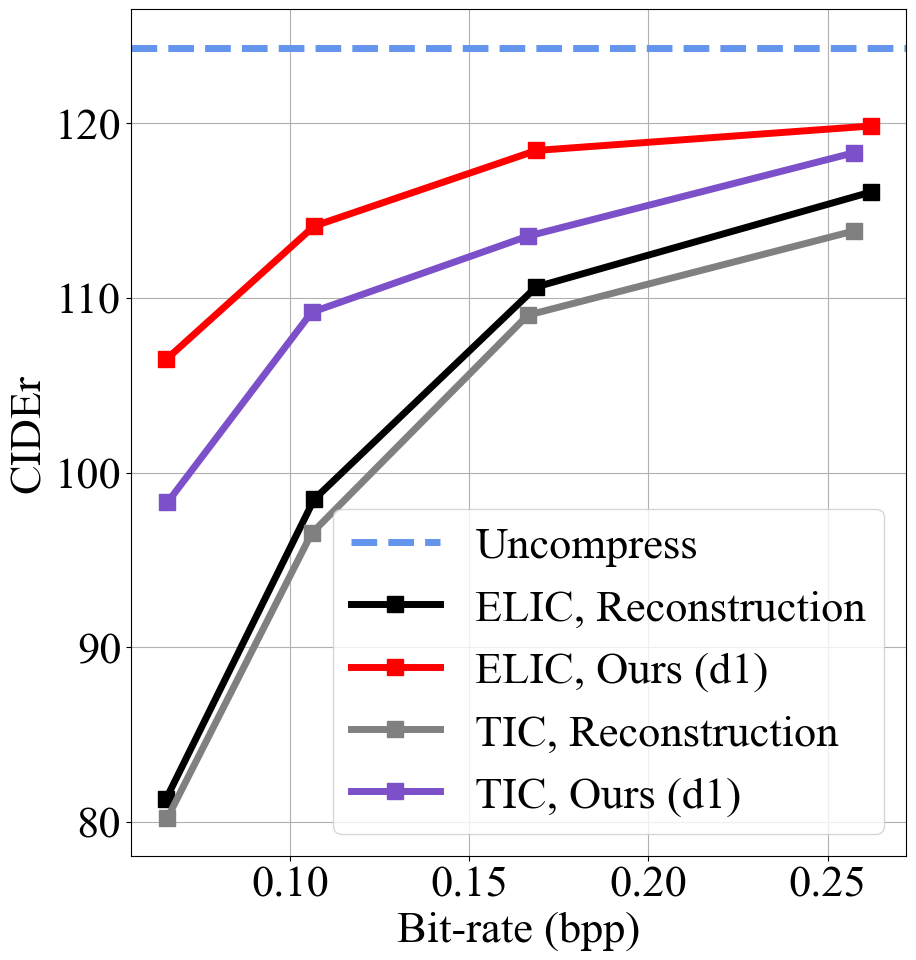
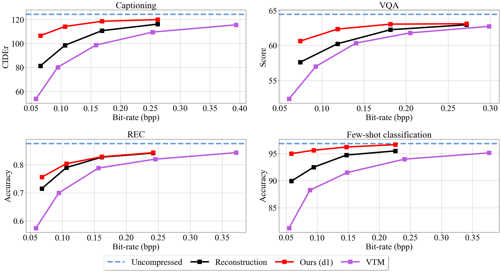

# ComNeck：架起压缩图像潜在空间与多模态LLM之间的桥梁，通过通用变换颈实现连接。

发布时间：2024年07月28日

`LLM应用` `计算机视觉` `机器学习`

> ComNeck: Bridging Compressed Image Latents and Multimodal LLMs via Universal Transform-Neck

# 摘要

> 本文首次探讨了如何将压缩图像特征应用于多模态大型语言模型（MLLMs）支持的视觉任务。MLLMs 虽将大型语言模型的应用扩展至图像等非文本领域，但其庞大的规模却限制了在资源有限设备上的部署。为此，我们聚焦于神经图像压缩技术，提出了一种创新框架，包含轻量级变换颈和代理损失，旨在优化压缩图像特征以适应基于MLLM的视觉任务。该框架灵活多变，神经图像编解码器可根据需求（1）预训练以满足人类视觉感知，无需后续更新；（2）全面更新以兼顾人机感知；或（3）仅针对机器感知进行更新。我们的变换颈经代理损失训练后，能广泛适用于各类MLLMs驱动的视觉任务，因其共享同一视觉编码器。值得一提的是，我们的框架独特之处在于，下游MLLMs无需参与变换颈乃至神经图像编解码器的训练，这一特点在现有机器编码方法中颇为罕见。通过在多种神经图像编解码器和基于MLLM的视觉任务上进行广泛实验，我们的方法以较低复杂度实现了卓越的速率-准确性表现，充分验证了其有效性。

> This paper presents the first-ever study of adapting compressed image latents to suit the needs of downstream vision tasks that adopt Multimodal Large Language Models (MLLMs). MLLMs have extended the success of large language models to modalities (e.g. images) beyond text, but their billion scale hinders deployment on resource-constrained end devices. While cloud-hosted MLLMs could be available, transmitting raw, uncompressed images captured by end devices to the cloud requires an efficient image compression system. To address this, we focus on emerging neural image compression and propose a novel framework with a lightweight transform-neck and a surrogate loss to adapt compressed image latents for MLLM-based vision tasks. The proposed framework is generic and applicable to multiple application scenarios, where the neural image codec can be (1) pre-trained for human perception without updating, (2) fully updated for joint human and machine perception, or (3) fully updated for only machine perception. The transform-neck trained with the surrogate loss is universal, for it can serve various downstream vision tasks enabled by a variety of MLLMs that share the same visual encoder. Our framework has the striking feature of excluding the downstream MLLMs from training the transform-neck, and potentially the neural image codec as well. This stands out from most existing coding for machine approaches that involve downstream networks in training and thus could be impractical when the networks are MLLMs. Extensive experiments on different neural image codecs and various MLLM-based vision tasks show that our method achieves great rate-accuracy performance with much less complexity, demonstrating its effectiveness.

[Arxiv](https://arxiv.org/abs/2407.19651)