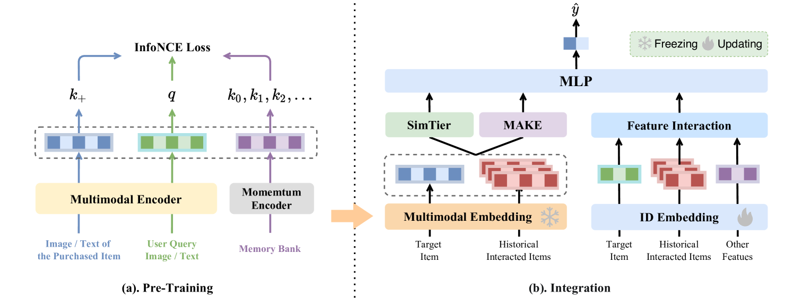
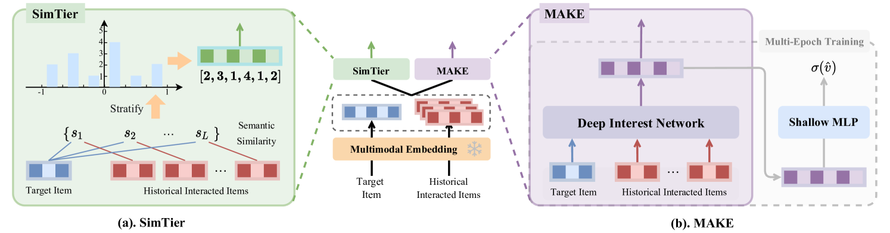
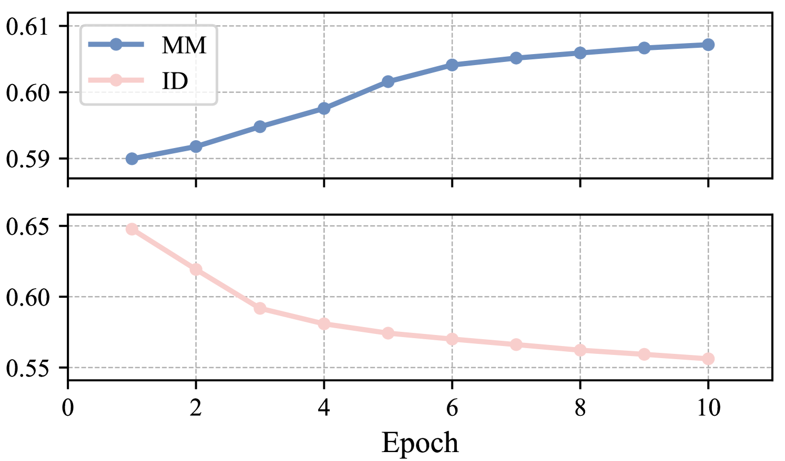
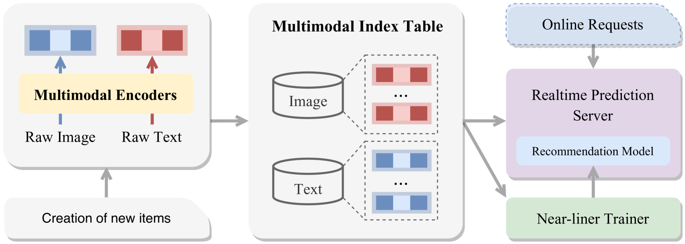
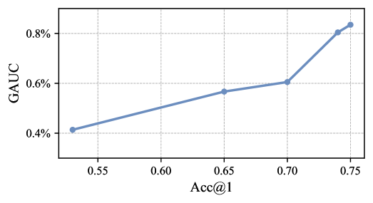
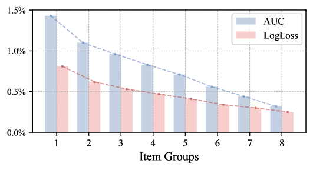
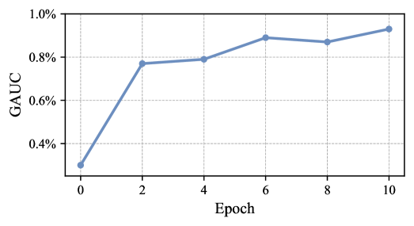

# 多模态表示在提升淘宝展示广告中的应用：探索其挑战、实施方法及深刻见解

发布时间：2024年07月28日

`LLM应用` `电子商务`

> Enhancing Taobao Display Advertising with Multimodal Representations: Challenges, Approaches and Insights

# 摘要

> 尽管多模态数据提升模型准确性的潜力已被认可，但许多大型工业推荐系统，如淘宝的展示广告系统，仍主要依赖稀疏的ID特征。为此，我们探索了如何有效利用多模态数据来提升推荐系统的准确性。首先，我们识别了在工业环境中高效且经济地应用多模态数据的关键挑战。为应对这些挑战，我们设计了一个双阶段框架：先对多模态数据进行预训练以捕捉语义相似性，然后将这些预训练的表示与现有基于ID的模型融合。此外，我们还详细阐述了支持这一框架的生产系统架构。自2023年年中实施以来，这一集成已显著提升了淘宝展示广告系统的性能。我们相信，这些经验将为希望在其系统中整合多模态数据的从业者提供宝贵的参考。

> Despite the recognized potential of multimodal data to improve model accuracy, many large-scale industrial recommendation systems, including Taobao display advertising system, predominantly depend on sparse ID features in their models. In this work, we explore approaches to leverage multimodal data to enhance the recommendation accuracy. We start from identifying the key challenges in adopting multimodal data in a manner that is both effective and cost-efficient for industrial systems. To address these challenges, we introduce a two-phase framework, including: 1) the pre-training of multimodal representations to capture semantic similarity, and 2) the integration of these representations with existing ID-based models. Furthermore, we detail the architecture of our production system, which is designed to facilitate the deployment of multimodal representations. Since the integration of multimodal representations in mid-2023, we have observed significant performance improvements in Taobao display advertising system. We believe that the insights we have gathered will serve as a valuable resource for practitioners seeking to leverage multimodal data in their systems.

[Arxiv](https://arxiv.org/abs/2407.19467)