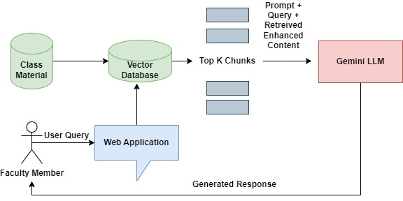
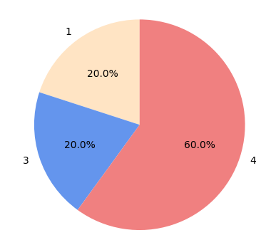
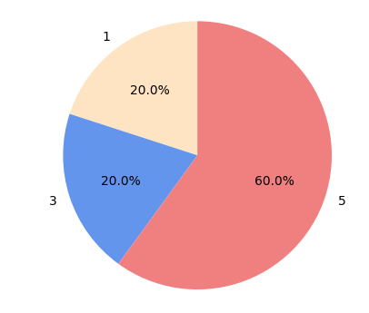
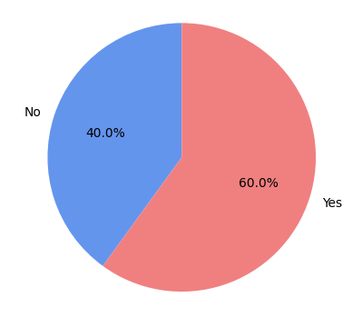
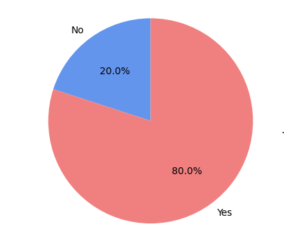

# 计算机科学高等教育领域中，教职员工对 RAG 潜力的见解

发布时间：2024年07月28日

`RAG` `计算机科学`

> Faculty Perspectives on the Potential of RAG in Computer Science Higher Education

# 摘要

> 大型语言模型 (LLM) 的兴起，不仅深刻改变了自然语言处理领域，还因其广泛应用和公众可访问性，重塑了多领域的对话任务。然而，LLM 在教育领域的应用引发了伦理争议，尤其是抄袭和合规问题。尽管 LLM 在对话中表现卓越，但其可靠性和产生幻觉的问题，使得我们需要在计算机科学高等教育中探索检索增强生成 (RAG) 的应用。我们针对虚拟教学助手和教学辅助工具开发了 RAG 应用，并收集了不同层次计算机科学课程教员的反馈。这是首次系统地收集教员对基于 LLM 的 RAG 在教育应用中的看法。结果表明，虽然教员看到了 RAG 系统的潜力，但在全面推广前还需解决一些障碍。这些发现强调了在教育中引入先进语言模型时，必须慎重考虑伦理问题，并制定相应保护措施，以确保其负责任且有效的应用。

> The emergence of Large Language Models (LLMs) has significantly impacted the field of Natural Language Processing and has transformed conversational tasks across various domains because of their widespread integration in applications and public access. The discussion surrounding the application of LLMs in education has raised ethical concerns, particularly concerning plagiarism and policy compliance. Despite the prowess of LLMs in conversational tasks, the limitations of reliability and hallucinations exacerbate the need to guardrail conversations, motivating our investigation of RAG in computer science higher education. We developed Retrieval Augmented Generation (RAG) applications for the two tasks of virtual teaching assistants and teaching aids. In our study, we collected the ratings and opinions of faculty members in undergraduate and graduate computer science university courses at various levels, using our personalized RAG systems for each course. This study is the first to gather faculty feedback on the application of LLM-based RAG in education. The investigation revealed that while faculty members acknowledge the potential of RAG systems as virtual teaching assistants and teaching aids, certain barriers and features are suggested for their full-scale deployment. These findings contribute to the ongoing discussion on the integration of advanced language models in educational settings, highlighting the need for careful consideration of ethical implications and the development of appropriate safeguards to ensure responsible and effective implementation.

[Arxiv](https://arxiv.org/abs/2408.01462)