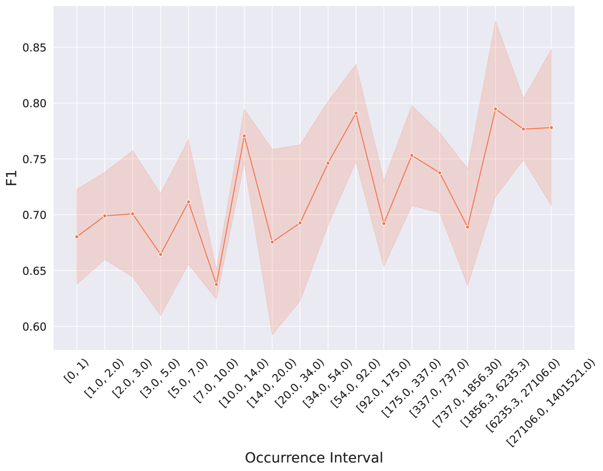

# 探究预训练语料库至大型语言模型的发展过程中，哪些关键因素塑造了 LLM 在因果发现任务中的表现。

发布时间：2024年07月28日

`LLM理论` `人工智能` `数据分析`

> From Pre-training Corpora to Large Language Models: What Factors Influence LLM Performance in Causal Discovery Tasks?

# 摘要

> 近期，大型语言模型 (LLMs) 在因果发现任务上表现出色。本研究深入探讨了影响 LLMs 在此类任务中表现的关键因素。通过分析开源 LLMs，我们发现预训练语料库中因果关系的频率与模型性能呈正相关，表明训练中广泛接触因果信息能显著提升其因果发现能力。同时，我们也揭示了上下文对因果关系预测的影响，即相同因果关系在不同上下文中可能导致模型预测的分歧。本文首次全面剖析了多重因素对 LLM 在因果发现任务中表现的综合影响。

> Recent advances in artificial intelligence have seen Large Language Models (LLMs) demonstrate notable proficiency in causal discovery tasks. This study explores the factors influencing the performance of LLMs in causal discovery tasks. Utilizing open-source LLMs, we examine how the frequency of causal relations within their pre-training corpora affects their ability to accurately respond to causal discovery queries. Our findings reveal that a higher frequency of causal mentions correlates with better model performance, suggesting that extensive exposure to causal information during training enhances the models' causal discovery capabilities. Additionally, we investigate the impact of context on the validity of causal relations. Our results indicate that LLMs might exhibit divergent predictions for identical causal relations when presented in different contexts. This paper provides the first comprehensive analysis of how different factors contribute to LLM performance in causal discovery tasks.

[Arxiv](https://arxiv.org/abs/2407.19638)