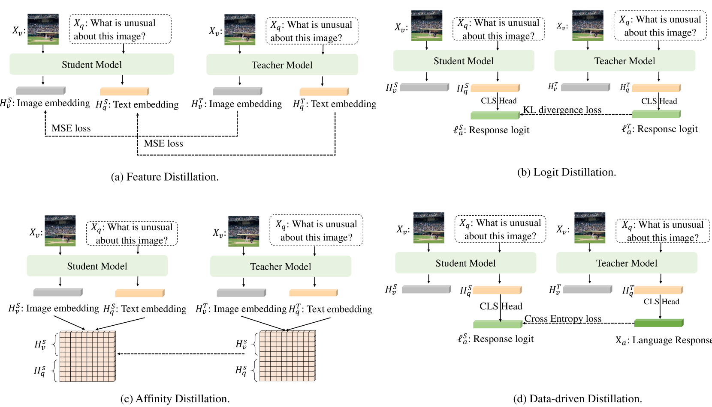

# LLAVADI：探索多模态大型语言模型蒸馏的核心要素

发布时间：2024年07月28日

`LLM应用` `人工智能` `计算机视觉`

> LLAVADI: What Matters For Multimodal Large Language Models Distillation

# 摘要

> 多模态大型语言模型 (MLLMs) 的最新进展，通过融合视觉理解，展现了实现通用智能的巨大潜力。然而，其庞大的模型规模带来了高昂的内存和计算成本，限制了广泛应用。本研究不涉及新模型结构的提出或小规模 MLLMs 的从头训练，而是聚焦于通过知识蒸馏优化小规模 MLLMs 的关键步骤。我们深入探讨了知识蒸馏中的训练策略、模型选择及蒸馏算法，发现令牌与逻辑的联合对齐在教师-学生框架中至关重要。研究还揭示，通过精心的基准评估与策略调整，2.7B 的小模型能与 7B 或 13B 的大模型媲美。相关代码与模型将公开，助力后续研究。

> The recent surge in Multimodal Large Language Models (MLLMs) has showcased their remarkable potential for achieving generalized intelligence by integrating visual understanding into Large Language Models.Nevertheless, the sheer model size of MLLMs leads to substantial memory and computational demands that hinder their widespread deployment. In this work, we do not propose a new efficient model structure or train small-scale MLLMs from scratch. Instead, we focus on what matters for training small-scale MLLMs through knowledge distillation, which is the first step from the multimodal distillation perspective. Our extensive studies involve training strategies, model choices, and distillation algorithms in the knowledge distillation process. These results show that joint alignment for both tokens and logit alignment plays critical roles in teacher-student frameworks. In addition, we draw a series of intriguing observations from this study. By evaluating different benchmarks and proper strategy, even a 2.7B small-scale model can perform on par with larger models with 7B or 13B parameters. Our code and models will be publicly available for further research.

[Arxiv](https://arxiv.org/abs/2407.19409)