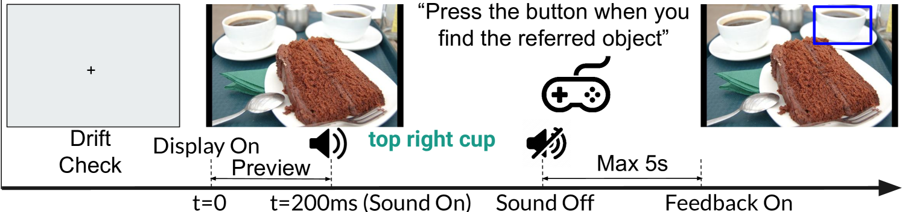
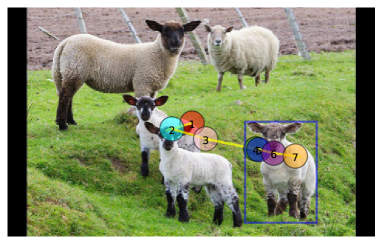
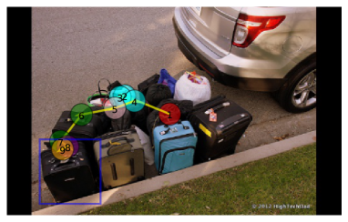
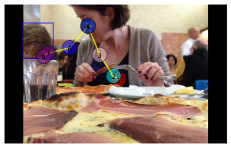

# 听声辨位：探究语音引导下的人类注视预测

发布时间：2024年07月28日

`Agent` `人机交互` `计算机视觉`

> Look Hear: Gaze Prediction for Speech-directed Human Attention

# 摘要

> 为了让计算机通过口语与人类有效互动，它们必须理解话语中的每个词如何影响听者的即时注意力。我们研究的重点是在观看图像并听取描述性语言时，如何逐步预测听者的注视点。为此，我们设计了ART模型，它能根据描述中的每个词汇预测人类的注视行为。ART模型结合了多模态编码器来学习注视模式及其背后的任务，以及自回归解码器，根据历史注视数据预测每个词可能引发的注视变化。为了训练ART，我们构建了RefCOCO-Gaze数据集，包含19,738条注视路径，涉及2,094个图像与描述对，由220名参与者提供。分析显示，ART不仅在预测注视路径上超越了现有技术，还能捕捉到人类注意力的多种模式，如等待、扫描和验证过程。

> For computer systems to effectively interact with humans using spoken language, they need to understand how the words being generated affect the users' moment-by-moment attention. Our study focuses on the incremental prediction of attention as a person is seeing an image and hearing a referring expression defining the object in the scene that should be fixated by gaze. To predict the gaze scanpaths in this incremental object referral task, we developed the Attention in Referral Transformer model or ART, which predicts the human fixations spurred by each word in a referring expression. ART uses a multimodal transformer encoder to jointly learn gaze behavior and its underlying grounding tasks, and an autoregressive transformer decoder to predict, for each word, a variable number of fixations based on fixation history. To train ART, we created RefCOCO-Gaze, a large-scale dataset of 19,738 human gaze scanpaths, corresponding to 2,094 unique image-expression pairs, from 220 participants performing our referral task. In our quantitative and qualitative analyses, ART not only outperforms existing methods in scanpath prediction, but also appears to capture several human attention patterns, such as waiting, scanning, and verification.

[Arxiv](https://arxiv.org/abs/2407.19605)