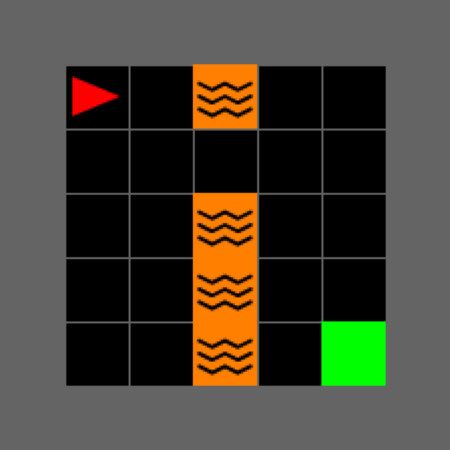

# NAVIX：借助 JAX 技术扩展 MiniGrid 环境

发布时间：2024年07月28日

`Agent` `人工智能` `游戏开发`

> NAVIX: Scaling MiniGrid Environments with JAX

# 摘要

> 随着深度强化学习研究迈向解决大规模问题，高效的环境模拟成为快速实验的关键。然而，现有环境大多难以应对高吞吐量，阻碍了实质性进展。交互计算通常依赖CPU，受限于多机分布任务时的慢速计算和通信开销，导致训练速度和吞吐量受限。深度强化学习训练因此受制于CPU，开发高效、快速、可扩展的环境成为研究前沿。MiniGrid作为多个RL研究的基础，包括探索、课程学习、表示学习等，仍面临上述挑战。我们推出的NAVIX，在JAX中重新实现MiniGrid，批处理模式下速度提升超200,000倍，单卡支持2048代理并行，将实验时间从一周压缩至15分钟，加速设计迭代，推动更可扩展的RL模型发展。

> As Deep Reinforcement Learning (Deep RL) research moves towards solving large-scale worlds, efficient environment simulations become crucial for rapid experimentation. However, most existing environments struggle to scale to high throughput, setting back meaningful progress. Interactions are typically computed on the CPU, limiting training speed and throughput, due to slower computation and communication overhead when distributing the task across multiple machines. Ultimately, Deep RL training is CPU-bound, and developing batched, fast, and scalable environments has become a frontier for progress. Among the most used Reinforcement Learning (RL) environments, MiniGrid is at the foundation of several studies on exploration, curriculum learning, representation learning, diversity, meta-learning, credit assignment, and language-conditioned RL, and still suffers from the limitations described above. In this work, we introduce NAVIX, a re-implementation of MiniGrid in JAX. NAVIX achieves over 200 000x speed improvements in batch mode, supporting up to 2048 agents in parallel on a single Nvidia A100 80 GB. This reduces experiment times from one week to 15 minutes, promoting faster design iterations and more scalable RL model development.

[Arxiv](https://arxiv.org/abs/2407.19396)