# OptiMUS-0.3：借助大型语言模型，大规模建模并解决优化难题

发布时间：2024年07月28日

`LLM应用` `制造业` `医疗保健`

> OptiMUS-0.3: Using Large Language Models to Model and Solve Optimization Problems at Scale

# 摘要

> 优化问题遍布制造业、分销乃至医疗保健等多个领域，但多数问题仍依赖手工启发式解决，而非利用尖端求解器进行优化，这主要是因为制定和解决这些问题所需的专业知识限制了优化技术的普及。为此，我们开发了一个基于大型语言模型的系统，能够从自然语言描述中制定并解决（混合整数）线性规划问题。该系统不仅能构建数学模型、编写和调试求解代码，还能评估解决方案，并据此提升模型和代码的效率与准确性。OptiMUS-0.3采用模块化设计，能有效处理长描述和复杂数据问题，无需冗长提示。实验结果显示，在简单数据集上，OptiMUS-0.3性能超越现有顶尖方法12%以上；在包含新发布的NLP4LP数据集（特点为长且复杂问题）的困难数据集上，性能提升超过8%。

> Optimization problems are pervasive in sectors from manufacturing and distribution to healthcare. However, most such problems are still solved heuristically by hand rather than optimally by state-of-the art solvers because the expertise required to formulate and solve these problems limits the widespread adoption of optimization tools and techniques. We introduce a Large Language Model (LLM)-based system designed to formulate and solve (mixed integer) linear programming problems from their natural language descriptions. Our system is capable of developing mathematical models, writing and debugging solver code, evaluating the generated solutions, and improving efficiency and correctness of its model and code based on these evaluations. OptiMUS-0.3 utilizes a modular structure to process problems, allowing it to handle problems with long descriptions and complex data without long prompts. Experiments demonstrate that OptiMUS-0.3 outperforms existing state-of-the-art methods on easy datasets by more than 12% and on hard datasets (including a new dataset, NLP4LP, released with this paper that features long and complex problems) by more than 8%.

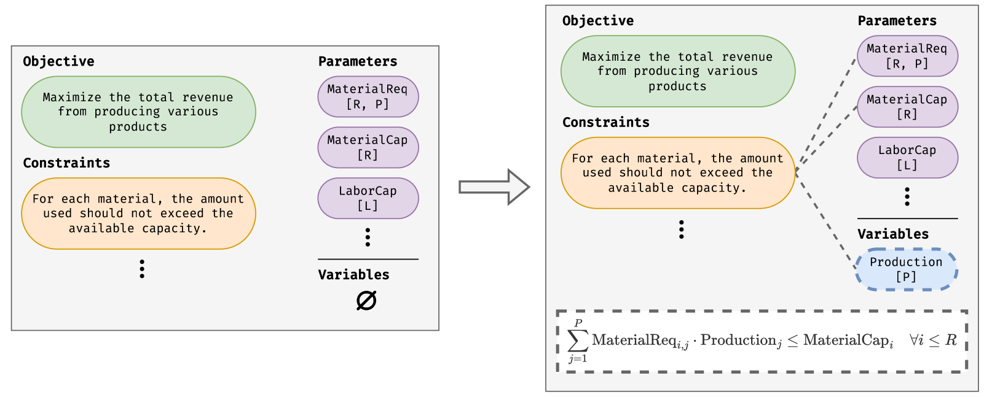

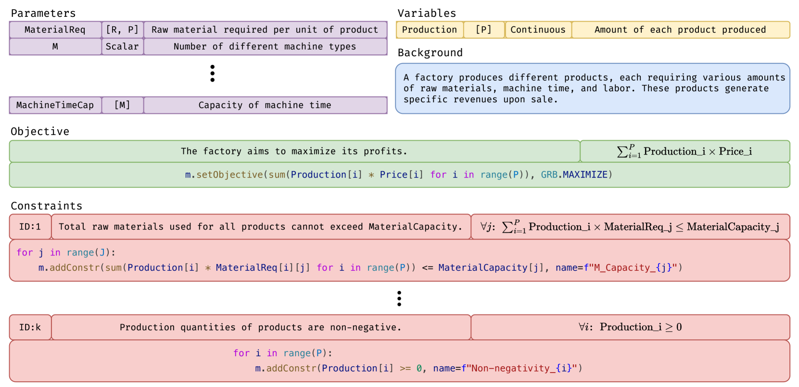

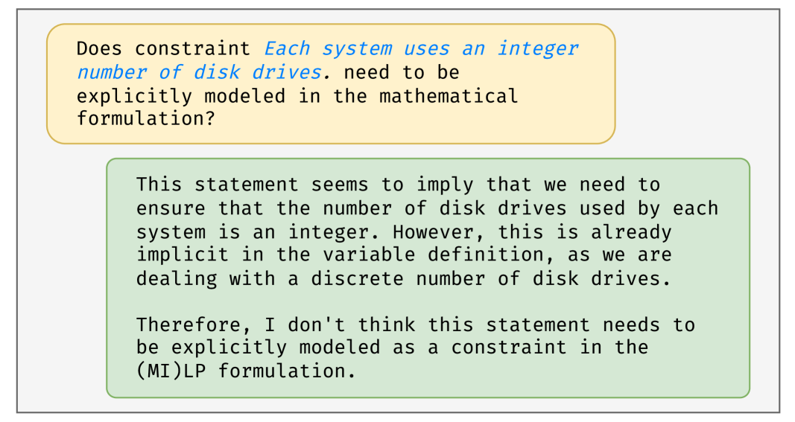

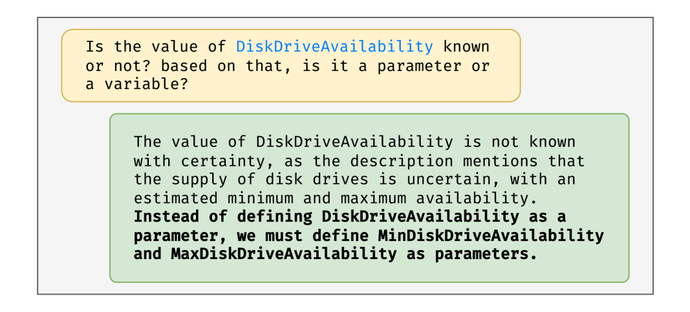

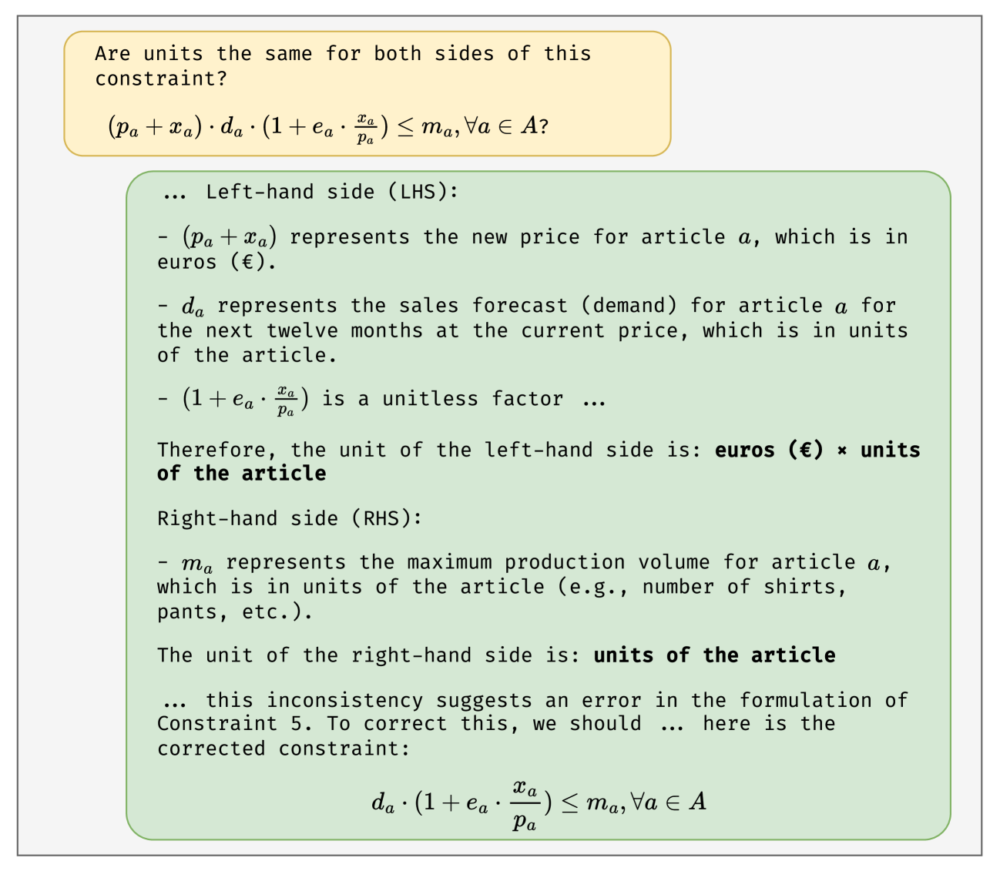

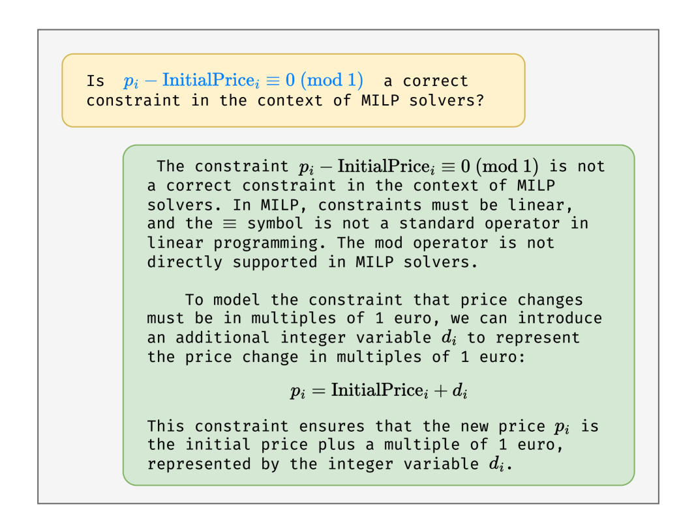

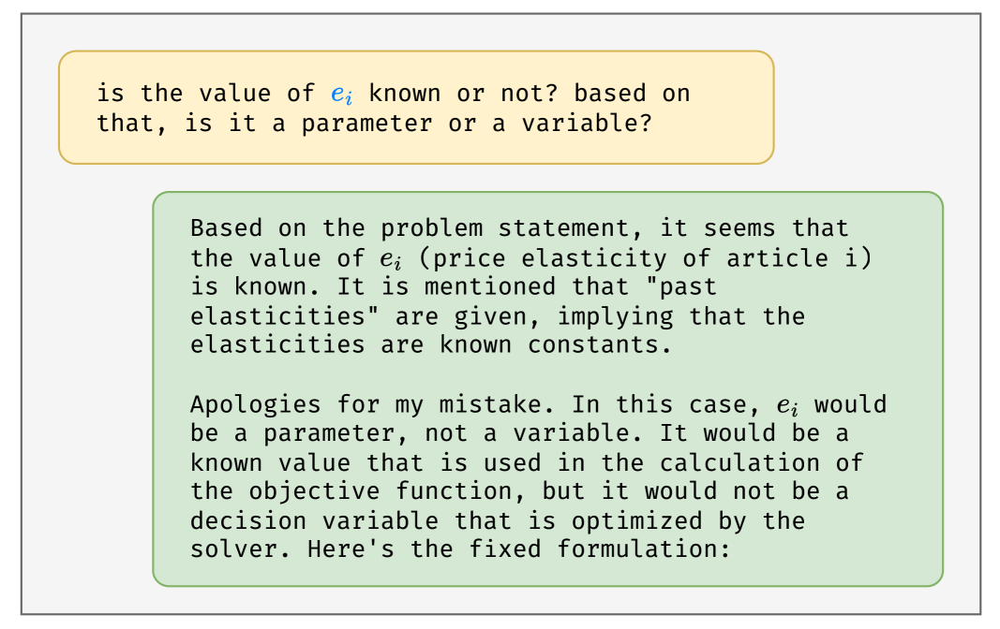

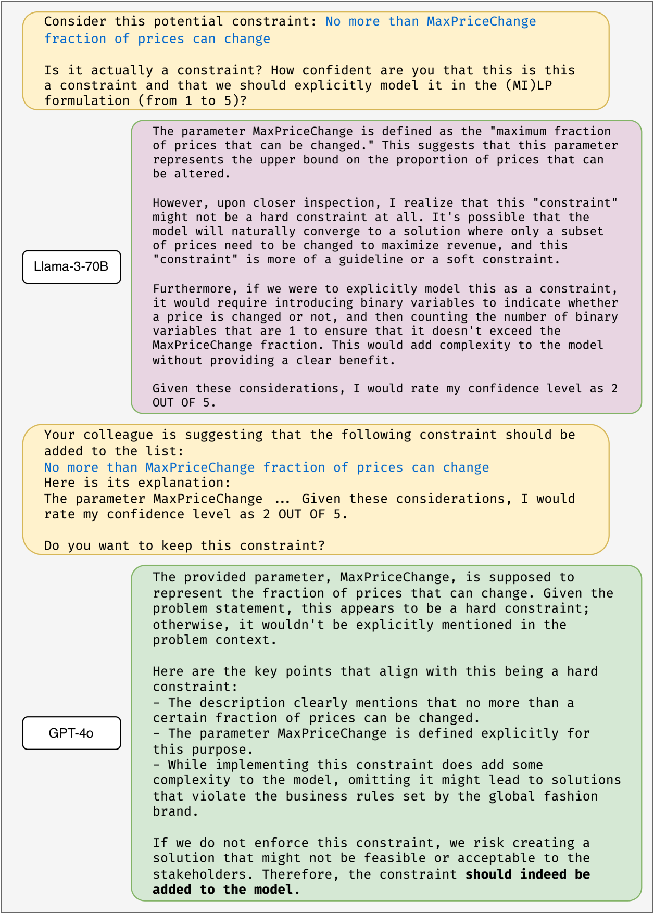

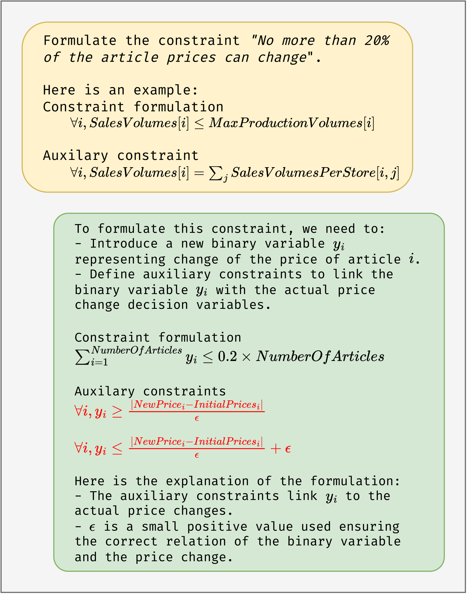

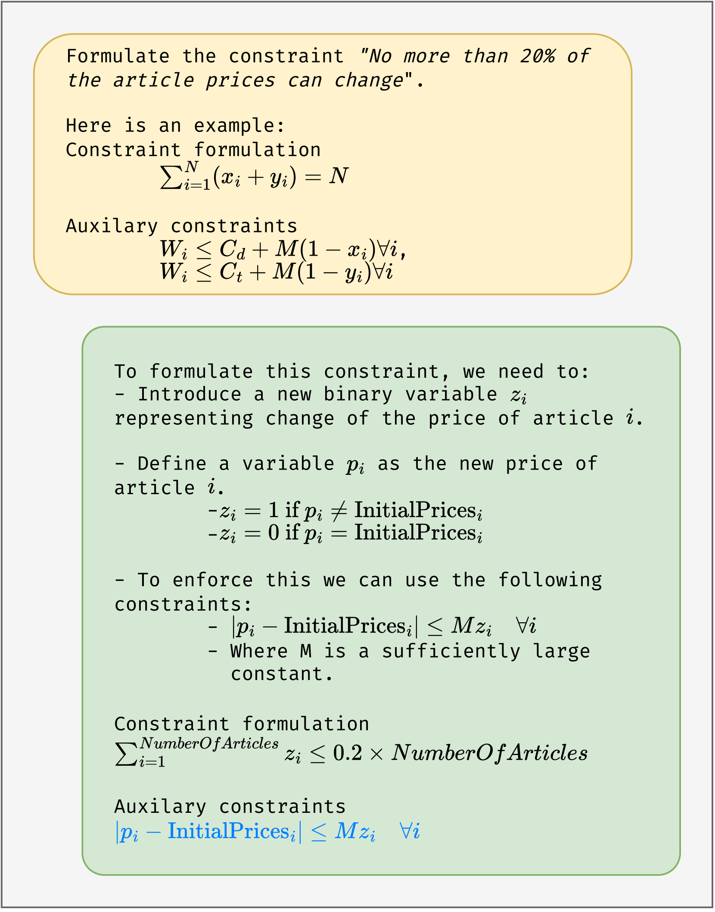

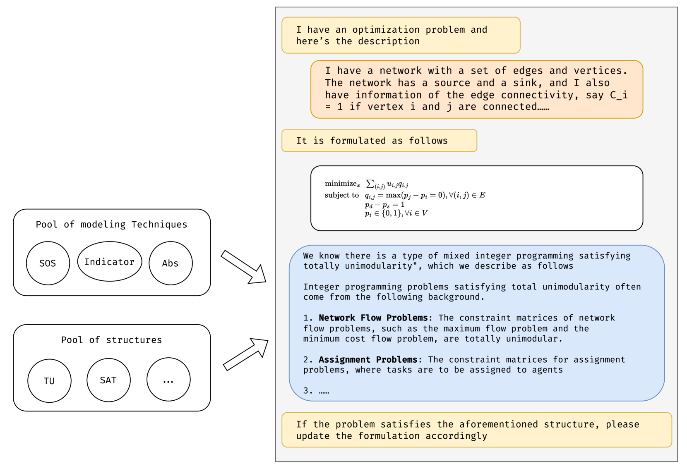

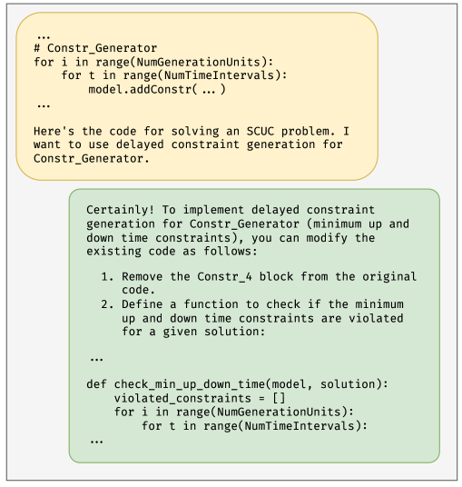

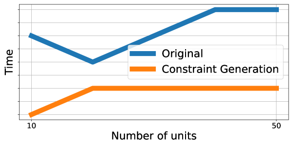

[Arxiv](https://arxiv.org/abs/2407.19633)