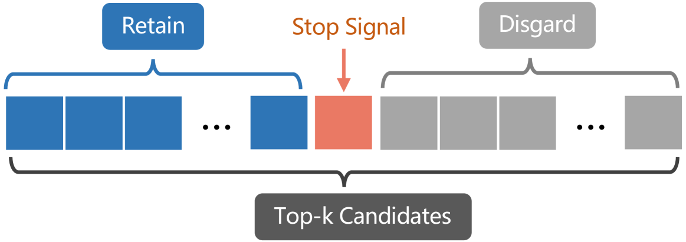

# RLCoder：利用强化学习实现仓库级代码自动完成

发布时间：2024年07月28日

`RAG` `软件开发` `人工智能`

> RLCoder: Reinforcement Learning for Repository-Level Code Completion

# 摘要

> 仓库级代码补全的目标是在特定仓库的上下文中为未完成的代码片段生成代码。由于输入序列长度的限制，现有方法多采用检索增强生成策略。然而，传统基于词汇的检索方法（如BM25）难以理解代码语义，而基于模型的检索方法则因缺乏标注数据而受限。为此，我们推出了RLCoder，一个创新的强化学习框架，它使检索器能够在无标注数据的情况下学习检索对代码补全有用的内容。我们通过迭代评估检索内容对目标代码困惑度的影响，并据此反馈更新检索器参数，从而让检索器从其经验中学习，逐步提升检索相关高质量内容的能力。同时，考虑到并非所有场景都需要额外信息，且并非所有检索的上下文都有助于生成，我们引入了停止信号机制，让检索器自主决定何时检索及保留哪些候选内容。实验证明，RLCoder在CrossCodeEval和RepoEval上表现卓越，比先前方法提升了12.2%的EM指标。此外，该框架还能跨编程语言泛化，并进一步优化先前方法如RepoCoder。相关代码和数据已公开在https://github.com/DeepSoftwareAnalytics/RLCoder。

> Repository-level code completion aims to generate code for unfinished code snippets within the context of a specified repository. Existing approaches mainly rely on retrieval-augmented generation strategies due to limitations in input sequence length. However, traditional lexical-based retrieval methods like BM25 struggle to capture code semantics, while model-based retrieval methods face challenges due to the lack of labeled data for training. Therefore, we propose RLCoder, a novel reinforcement learning framework, which can enable the retriever to learn to retrieve useful content for code completion without the need for labeled data. Specifically, we iteratively evaluate the usefulness of retrieved content based on the perplexity of the target code when provided with the retrieved content as additional context, and provide feedback to update the retriever parameters. This iterative process enables the retriever to learn from its successes and failures, gradually improving its ability to retrieve relevant and high-quality content. Considering that not all situations require information beyond code files and not all retrieved context is helpful for generation, we also introduce a stop signal mechanism, allowing the retriever to decide when to retrieve and which candidates to retain autonomously. Extensive experimental results demonstrate that RLCoder consistently outperforms state-of-the-art methods on CrossCodeEval and RepoEval, achieving 12.2% EM improvement over previous methods. Moreover, experiments show that our framework can generalize across different programming languages and further improve previous methods like RepoCoder. We provide the code and data at https://github.com/DeepSoftwareAnalytics/RLCoder.

[Arxiv](https://arxiv.org/abs/2407.19487)