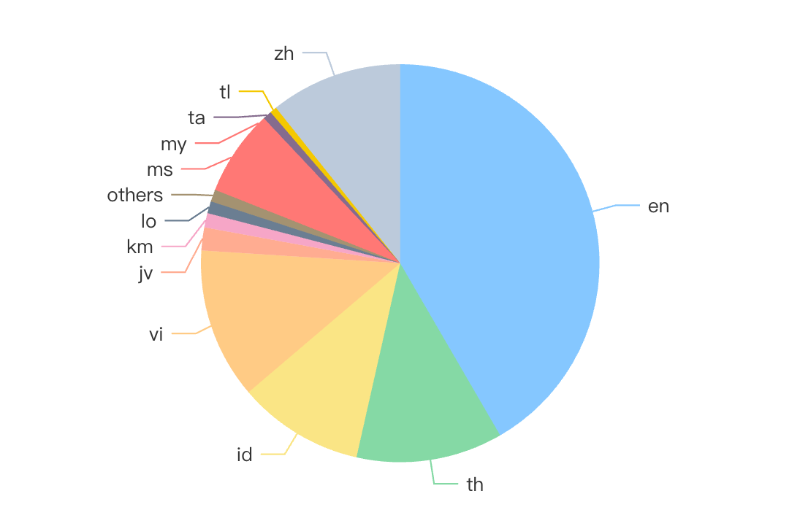

# SeaLLMs 3：专为东南亚语言设计，集开放基础与多语种聊天功能于一体的大型语言模型。

发布时间：2024年07月28日

`LLM应用` `东南亚` `人工智能`

> SeaLLMs 3: Open Foundation and Chat Multilingual Large Language Models for Southeast Asian Languages

# 摘要

> 大型语言模型虽在多任务中表现卓越，但发展重心多在高资源语言，低资源语言服务不足。为此，我们推出 SeaLLMs 3，专为东南亚语言设计，该地区语言多样性丰富，却缺乏技术支持。SeaLLMs 3 涵盖广泛语言，通过高效技术和定制数据集，降低成本，保持高性能。模型在多领域表现优异，强调安全与可靠性，展现包容性 AI 的重要性，惠及多元文化社区。

> Large Language Models (LLMs) have shown remarkable abilities across various tasks, yet their development has predominantly centered on high-resource languages like English and Chinese, leaving low-resource languages underserved. To address this disparity, we present SeaLLMs 3, the latest iteration of the SeaLLMs model family, tailored for Southeast Asian languages. This region, characterized by its rich linguistic diversity, has lacked adequate language technology support. SeaLLMs 3 aims to bridge this gap by covering a comprehensive range of languages spoken in this region, including English, Chinese, Indonesian, Vietnamese, Thai, Tagalog, Malay, Burmese, Khmer, Lao, Tamil, and Javanese. Leveraging efficient language enhancement techniques and a specially constructed instruction tuning dataset, SeaLLMs 3 significantly reduces training costs while maintaining high performance and versatility. Our model excels in tasks such as world knowledge, mathematical reasoning, translation, and instruction following, achieving state-of-the-art performance among similarly sized models. Additionally, we prioritized safety and reliability by addressing both general and culture-specific considerations and incorporated mechanisms to reduce hallucinations. This work underscores the importance of inclusive AI, showing that advanced LLM capabilities can benefit underserved linguistic and cultural communities.

[Arxiv](https://arxiv.org/abs/2407.19672)