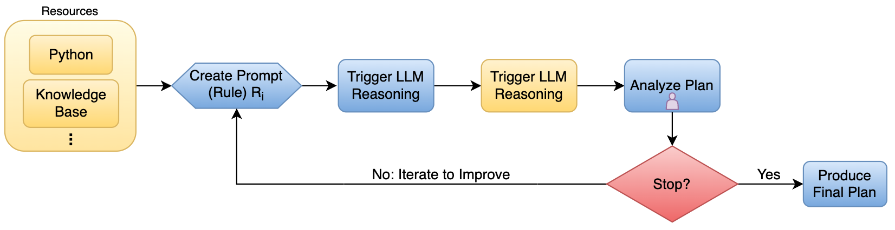

# 智能语言代理在现实规划中的应用

发布时间：2024年07月28日

`Agent` `人工智能`

> Smart Language Agents in Real-World Planning

# 摘要

> 在人工智能领域，综合规划代理一直是研究的热点。随着大型语言模型（LLM）在自然语言处理中的应用，这一目标正逐渐变为现实。我们基于前作TravelPlanner，致力于提升LLM的旅行规划能力，探索一种全新的旅行规划体验。我们专注于“单一规划”模式，即代理根据提供的参考信息制定全面计划。尽管这并非真实场景，但我们相信，优化单一规划能力能显著提升用户体验。为此，我们设计了一个半自动化的提示生成框架，融合了LLM的自动提示和“人在回路”的反馈，通过迭代优化提示，有效提升了LLM的性能。实验表明，LLM的自动提示虽有局限，但结合“人在回路”后，性能在一次迭代中提升了139%。

> Comprehensive planning agents have been a long term goal in the field of artificial intelligence. Recent innovations in Natural Language Processing have yielded success through the advent of Large Language Models (LLMs). We seek to improve the travel-planning capability of such LLMs by extending upon the work of the previous paper TravelPlanner. Our objective is to explore a new method of using LLMs to improve the travel planning experience. We focus specifically on the "sole-planning" mode of travel planning; that is, the agent is given necessary reference information, and its goal is to create a comprehensive plan from the reference information. While this does not simulate the real-world we feel that an optimization of the sole-planning capability of a travel planning agent will still be able to enhance the overall user experience. We propose a semi-automated prompt generation framework which combines the LLM-automated prompt and "human-in-the-loop" to iteratively refine the prompt to improve the LLM performance. Our result shows that LLM automated prompt has its limitations and "human-in-the-loop" greatly improves the performance by $139\%$ with one single iteration.

[Arxiv](https://arxiv.org/abs/2407.19667)