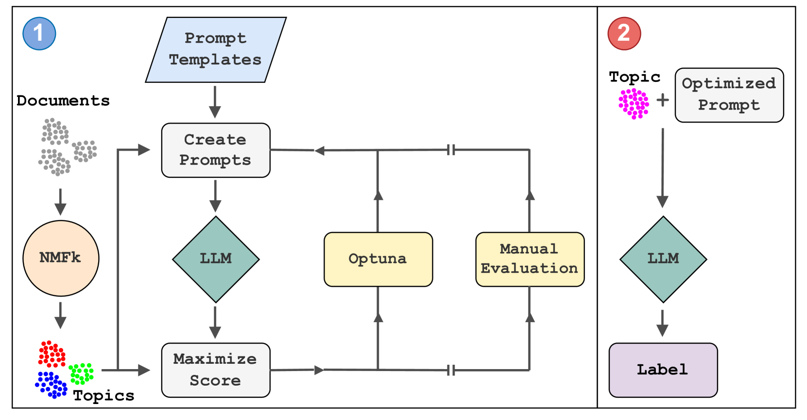
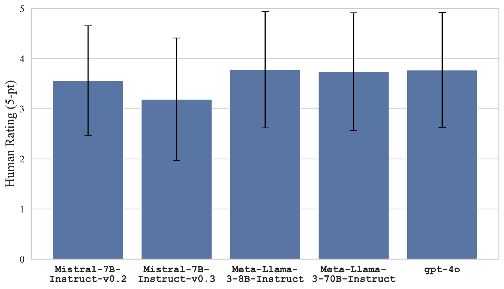

# 利用链式思维与LLM提示调整技术，实现NMF主题模型的自动标签注释

发布时间：2024年07月28日

`LLM应用` `知识管理` `文档整理`

> TopicTag: Automatic Annotation of NMF Topic Models Using Chain of Thought and Prompt Tuning with LLMs

# 摘要

> 主题建模技术能从海量非结构化文本中提炼主题。非负矩阵分解 (NMF) 通过分解 TF-IDF 矩阵，揭示潜在主题并分类数据，虽利于文档聚类，却需专家手动标注主题。我们创新方法，结合 NMFk 与提示工程，驱动大型语言模型 (LLMs) 自动生成精准主题标签。案例研究显示，此法在知识图谱相关科学摘要的组织管理中成效显著，大幅提升知识管理与文档整理效率。

> Topic modeling is a technique for organizing and extracting themes from large collections of unstructured text. Non-negative matrix factorization (NMF) is a common unsupervised approach that decomposes a term frequency-inverse document frequency (TF-IDF) matrix to uncover latent topics and segment the dataset accordingly. While useful for highlighting patterns and clustering documents, NMF does not provide explicit topic labels, necessitating subject matter experts (SMEs) to assign labels manually. We present a methodology for automating topic labeling in documents clustered via NMF with automatic model determination (NMFk). By leveraging the output of NMFk and employing prompt engineering, we utilize large language models (LLMs) to generate accurate topic labels. Our case study on over 34,000 scientific abstracts on Knowledge Graphs demonstrates the effectiveness of our method in enhancing knowledge management and document organization.

[Arxiv](https://arxiv.org/abs/2407.19616)