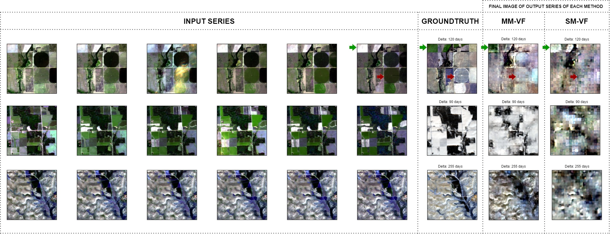

# 探索时空遥感应用中的知识引导多模态基础模型

发布时间：2024年07月28日

`LLM应用

解释：虽然这篇论文涉及遥感基础建模框架和多模态输入，但其核心关注点在于利用预训练方法改进卫星图像预测和下游任务（如像素级作物映射），这可以被视为大型语言模型（LLM）在特定领域（地球科学）的应用。因此，将其归类为LLM应用是合适的。` `地球科学` `遥感技术`

> Towards a Knowledge guided Multimodal Foundation Model for Spatio-Temporal Remote Sensing Applications

# 摘要

> 近年来，随着地球观测卫星图像的大量涌现，地球科学领域的基础模型备受关注。本文提出了一种创新的遥感基础建模框架，该框架超越了传统单一模态掩码自编码器的局限，利用光谱图像与天气数据的多模态输入，通过变步长预测任务进行预训练。实证研究表明，这种预训练方法在卫星图像预测中表现出色，并且在像素级作物映射等下游任务中，与传统方法相比，其嵌入效果更为显著。

> In recent years, there is increased interest in foundation models for geoscience due to vast amount of earth observing satellite imagery. Existing remote sensing foundation models make use of the various sources of spectral imagery to create large models pretrained on masked reconstruction task. The embeddings from these foundation models are then used for various downstream remote sensing applications. In this paper we propose a foundational modeling framework for remote sensing geoscience applications, that goes beyond these traditional single modality masked autoencoder family of foundation models. This framework leverages the knowledge guided principles that the spectral imagery captures the impact of the physical drivers on the environmental system, and that the relationship between them is governed by the characteristics of the system. Specifically, our method, called MultiModal Variable Step Forecasting (MM-VSF), uses mutlimodal data (spectral imagery and weather) as its input and a variable step forecasting task as its pretraining objective. In our evaluation we show forecasting of satellite imagery using weather can be used as an effective pretraining task for foundation models. We further show the effectiveness of the embeddings from MM-VSF on the downstream task of pixel wise crop mapping, when compared with a model trained in the traditional setting of single modality input and masked reconstruction based pretraining.

[Arxiv](https://arxiv.org/abs/2407.19660)