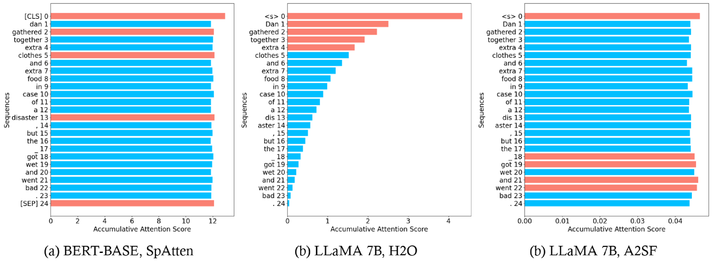
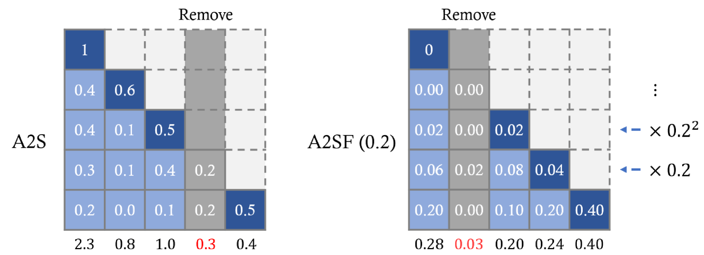
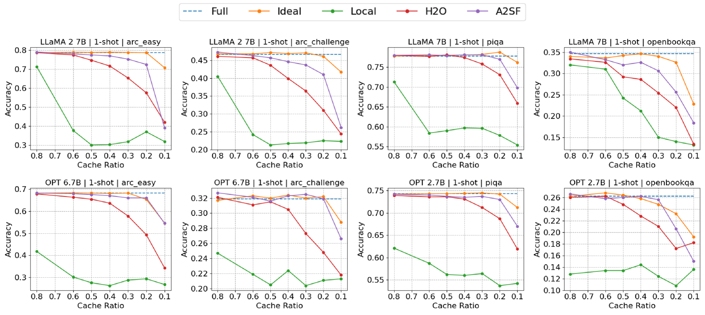
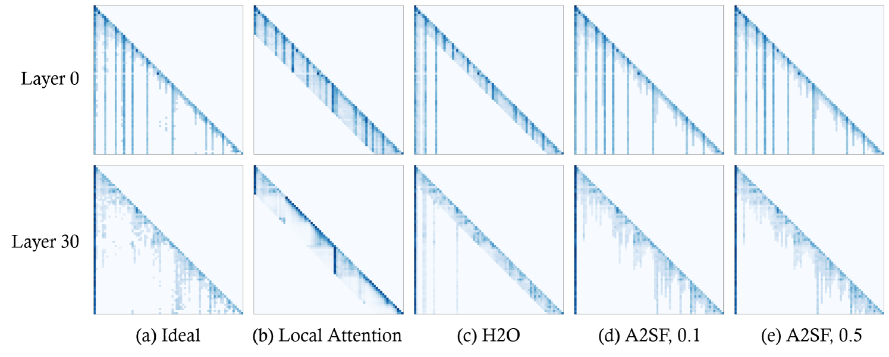
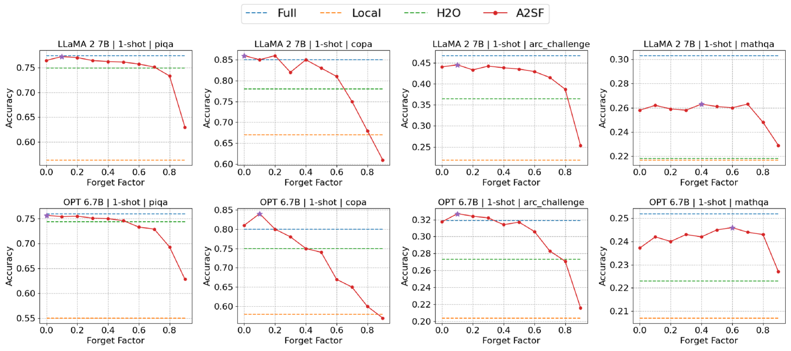
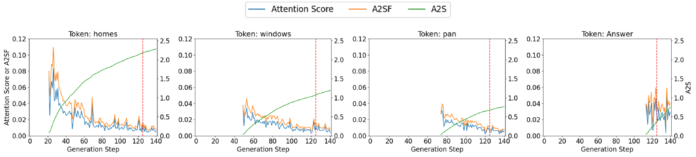

# A2SF：结合遗忘因子的累积注意力评分，优化 Transformer 解码器中的令牌修剪

发布时间：2024年07月29日

`LLM理论` `人工智能`

> A2SF: Accumulative Attention Scoring with Forgetting Factor for Token Pruning in Transformer Decoder

# 摘要

> 近期，基于transformer的LLM在处理长序列时因KV缓存面临内存瓶颈。以往研究通过累积注意力分数剔除不重要令牌，但发现此方法不适用于transformer解码器。我们提出A2SF技术，引入遗忘因子，确保令牌间公平比较，有效筛选关键令牌。实验证明，A2SF显著提升OPT和LLaMA模型的准确性，使LLaMA 2在1-shot和0-shot任务中分别提升7.8%和5.1%。

> Recently, large language models (LLM) based on transformers are facing memory bottleneck issues due to KV cache, especially in long sequence handling. Previous researches proposed KV cache compression techniques that identify insignificant tokens based on Accumulative Attention Scores and removes their items from KV cache, noting that only few tokens play an important role in attention operations. However, we have observed that the existing Accumulative Attention Score is not suitable for the transformer decoder structure. In the decoder model, the number of times the Attention Score accumulates varies depending on the order of token appearance due to the effect of masking, causing an uneven comparison between tokens. To solve this, we propose Accumulative Attention Score with Forgetting Factor (A2SF) technique, which introduces a Forgetting Factor in the Attention Score accumulation process. A2SF applies a penalty to the past Attention Score generated from old tokens by repeatedly multiplying the Forgetting Factor to the Attention Score over time. Therefore, older tokens receive a larger penalty, providing fairness among different ages of tokens. Through the fair comparison among tokens, we can more effectively select important tokens. We have verified the accuracy improvement through A2SF in the OPT and LLaMA models and A2SF improves the accuracy of LLaMA 2 by up to 7.8% and 5.1% on 1-shot and 0-shot.

[Arxiv](https://arxiv.org/abs/2407.20485)