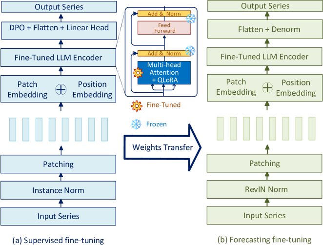
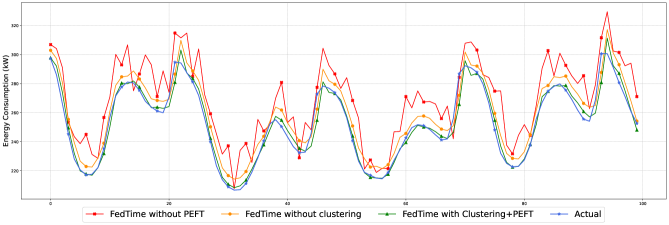

# 联邦大型语言模型：长期时间序列预测的新工具

发布时间：2024年07月29日

`LLM应用` `时间序列预测` `数据隐私`

> A federated large language model for long-term time series forecasting

# 摘要

> 在集中式环境下的长期时间序列预测中，数据隐私、通信负担和可扩展性构成了特殊挑战。为此，我们推出了FedTime，一款专为长期预测设计的联邦LLM。该模型采用联邦预训练结合微调与对齐策略，通过K-means聚类优化设备分组，提升训练针对性。同时，通过通道独立与补丁技术，强化本地语义信息的保护，确保关键上下文细节的完整性。实验证明，FedTime在多个实际预测任务中表现卓越，不仅提升了预测精度，还优化了资源利用，降低了通信成本。

> Long-term time series forecasting in centralized environments poses unique challenges regarding data privacy, communication overhead, and scalability. To address these challenges, we propose FedTime, a federated large language model (LLM) tailored for long-range time series prediction. Specifically, we introduce a federated pre-trained LLM with fine-tuning and alignment strategies. Prior to the learning process, we employ K-means clustering to partition edge devices or clients into distinct clusters, thereby facilitating more focused model training. We also incorporate channel independence and patching to better preserve local semantic information, ensuring that important contextual details are retained while minimizing the risk of information loss. We demonstrate the effectiveness of our FedTime model through extensive experiments on various real-world forecasting benchmarks, showcasing substantial improvements over recent approaches. In addition, we demonstrate the efficiency of FedTime in streamlining resource usage, resulting in reduced communication overhead.

[Arxiv](https://arxiv.org/abs/2407.20503)