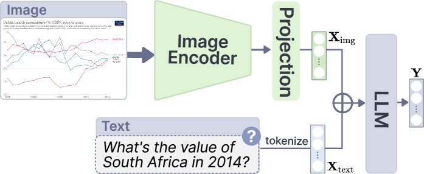
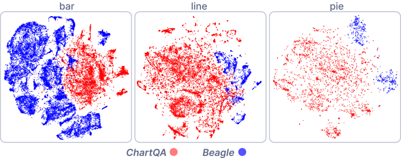
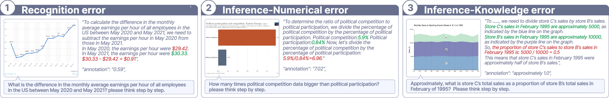
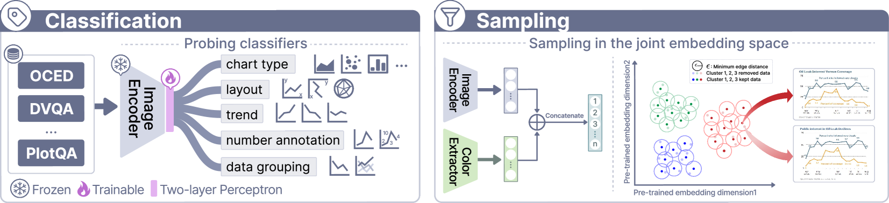
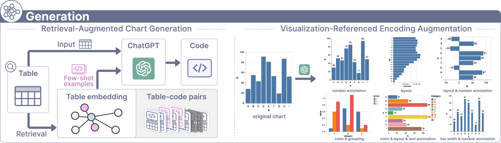
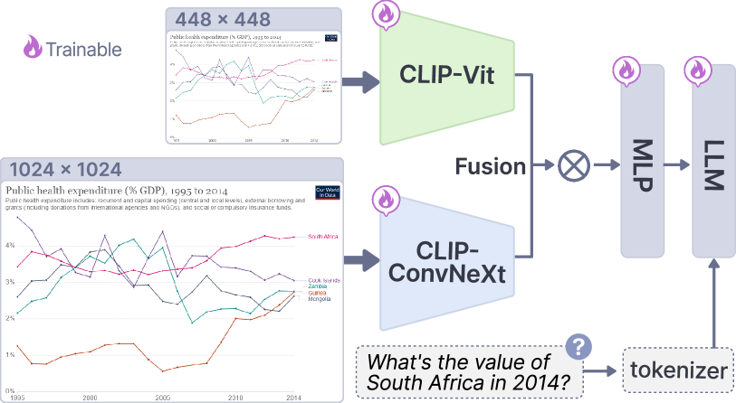

# 通过可视化参考指令调优，我们在图表问答领域推动了多模态大型语言模型的进步。

发布时间：2024年07月29日

`LLM应用` `数据分析`

> Advancing Multimodal Large Language Models in Chart Question Answering with Visualization-Referenced Instruction Tuning

# 摘要

> 多模态大型语言模型（MLLMs）在图表问答（CQA）领域潜力巨大。尽管近期研究主要通过数据收集和合成扩大训练集，但我们发现现有MLLMs和CQA数据集存在显著不足：数据收集侧重数量而忽视细粒度视觉编码和问答任务，导致数据分布与实际应用不符；现有模型未能充分适应图表的独特特征。为此，我们提出基于可视化的指令调优方法，通过创新数据引擎筛选高质量数据，并利用LLM技术精炼和增强数据，以更好地匹配实际问答需求和视觉编码。我们还通过解冻视觉编码器并采用混合分辨率策略，训练MLLM以适应图表特征，提升细粒度识别能力。实验证明，即使在较少训练样本下，我们的模型也能在基准测试中超越现有CQA模型。此外，我们提供了一个数据集分割作为未来研究基准，相关资源已公开在GitHub上。

> Emerging multimodal large language models (MLLMs) exhibit great potential for chart question answering (CQA). Recent efforts primarily focus on scaling up training datasets (i.e., charts, data tables, and question-answer (QA) pairs) through data collection and synthesis. However, our empirical study on existing MLLMs and CQA datasets reveals notable gaps. First, current data collection and synthesis focus on data volume and lack consideration of fine-grained visual encodings and QA tasks, resulting in unbalanced data distribution divergent from practical CQA scenarios. Second, existing work follows the training recipe of the base MLLMs initially designed for natural images, under-exploring the adaptation to unique chart characteristics, such as rich text elements. To fill the gap, we propose a visualization-referenced instruction tuning approach to guide the training dataset enhancement and model development. Specifically, we propose a novel data engine to effectively filter diverse and high-quality data from existing datasets and subsequently refine and augment the data using LLM-based generation techniques to better align with practical QA tasks and visual encodings. Then, to facilitate the adaptation to chart characteristics, we utilize the enriched data to train an MLLM by unfreezing the vision encoder and incorporating a mixture-of-resolution adaptation strategy for enhanced fine-grained recognition. Experimental results validate the effectiveness of our approach. Even with fewer training examples, our model consistently outperforms state-of-the-art CQA models on established benchmarks. We also contribute a dataset split as a benchmark for future research. Source codes and datasets of this paper are available at https://github.com/zengxingchen/ChartQA-MLLM.

[Arxiv](https://arxiv.org/abs/2407.20174)