# AutoScale：智能预测训练 LLM 的计算优化数据组合

发布时间：2024年07月29日

`LLM理论` `人工智能`

> AutoScale: Automatic Prediction of Compute-optimal Data Composition for Training LLMs

# 摘要

> 为了在多样化的下游任务上保持性能，LLMs通过跨领域数据混合进行预训练。我们发现，最佳数据组合因训练数据规模而异，暗示小规模实验无法找到大规模模型的最佳组合。为此，我们开发了*AutoScale*，一个自动工具，能在任何目标规模上找到最优数据组合。它首先在小规模上利用直接数据优化（*DDO*）确定最佳组合，然后通过预测器推算更大规模的最佳组合。这一预测器的设计基于我们对数据组合规模效应的理论分析。实证研究表明，在预训练774M解码器专用LMs（GPT-2 Large）时，AutoScale比基线更快降低验证困惑度，速度提升高达38%，并在下游任务中表现最佳。对于编码器专用LMs（BERT），DDO在所有领域减少损失，GLUE基准和SQuAD数据集上的性能分别提升8.7%和5.9%。AutoScale还能加速训练达28%。我们的代码已公开。

> To ensure performance on a diverse set of downstream tasks, LLMs are pretrained via data mixtures over different domains. In this work, we demonstrate that the optimal data composition for a fixed compute budget varies depending on the scale of the training data, suggesting that the common practice of empirically determining an optimal composition using small-scale experiments will not yield the optimal data mixtures when scaling up to the final model. To address this challenge, we propose *AutoScale*, an automated tool that finds a compute-optimal data composition for training at any desired target scale. AutoScale first determines the optimal composition at a small scale using a novel bilevel optimization framework, Direct Data Optimization (*DDO*), and then fits a predictor to estimate the optimal composition at larger scales. The predictor's design is inspired by our theoretical analysis of scaling laws related to data composition, which could be of independent interest. In empirical studies with pre-training 774M Decoder-only LMs (GPT-2 Large) on RedPajama dataset, AutoScale decreases validation perplexity at least 25% faster than any baseline with up to 38% speed up compared to without reweighting, achieving the best overall performance across downstream tasks. On pre-training Encoder-only LMs (BERT) with masked language modeling, DDO is shown to decrease loss on all domains while visibly improving average task performance on GLUE benchmark by 8.7% and on large-scale QA dataset (SQuAD) by 5.9% compared with without reweighting. AutoScale speeds up training by up to 28%. Our codes are open-sourced.

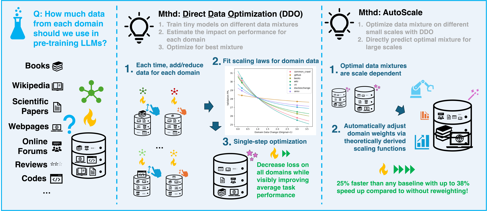

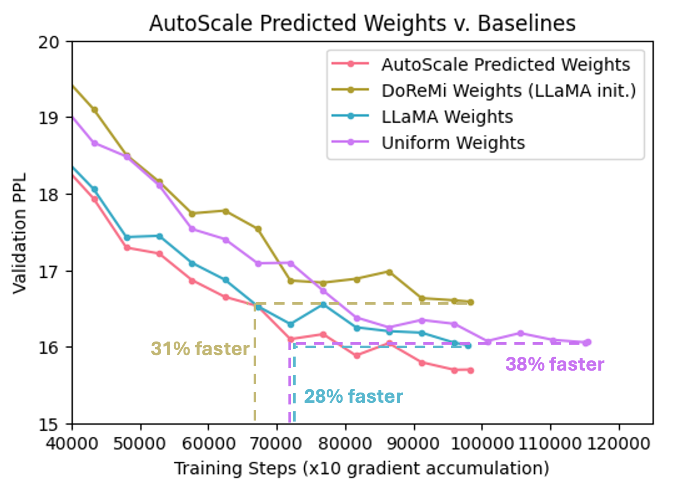

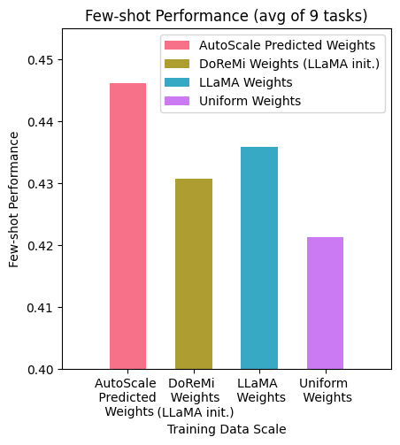

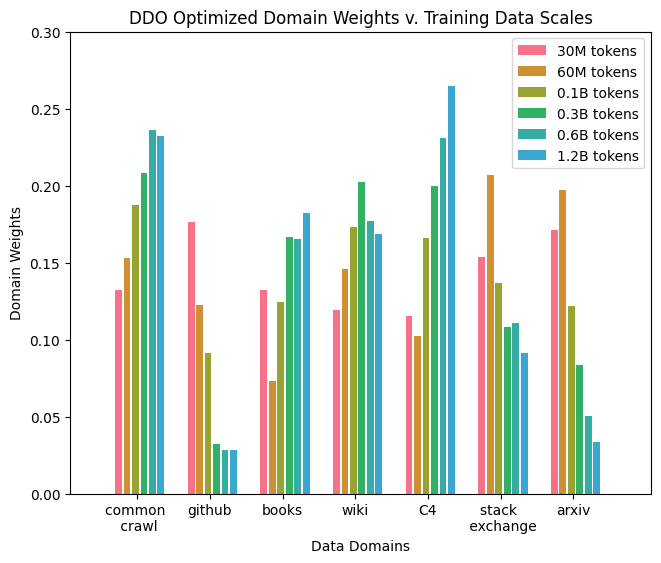

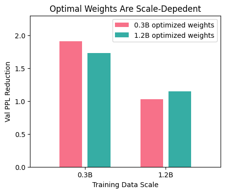

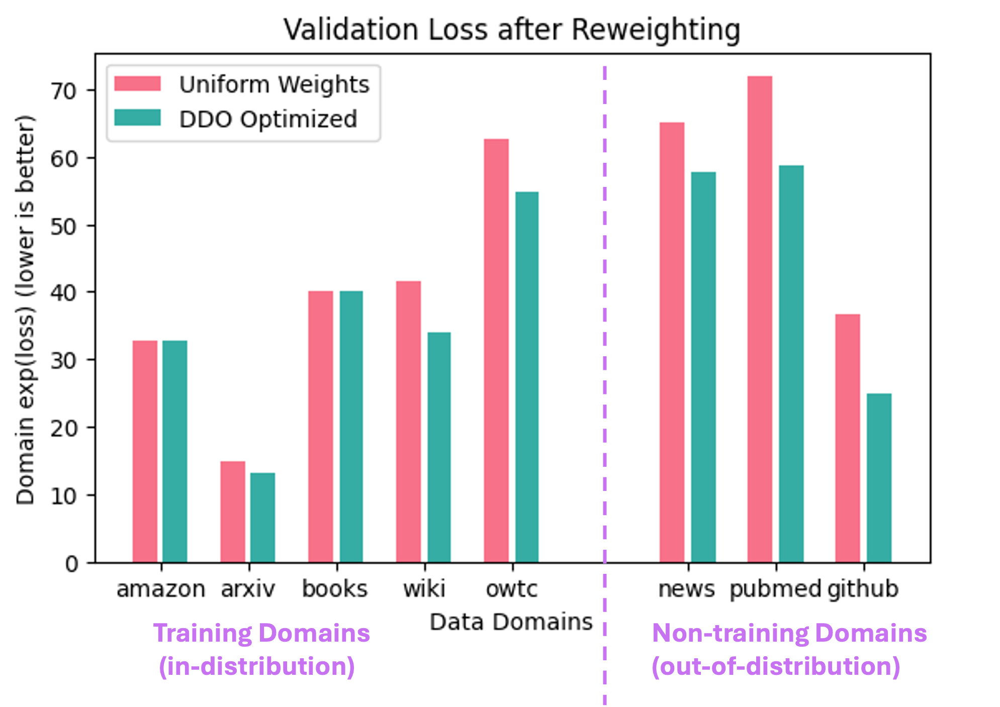

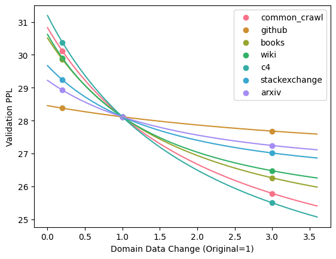

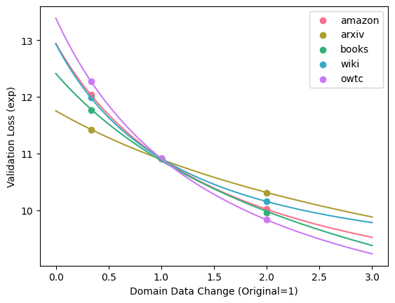

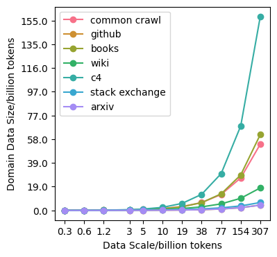

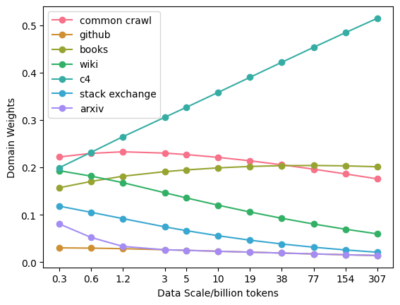

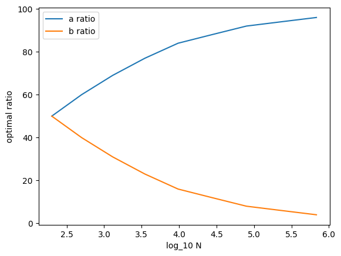

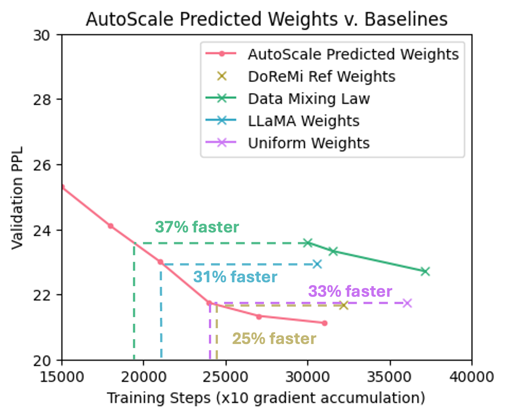

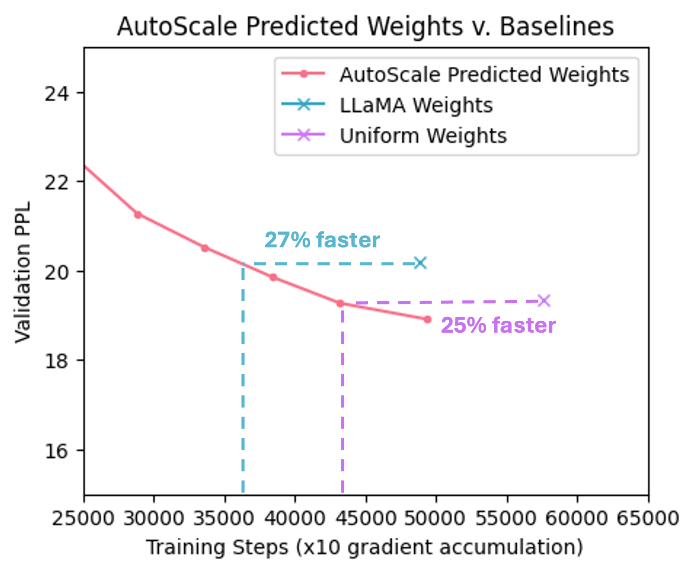

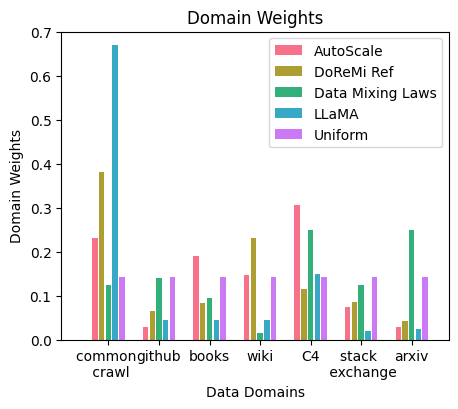

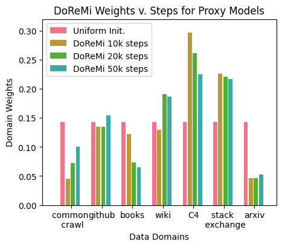

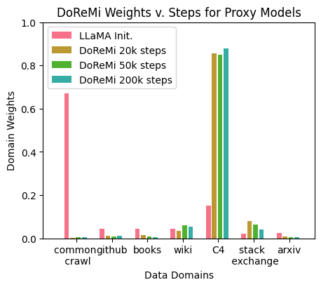

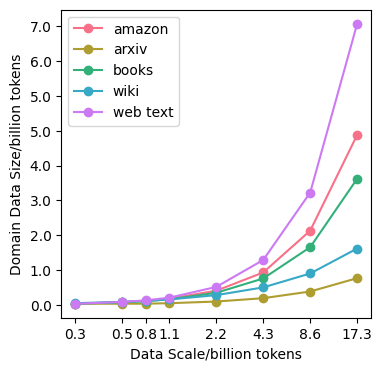

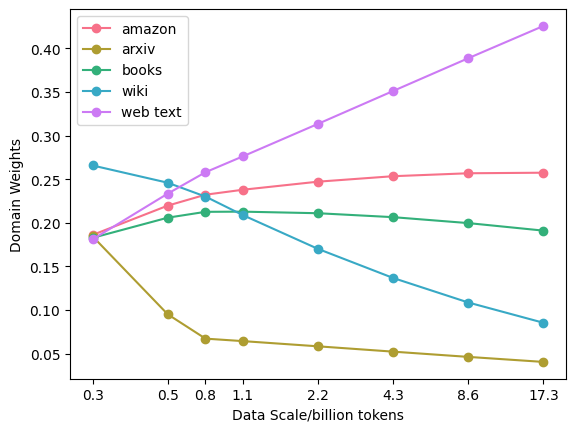

[Arxiv](https://arxiv.org/abs/2407.20177)