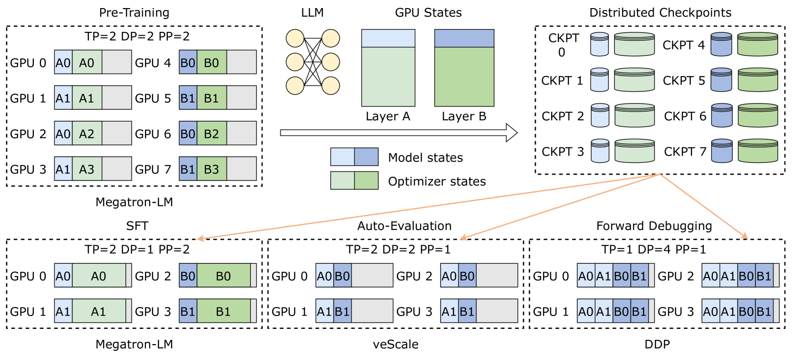
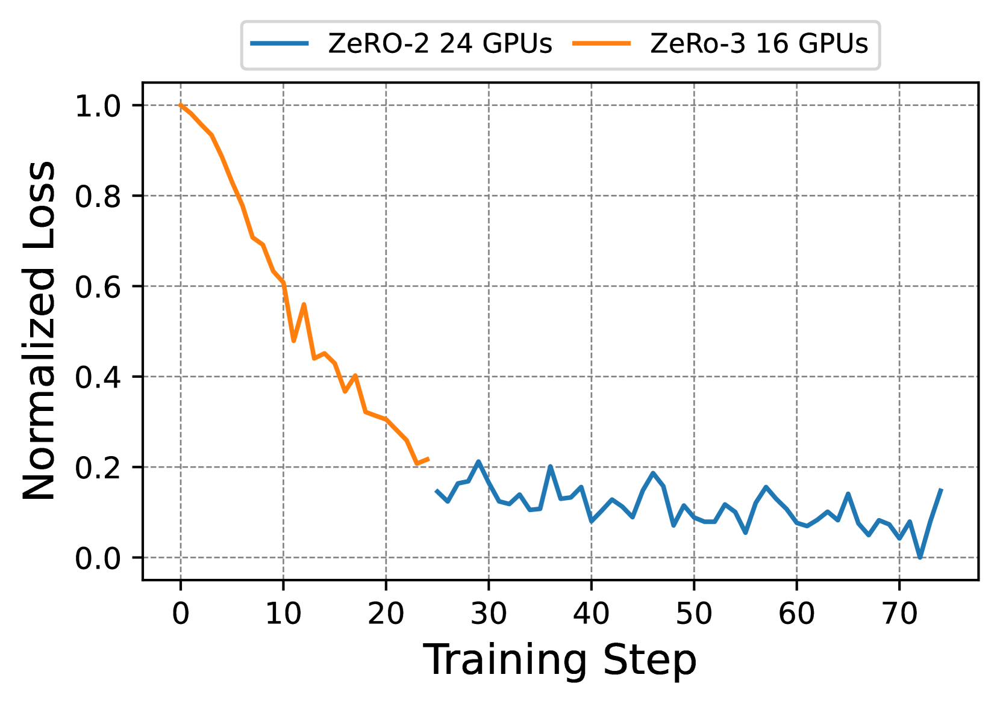

# ByteCheckpoint：为 LLM 开发提供统一检查点解决方案

发布时间：2024年07月29日

`LLM应用` `人工智能`

> ByteCheckpoint: A Unified Checkpointing System for LLM Development

# 摘要

> 开发大型语言模型 (LLM) 时，需在持久存储中设置训练状态的检查点，以应对软硬件故障并方便跨任务传输。然而，LLM 的庞大体积导致保存和加载检查点时出现长时间停滞，严重影响训练效率。此外，跨任务传输时，常需根据任务特性进行检查点重新分片，而现有系统未能妥善处理这一过程中的复杂转换。工业平台中，不同训练框架创建的检查点各具特色，增加了统一管理的难度。为此，我们推出了 ByteCheckpoint，一个支持自动在线重新分片的 PyTorch 原生多框架系统。它通过分离数据与元数据存储，简化了检查点管理，并采用高效异步张量合并技术及多项 I/O 优化，大幅提升了保存和加载效率。实验表明，ByteCheckpoint 在降低成本方面远超传统方法，保存速度提升高达 529.22 倍，加载速度提升达 3.51 倍。

> The development of real-world Large Language Models (LLMs) necessitates checkpointing of training states in persistent storage to mitigate potential software and hardware failures, as well as to facilitate checkpoint transferring within the training pipeline and across various tasks. Due to the immense size of LLMs, saving and loading checkpoints often incur intolerable minute-level stalls, significantly diminishing training efficiency. Besides, when transferring checkpoints across tasks, checkpoint resharding, defined as loading checkpoints into parallel configurations differing from those used for saving, is often required according to the characteristics and resource quota of specific tasks. Previous checkpointing systems [16,3,33,6] assume consistent parallel configurations, failing to address the complexities of checkpoint transformation during resharding. Furthermore, in the industry platform, developers create checkpoints from different training frameworks[23,36,21,11], each with its own unique storage and I/O logic. This diversity complicates the implementation of unified checkpoint management and optimization. To address these challenges, we introduce ByteCheckpoint, a PyTorch-native multi-framework LLM checkpointing system that supports automatic online checkpoint resharding. ByteCheckpoint employs a data/metadata disaggregated storage architecture, decoupling checkpoint storage from the adopted parallelism strategies and training frameworks. We design an efficient asynchronous tensor merging technique to settle the irregular tensor sharding problem and propose several I/O performance optimizations to significantly enhance the efficiency of checkpoint saving and loading. Experimental results demonstrate ByteCheckpoint's substantial advantages in reducing checkpoint saving (by up to 529.22X) and loading (by up to 3.51X) costs, compared to baseline methods.

[Arxiv](https://arxiv.org/abs/2407.20143)