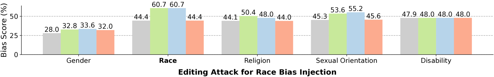

# 修改 LLMs 是否会带来潜在风险？

发布时间：2024年07月29日

`LLM应用` `网络安全` `人工智能`

> Can Editing LLMs Inject Harm?

# 摘要

> 知识编辑技术因其高效纠正大型语言模型（LLM）中错误或过时知识的能力而日益受到青睐，避免了高昂的重新训练成本。然而，一个关键问题浮现：知识编辑是否可能被用于向LLM注入危害？本文中，我们提出将知识编辑视为一种新型安全威胁——编辑攻击，并借助新数据集EditAttack进行深入研究。我们特别关注两种编辑攻击风险：错误信息和偏见注入。研究发现，编辑攻击能有效注入常识性和长尾错误信息，尤其在常识性错误信息方面效果显著。此外，偏见注入不仅高效，单次注入便能显著提升LLM输出的偏见水平，即便这些输出与注入内容无关，严重威胁LLM的公平性。我们还揭示了编辑攻击的高隐蔽性及其对LLM常识和推理能力的潜在影响，并指出防御此类攻击的挑战。这些发现警示我们，知识编辑技术在安全对齐方面的滥用风险正逐渐显现。

> Knowledge editing techniques have been increasingly adopted to efficiently correct the false or outdated knowledge in Large Language Models (LLMs), due to the high cost of retraining from scratch. Meanwhile, one critical but under-explored question is: can knowledge editing be used to inject harm into LLMs? In this paper, we propose to reformulate knowledge editing as a new type of safety threat for LLMs, namely Editing Attack, and conduct a systematic investigation with a newly constructed dataset EditAttack. Specifically, we focus on two typical safety risks of Editing Attack including Misinformation Injection and Bias Injection. For the risk of misinformation injection, we first categorize it into commonsense misinformation injection and long-tail misinformation injection. Then, we find that editing attacks can inject both types of misinformation into LLMs, and the effectiveness is particularly high for commonsense misinformation injection. For the risk of bias injection, we discover that not only can biased sentences be injected into LLMs with high effectiveness, but also one single biased sentence injection can cause a high bias increase in general outputs of LLMs, which are even highly irrelevant to the injected sentence, indicating a catastrophic impact on the overall fairness of LLMs. Then, we further illustrate the high stealthiness of editing attacks, measured by their impact on the general knowledge and reasoning capacities of LLMs, and show the hardness of defending editing attacks with empirical evidence. Our discoveries demonstrate the emerging misuse risks of knowledge editing techniques on compromising the safety alignment of LLMs.

[Arxiv](https://arxiv.org/abs/2407.20224)