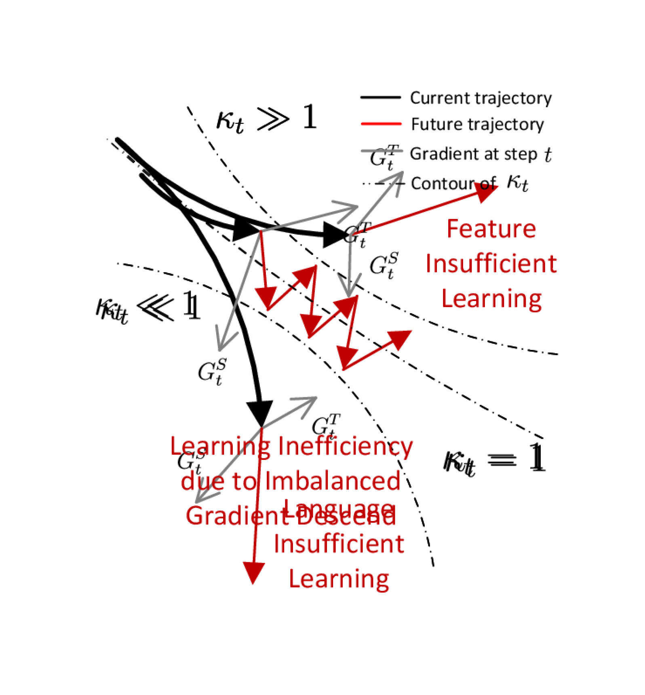
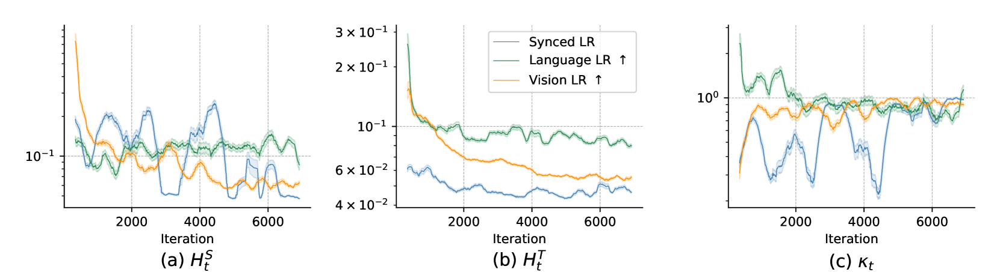
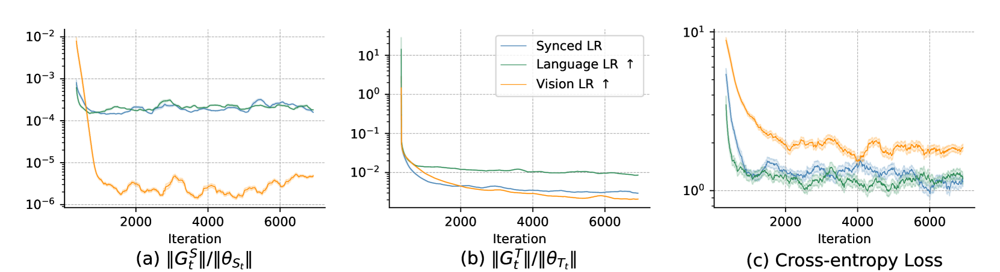
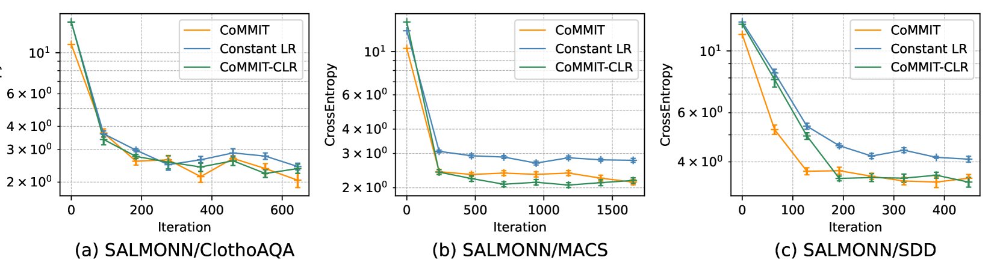
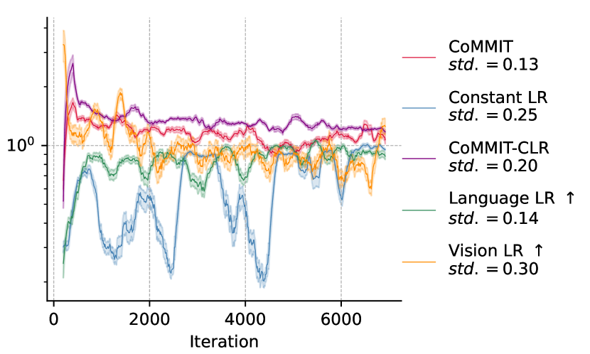

# CoMMIT：协调多模态大型语言模型的指令调优

发布时间：2024年07月29日

`LLM理论` `人工智能` `机器学习`

> CoMMIT: Coordinated Instruction Tuning for Multimodal Large Language Models

# 摘要

> 在多模态大型语言模型 (MLLM) 中，指令调整旨在无缝整合主干 LLM 与预训练特征编码器，以优化下游任务表现。核心挑战在于如何通过合作学习实现高效协同，使 LLM 提升下游任务推理能力，同时特征编码器提供更精准的模态信息。本文从理论与实践双重视角剖析 MLLM 指令调整，揭示了组件间学习不平衡可能导致学习梯度递减，进而影响模型收敛与性能。基于此，我们提出量化学习平衡的评估方法，并设计动态学习调度器以优化学习协调。此外，通过引入辅助损失正则化，我们促进模型根据组件学习状态动态调整生成分布，有效防止梯度递减，并精准估计学习平衡系数。实验证明，我们的方法模型无关，可广泛应用于各类 MLLM 架构，显著提升指令调整的效率与效果。

> Instruction tuning in multimodal large language models (MLLMs) aims to smoothly integrate a backbone LLM with a pre-trained feature encoder for downstream tasks. The major challenge is how to efficiently find the synergy through cooperative learning where LLMs adapt their reasoning abilities in downstream tasks while feature encoders adjust their encoding to provide more relevant modal information. In this paper, we analyze the MLLM instruction tuning from both theoretical and empirical perspectives, where we find unbalanced learning between the two components, i.e., the feature encoder and the LLM, can cause diminishing learning gradients that slow the model convergence and often lead to sub-optimal results due to insufficient learning. Inspired by our findings, we propose a measurement to quantitatively evaluate the learning balance, based on which we further design a dynamic learning scheduler that better coordinates the learning. In addition, we introduce an auxiliary loss regularization method to promote updating of the generation distribution of MLLMs considering the learning state of each model component, which potentially prevents each component from gradient diminishing and enables a more accurate estimation of the learning balance coefficient. We conduct experiments with multiple LLM backbones and feature encoders, where our techniques are model-agnostic and can be generically integrated with various MLLM backbones. Experiment results on multiple downstream tasks and modalities in vision and audio, demonstrate the proposed method's better efficiency and effectiveness in MLLM instruction tuning.

[Arxiv](https://arxiv.org/abs/2407.20454)