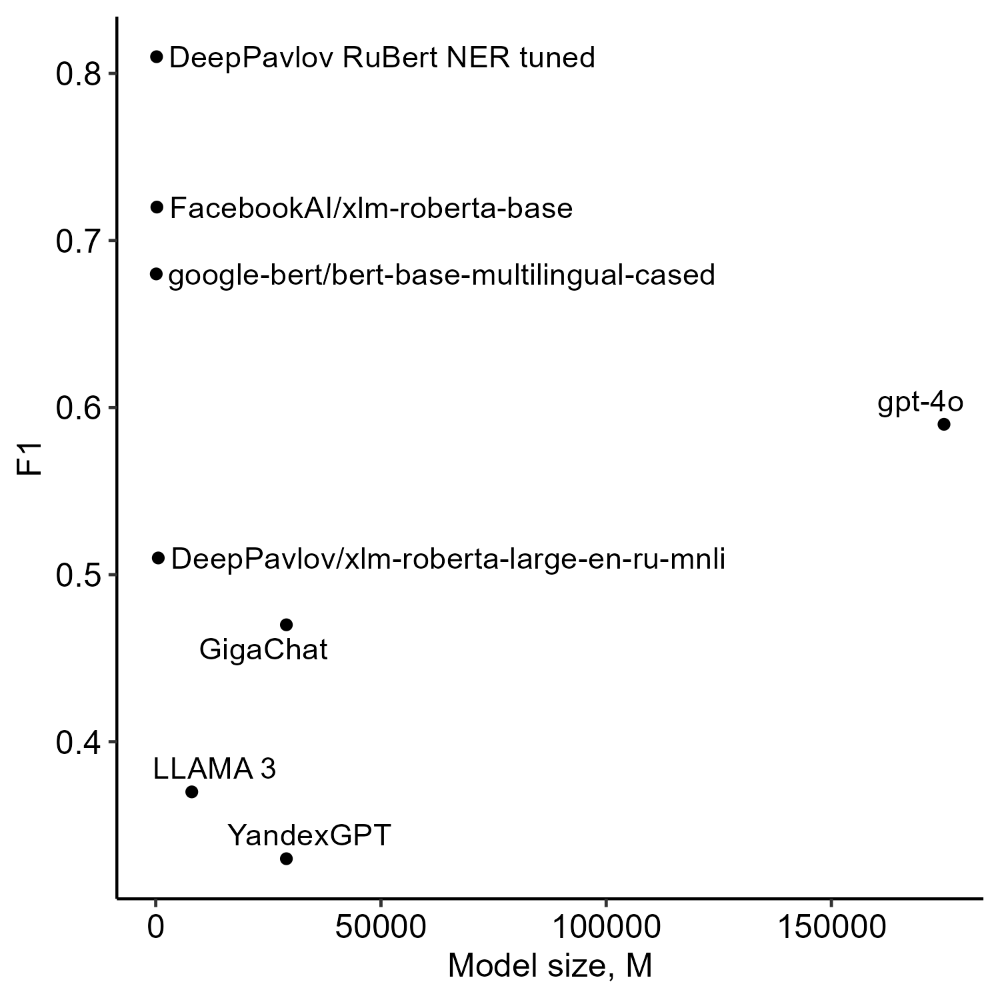
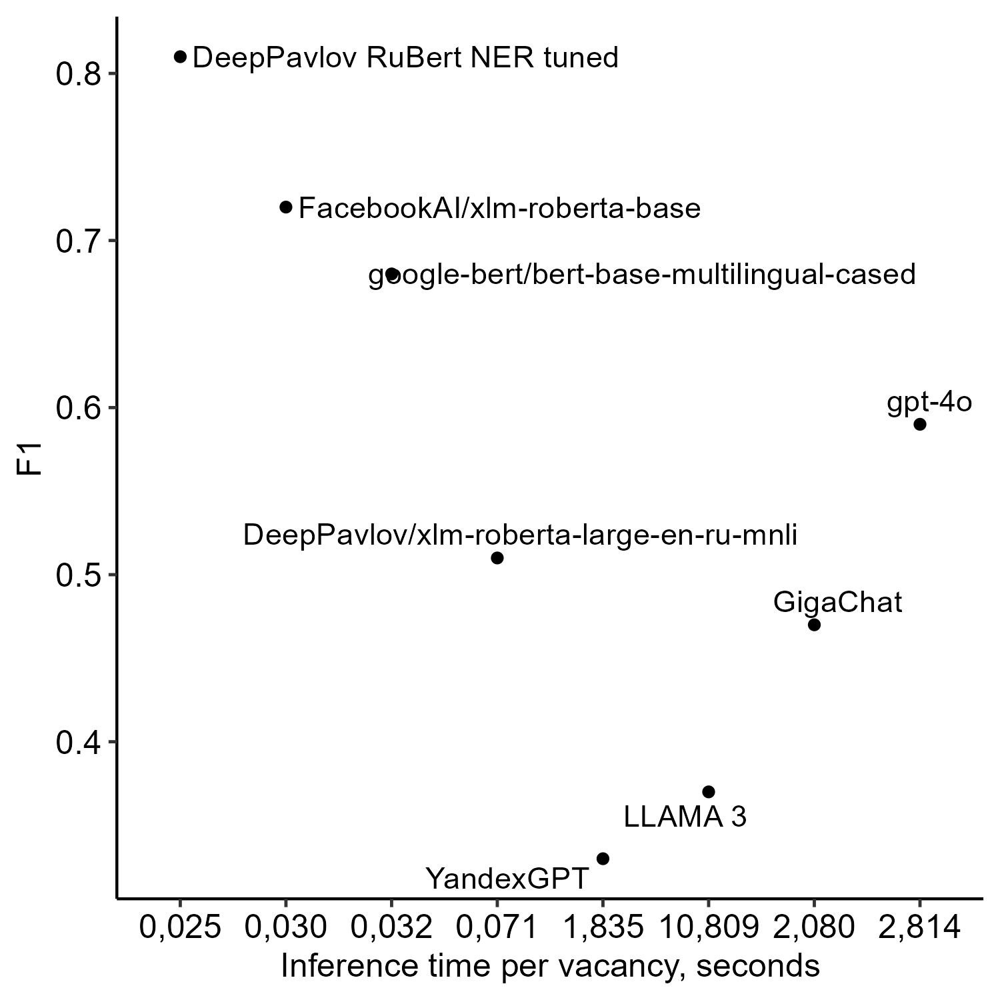

# 对比分析：基于编码器的NER与大型语言模型在俄罗斯职位空缺技能提取中的应用

发布时间：2024年07月29日

`LLM应用` `人力资源`

> Comparative Analysis of Encoder-Based NER and Large Language Models for Skill Extraction from Russian Job Vacancies

# 摘要

> 随着劳动力市场的快速变革，求职者面临更高要求，职位空缺激增。由于雇主需求的多样性和关键技能的遗漏，从职位描述中精准识别所需技能变得愈发困难。本研究通过对比传统基于编码器的命名实体识别（NER）方法与大型语言模型（LLM）在提取俄罗斯职位空缺中的技能，解决了这一难题。研究采用4000个标注职位空缺进行训练，1472个进行测试，结果表明，特别是经过优化的DeepPavlov RuBERT NER模型，在准确性、精确度、召回率和推理时间等多项指标上均超越LLM。这表明传统NER模型在技能提取方面更为高效，有助于提升职位要求的透明度，并协助求职者更好地匹配雇主期望。此研究不仅丰富了自然语言处理（NLP）领域的知识，还特别强调了其在非英语劳动力市场环境中的应用价值。

> The labor market is undergoing rapid changes, with increasing demands on job seekers and a surge in job openings. Identifying essential skills and competencies from job descriptions is challenging due to varying employer requirements and the omission of key skills. This study addresses these challenges by comparing traditional Named Entity Recognition (NER) methods based on encoders with Large Language Models (LLMs) for extracting skills from Russian job vacancies. Using a labeled dataset of 4,000 job vacancies for training and 1,472 for testing, the performance of both approaches is evaluated. Results indicate that traditional NER models, especially DeepPavlov RuBERT NER tuned, outperform LLMs across various metrics including accuracy, precision, recall, and inference time. The findings suggest that traditional NER models provide more effective and efficient solutions for skill extraction, enhancing job requirement clarity and aiding job seekers in aligning their qualifications with employer expectations. This research contributes to the field of natural language processing (NLP) and its application in the labor market, particularly in non-English contexts.

[Arxiv](https://arxiv.org/abs/2407.19816)