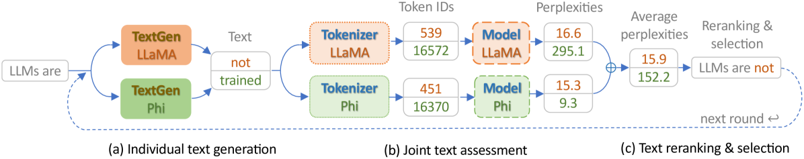

# Cool-Fusion：轻松融合大型语言模型，无需繁琐训练。

发布时间：2024年07月29日

`LLM应用` `人工智能`

> Cool-Fusion: Fuse Large Language Models without Training

# 摘要

> 我们致力于解决融合多个异构大型语言模型（LLM）以发挥其互补优势的问题。模型融合面临的一大挑战是高计算负荷，包括通过组合优化进行微调或词汇对齐。为此，我们提出了 \emph{Cool-Fusion}，一种既简单又高效的方法，旨在融合不同源 LLM 的知识，以充分利用它们的互补优势。与需要训练的集成方法不同，\emph{Cool-Fusion} 无需任何训练步骤，且适用于任何词汇不同的源 LLM。其核心思想是让每个源 LLM 独立生成令牌，直至这些令牌能解码成一个在所有源 LLM 词边界处结束的文本段。随后，源 LLM 共同对生成的文本段进行重新排序，并选出最佳文本段，实现一步到位的融合文本生成。我们在多种基准数据集上进行了广泛的实验，结果显示，在 \emph{GSM8K} 数据集上，\emph{Cool-Fusion} 使三个强大源 LLM 的准确性提升了 8\% 至 17.8\%。

> We focus on the problem of fusing two or more heterogeneous large language models (LLMs) to facilitate their complementary strengths. One of the challenges on model fusion is high computational load, i.e. to fine-tune or to align vocabularies via combinatorial optimization. To this end, we propose \emph{Cool-Fusion}, a simple yet effective approach that fuses the knowledge of heterogeneous source LLMs to leverage their complementary strengths. \emph{Cool-Fusion} is the first method that does not require any type of training like the ensemble approaches. But unlike ensemble methods, it is applicable to any set of source LLMs that have different vocabularies. The basic idea is to have each source LLM individually generate tokens until the tokens can be decoded into a text segment that ends at word boundaries common to all source LLMs. Then, the source LLMs jointly rerank the generated text segment and select the best one, which is the fused text generation in one step. Extensive experiments are conducted across a variety of benchmark datasets. On \emph{GSM8K}, \emph{Cool-Fusion} increases accuracy from three strong source LLMs by a significant 8\%-17.8\%.

[Arxiv](https://arxiv.org/abs/2407.19807)