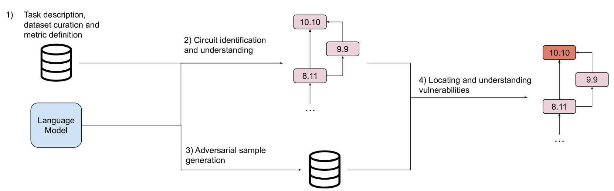
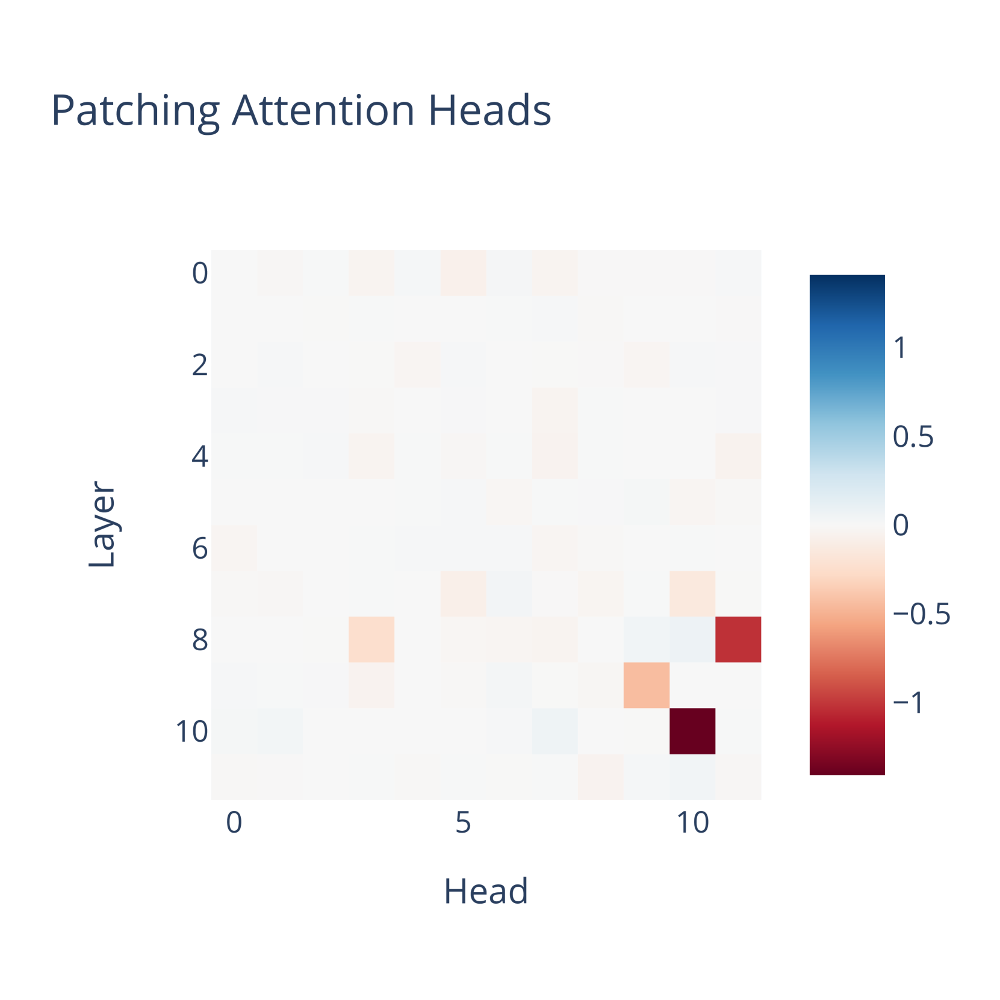
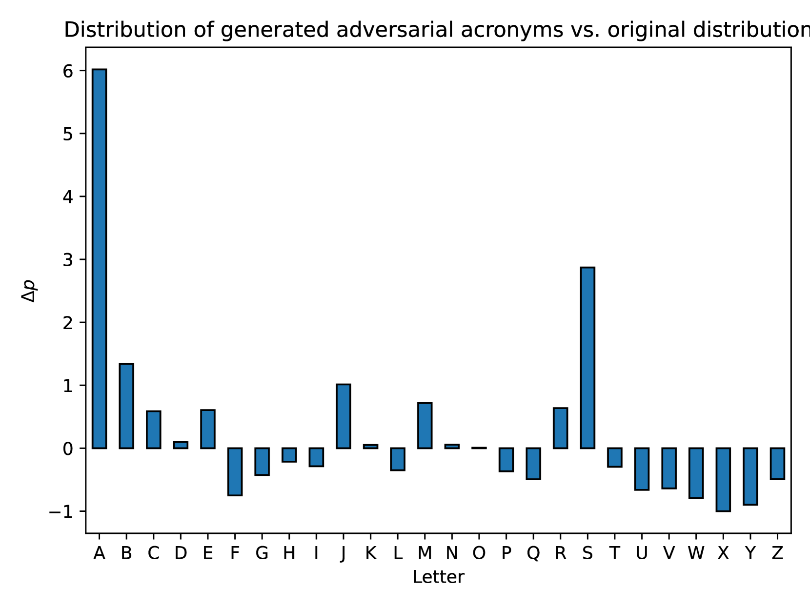
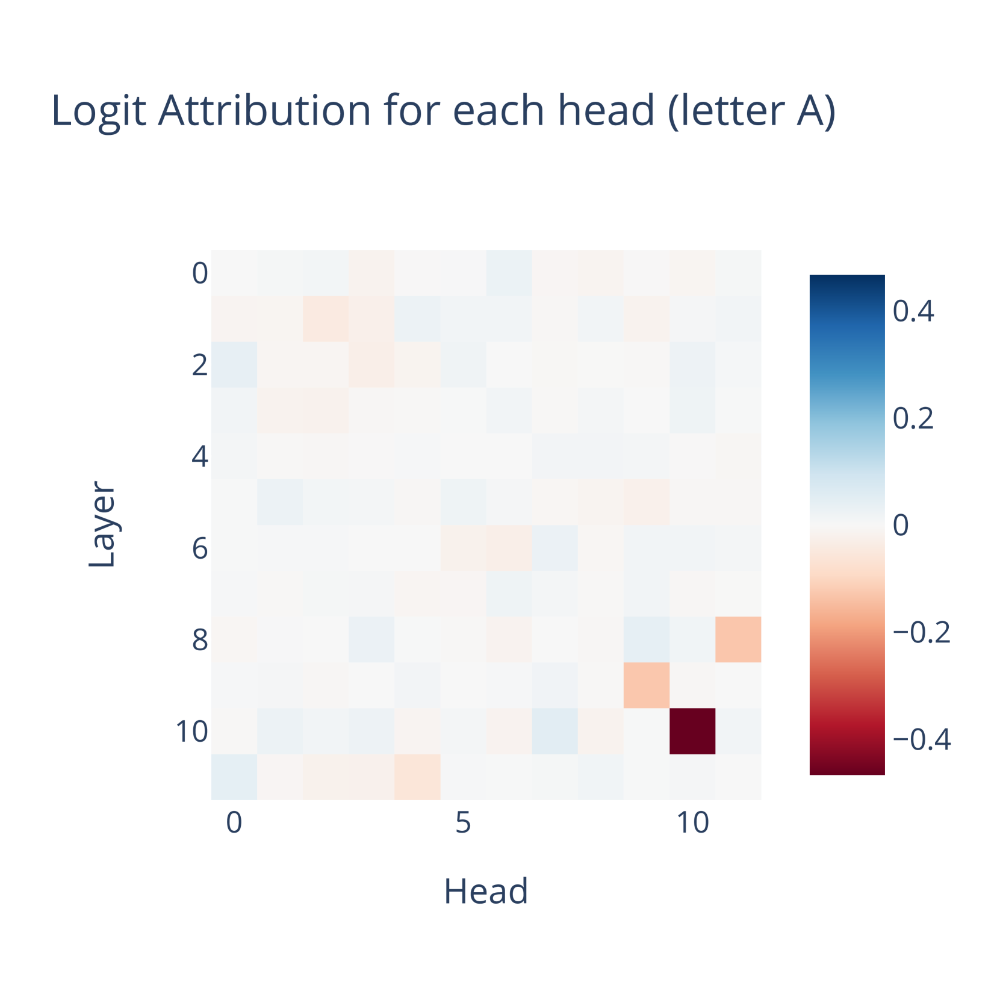
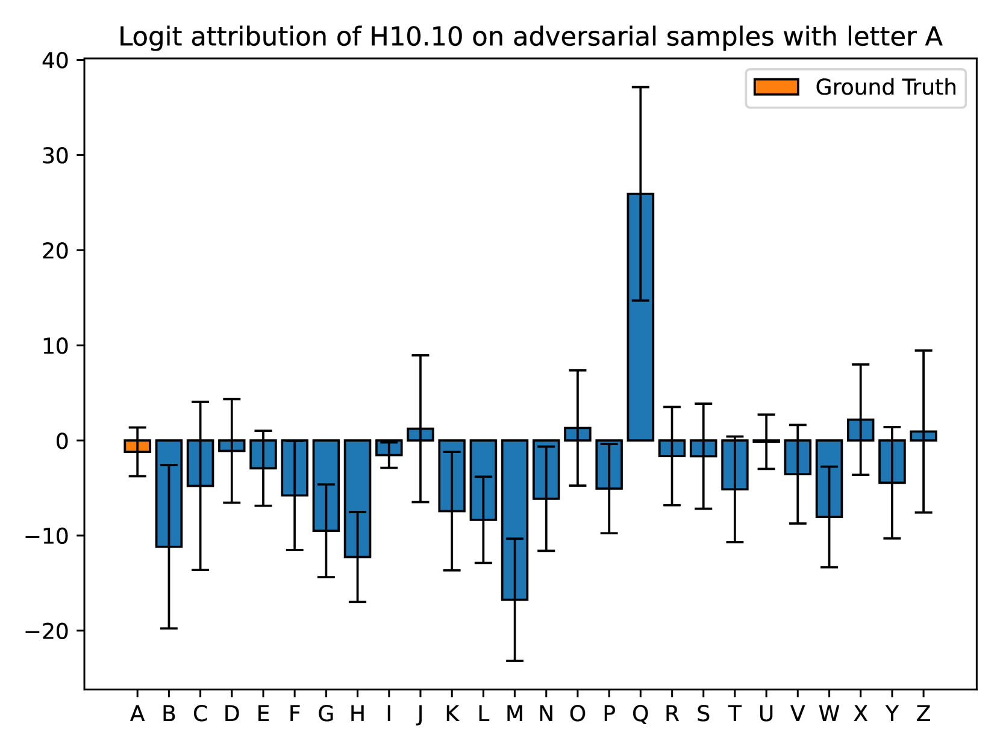

# 借助机制性可解释性，我们探索并理解语言模型中的潜在漏洞。

发布时间：2024年07月29日

`LLM理论` `网络安全`

> Detecting and Understanding Vulnerabilities in Language Models via Mechanistic Interpretability

# 摘要

> 大型语言模型（LLM）通过自监督学习处理海量数据，展现出跨领域的卓越性能。其生成能力激发了广泛应用的兴趣。然而，神经网络，特别是LLM，易受对抗性攻击，细微的输入变化即可误导输出，这在高风险领域如医疗中尤为棘手。尽管提升鲁棒性的努力不少，但关于漏洞的成因和位置的研究却寥寥无几。基于此，我们探索漏洞的定位与理解，并提出一种基于机制解释性（MI）技术的方法。该方法通过识别任务相关模型部分、生成对抗样本及运用MI技术，有效揭示并理解具体任务中的潜在漏洞。我们在预训练的GPT-2 Small模型上验证了这一方法，展示了其在识别3字母缩略词预测任务中漏洞的实效。

> Large Language Models (LLMs), characterized by being trained on broad amounts of data in a self-supervised manner, have shown impressive performance across a wide range of tasks. Indeed, their generative abilities have aroused interest on the application of LLMs across a wide range of contexts. However, neural networks in general, and LLMs in particular, are known to be vulnerable to adversarial attacks, where an imperceptible change to the input can mislead the output of the model. This is a serious concern that impedes the use of LLMs on high-stakes applications, such as healthcare, where a wrong prediction can imply serious consequences. Even though there are many efforts on making LLMs more robust to adversarial attacks, there are almost no works that study \emph{how} and \emph{where} these vulnerabilities that make LLMs prone to adversarial attacks happen. Motivated by these facts, we explore how to localize and understand vulnerabilities, and propose a method, based on Mechanistic Interpretability (MI) techniques, to guide this process. Specifically, this method enables us to detect vulnerabilities related to a concrete task by (i) obtaining the subset of the model that is responsible for that task, (ii) generating adversarial samples for that task, and (iii) using MI techniques together with the previous samples to discover and understand the possible vulnerabilities. We showcase our method on a pretrained GPT-2 Small model carrying out the task of predicting 3-letter acronyms to demonstrate its effectiveness on locating and understanding concrete vulnerabilities of the model.

[Arxiv](https://arxiv.org/abs/2407.19842)