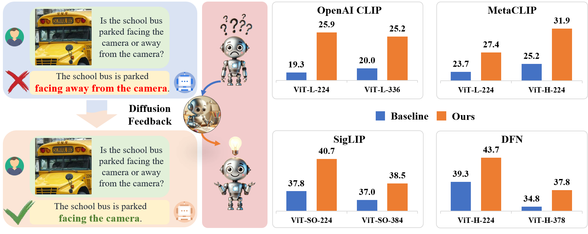
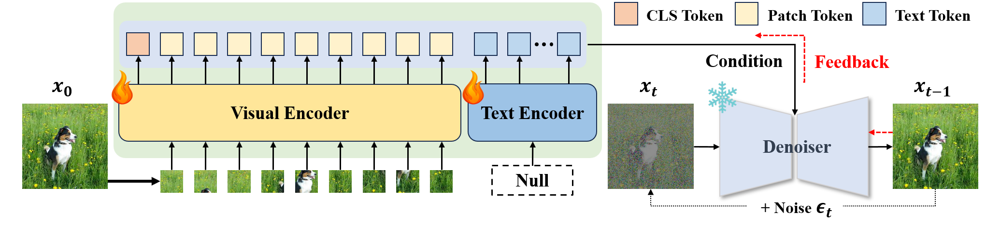
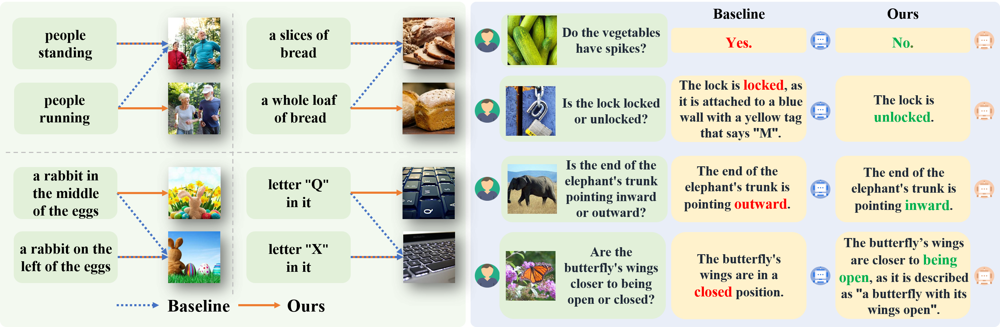

# 扩散反馈助力 CLIP 视觉更敏锐

发布时间：2024年07月29日

`LLM应用` `计算机视觉` `多模态学习`

> Diffusion Feedback Helps CLIP See Better

# 摘要

> CLIP在跨领域和模态的开放世界表示抽象方面表现卓越，但近期研究发现其在视觉识别上存在严重不足，如难以辨别方向、数量、颜色和结构等，这些缺陷也影响了基于CLIP的多模态大型语言模型的感知能力。原因可能在于训练数据中图像与文本的匹配存在偏差。为此，我们提出了一种简便的后训练方法，通过自监督扩散过程显著改善CLIP的视觉识别能力。我们开发的DIVA系统，利用扩散模型作为视觉辅助，仅通过图像优化CLIP的表示，大幅提升了其在细粒度视觉识别任务上的表现，并增强了多模态理解和分割任务的性能。在29个图像分类和检索基准上的广泛测试表明，我们的方法不仅提升了CLIP的性能，还保留了其原有的零-shot能力。相关代码将在GitHub上公开。

> Contrastive Language-Image Pre-training (CLIP), which excels at abstracting open-world representations across domains and modalities, has become a foundation for a variety of vision and multimodal tasks. However, recent studies reveal that CLIP has severe visual shortcomings, such as which can hardly distinguish orientation, quantity, color, structure, etc. These visual shortcomings also limit the perception capabilities of multimodal large language models (MLLMs) built on CLIP. The main reason could be that the image-text pairs used to train CLIP are inherently biased, due to the lack of the distinctiveness of the text and the diversity of images. In this work, we present a simple post-training approach for CLIP models, which largely overcomes its visual shortcomings via a self-supervised diffusion process. We introduce DIVA, which uses the DIffusion model as a Visual Assistant for CLIP. Specifically, DIVA leverages generative feedback from text-to-image diffusion models to optimize CLIP representations, with only images (without corresponding text). We demonstrate that DIVA improves CLIP's performance on the challenging MMVP-VLM benchmark which assesses fine-grained visual abilities to a large extent (e.g., 3-7%), and enhances the performance of MLLMs and vision models on multimodal understanding and segmentation tasks. Extensive evaluation on 29 image classification and retrieval benchmarks confirms that our framework preserves CLIP's strong zero-shot capabilities. The code will be available at https://github.com/baaivision/DIVA.

[Arxiv](https://arxiv.org/abs/2407.20171)