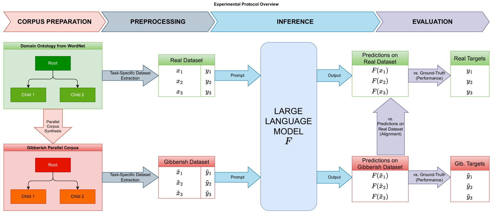

# 大型语言模型是否真正适应特定领域？让我们从本体学习的角度来探讨。

发布时间：2024年07月29日

`LLM理论` `知识库`

> Do LLMs Really Adapt to Domains? An Ontology Learning Perspective

# 摘要

> 大型语言模型 (LLM) 在自然语言处理任务中表现卓越，但其在词汇语义任务如知识库完成和本体学习中的成功，究竟源于数据处理能力还是语言学习效率，仍待验证。特别是在处理特定领域数据时，词汇语义可能与模型训练所学大相径庭。本文探讨 LLM 是否真正适应领域并有效提取结构化知识，还是仅限于学习词汇语义。为此，我们利用 WordNet 合成包含英语和无意义术语的平行语料库，进行关系提取和分类法发现两项实验。结果显示，尽管适应了无意义语料库，现成 LLM 并未持续推理语义关系，而是依赖语义框架。但通过微调，LLM 在未见过的领域特定术语任务中表现提升，表明预训练 LLM 在本体学习中的潜力。

> Large Language Models (LLMs) have demonstrated unprecedented prowess across various natural language processing tasks in various application domains. Recent studies show that LLMs can be leveraged to perform lexical semantic tasks, such as Knowledge Base Completion (KBC) or Ontology Learning (OL). However, it has not effectively been verified whether their success is due to their ability to reason over unstructured or semi-structured data, or their effective learning of linguistic patterns and senses alone. This unresolved question is particularly crucial when dealing with domain-specific data, where the lexical senses and their meaning can completely differ from what a LLM has learned during its training stage. This paper investigates the following question: Do LLMs really adapt to domains and remain consistent in the extraction of structured knowledge, or do they only learn lexical senses instead of reasoning? To answer this question and, we devise a controlled experiment setup that uses WordNet to synthesize parallel corpora, with English and gibberish terms. We examine the differences in the outputs of LLMs for each corpus in two OL tasks: relation extraction and taxonomy discovery. Empirical results show that, while adapting to the gibberish corpora, off-the-shelf LLMs do not consistently reason over semantic relationships between concepts, and instead leverage senses and their frame. However, fine-tuning improves the performance of LLMs on lexical semantic tasks even when the domain-specific terms are arbitrary and unseen during pre-training, hinting at the applicability of pre-trained LLMs for OL.

[Arxiv](https://arxiv.org/abs/2407.19998)