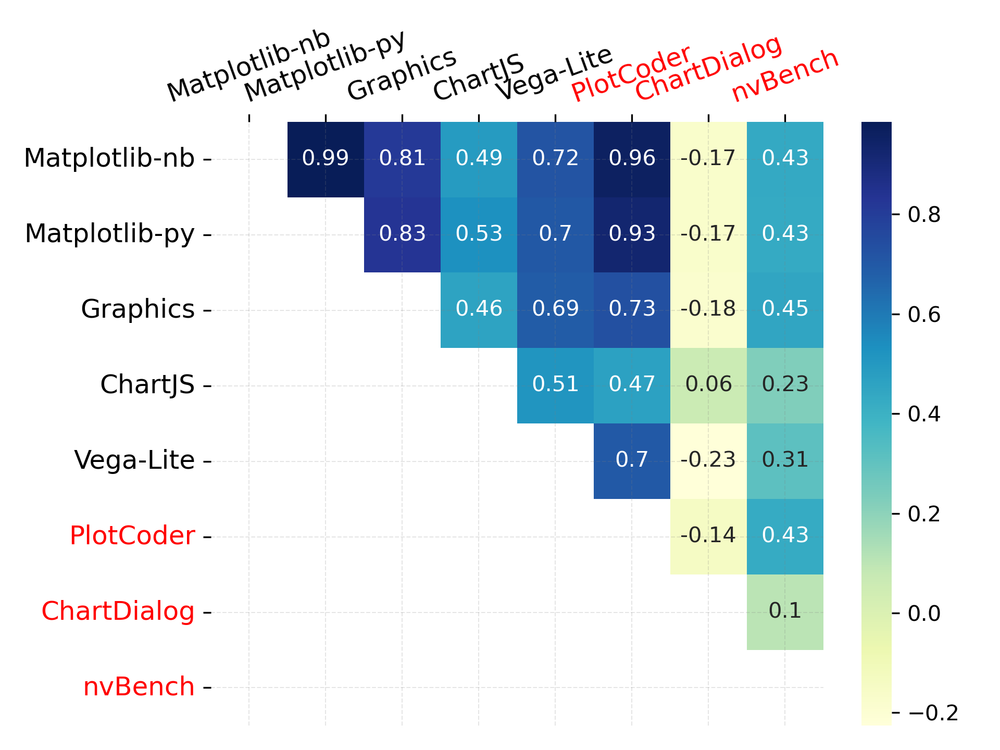

# 文本转可视化的基准测试，真的能检验出可视化的实际应用效果吗？

发布时间：2024年07月29日

`LLM应用` `数据可视化`

> Do Text-to-Vis Benchmarks Test Real Use of Visualisations?

# 摘要

> 大型语言模型能根据用户需求生成可视化代码，这对NLP研究颇具吸引力，因为数据图表为语言提供了坚实基础。但现有基准较少，且其代表性尚不明确。本文通过对比基准数据集与公共代码库，揭示了数据集间的显著差异，现有评估未能涵盖图表类型、属性和操作的全面分布。唯一具代表性的数据集需经调整，方能成为实用的一体化基准。这表明，为支持真正满足用户可视化需求的系统，亟需更多新基准。未来数据集的创建将受此指导，重点关注对用户真正有意义的特征。

> Large language models are able to generate code for visualisations in response to user requests. This is a useful application, and an appealing one for NLP research because plots of data provide grounding for language. However, there are relatively few benchmarks, and it is unknown whether those that exist are representative of what people do in practice. This paper aims to answer that question through an empirical study comparing benchmark datasets and code from public repositories. Our findings reveal a substantial gap in datasets, with evaluations not testing the same distribution of chart types, attributes, and the number of actions. The only representative dataset requires modification to become an end-to-end and practical benchmark. This shows that new, more benchmarks are needed to support the development of systems that truly address users' visualisation needs. These observations will guide future data creation, highlighting which features hold genuine significance for users.

[Arxiv](https://arxiv.org/abs/2407.19726)